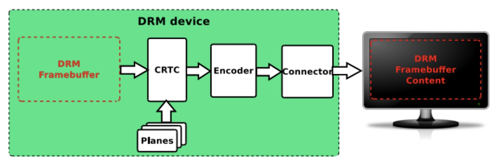
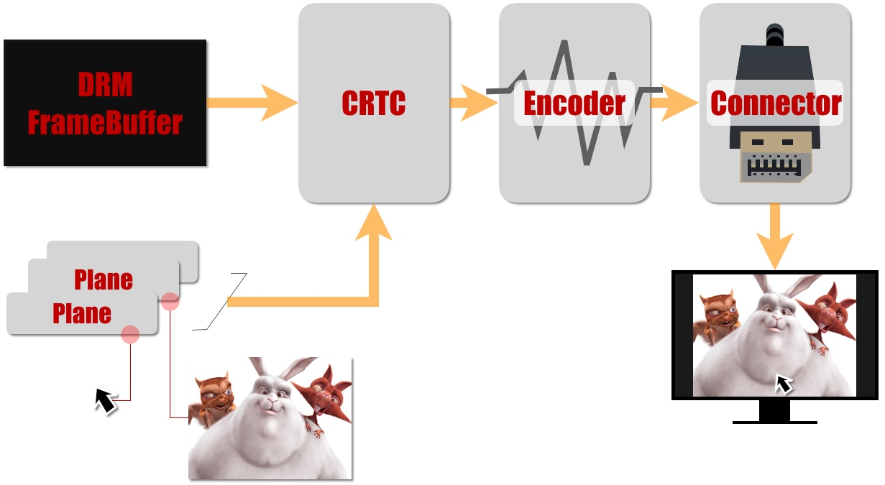

## DRM CORE 编译的文件
根据 drivers/gpu/drm/Makefile 编译文件，该目录下的点C文件主要是drm core的主要部分。主要是
| 文件名字 | 用途 | 代码行数 | 注释行数 | 空格 | 一共行数 |
| :--- | :--- | ---: | ---: | ---: | ---: |
| [Kconfig](/Kconfig) | 编译选项 | 322 | 0 | 100 | 422 |
| [Makefile](/Makefile) |编译文件 | 169 | 12 | 17 | 198 |
| [drm_agpsupport.c](/drm_agpsupport.c) |Accelerated Graphics Port (AGP) is a parallel expansion card standard, designed for attaching a video card to a computer system to assist in the acceleration of 3D computer graphics.     Get AGP information.| 252 | 141 | 59 | 452 |
| [drm_aperture.c](/drm_aperture.c) |  DRM aperture functions manage ownership of DRM framebuffer memory and hand-over between drivers.管理通用的设备驱动| 27 | 161 | 10 | 198 |
| [drm_atomic.c](/drm_atomic.c) |Global atomic state handing| 1,078 | 507 | 256 | 1,841 |
| [drm_atomic_helper.c](/drm_atomic_helper.c) | 提供了检查和提交函数的实现顶部的CRTC模型的帮助回调和平面的帮助回调 | 2,082 | 1,098 | 564 | 3,744 |
| [drm_atomic_state_helper.c](/drm_atomic_state_helper.c) | 原子状态重置和初始化 | 408 | 309 | 94 | 811 |
| [drm_atomic_uapi.c](/drm_atomic_uapi.c) | uapi 原子操作？ | 1,075 | 187 | 192 | 1,454 |
| [drm_auth.c](/drm_auth.c) | Clients can authenticate against the current master (if it matches their own)| 264 | 135 | 74 | 473 |
| [drm_blend.c](/drm_blend.c) | ？？？？？？| 210 | 354 | 54 | 618 |
| [drm_bridge.c](/drm_bridge.c) | A bridge is always attached to a single &drm_encoder at a time, but can be either connected to it directly, or through a chain of bridges::   [ CRTC ---> ] Encoder ---> Bridge A ---> Bridge B| 588 | 610 | 153 | 1,351 |
| [drm_bridge_connector.c](/drm_bridge_connector.c) | DRM桥接器操作基于操作实现由链条中的桥梁提供。每个连接器操作都是委托的到最靠近连接器的桥(在链的末端)提供相关功能。| 213 | 116 | 58 | 387 |
| [drm_buddy.c](/drm_buddy.c) |drm buddy 内存管理相关的 | 625 | 128 | 173 | 926 |
| [drm_bufs.c](/drm_bufs.c) | 内存buf相关的操作 | 1,158 | 256 | 214 | 1,628 |
| [drm_cache.c](/drm_cache.c) | GEM 缓存相关的| 216 | 99 | 42 | 357 |
| [drm_client.c](/drm_client.c) | This library provides support for clients running in the kernel like fbdev and bootsplash. | 306 | 131 | 86 | 523 |
| [drm_client_modeset.c](/drm_client_modeset.c) | mode set used by client| 873 | 162 | 205 | 1,240 |
| [drm_color_mgmt.c](/drm_color_mgmt.c) | 颜色管理和颜色空间  | 316 | 244 | 73 | 633 |
| [drm_connector.c](/drm_connector.c) | 连接器 和kms 相关 | 1,538 | 1,287 | 357 | 3,182 |
| [drm_context.c](/drm_context.c) | cortext 相关的 | 239 | 198 | 77 | 514 |
| [drm_crtc.c](/drm_crtc.c) | A CRTC represents the overall display pipeline.  | 563 | 252 | 143 | 958 |
| [drm_crtc_helper.c](/drm_crtc_helper.c) | ？？？？？？？| 602 | 315 | 144 | 1,061 |
| [drm_crtc_helper_internal.h](/drm_crtc_helper_internal.h) | ？？？？？？| 15 | 27 | 5 | 47 |
| [drm_crtc_internal.h](/drm_crtc_internal.h) | ？？？？？| 204 | 59 | 41 | 304 |
| [drm_damage_helper.c](/drm_damage_helper.c) | Add a new helper to validate damage during atomic_check| 175 | 119 | 40 | 334 |
| [drm_debugfs.c](/drm_debugfs.c) | debug相关的 | 385 | 73 | 107 | 565 |
| [drm_debugfs_crc.c](/drm_debugfs_crc.c) | C| 274 | 85 | 80 | 439 |
| [drm_displayid.c](/drm_displayid.c) | display id  | 123 | 15 | 39 | 177 |
| [drm_dma.c](/drm_dma.c) | drm dma 相关的 | 92 | 67 | 20 | 179 |
| [drm_drv.c](/drm_drv.c) | drm core | 563 | 388 | 159 | 1,110 |
| [drm_dumb_buffers.c](/drm_dumb_buffers.c) |  Dumb objects partly alleviate the problem by providing a standard API to create dumb buffers suitable for scanout, which can then be used to create KMS frame buffers. | 63 | 71 | 18 | 152 |
| [drm_edid.c](/drm_edid.c) |EDID blocks | 4,926 | 1,391 | 995 | 7,312 |
| [drm_edid_load.c](/drm_edid_load.c) | edid load 相关的| 212 | 18 | 28 | 258 |
| [drm_encoder.c](/drm_encoder.c) | Encoders represent the connecting element between the CRTC and the connectors | 207 | 99 | 55 | 361 |
| [drm_encoder_slave.c](/drm_encoder_slave.c) | ???? | 100 | 56 | 27 | 183 |
| [drm_fb_dma_helper.c](/drm_fb_dma_helper.c) | framebuffer dma helper functions | 76 | 57 | 18 | 151 |
| [drm_fb_helper.c](/drm_fb_helper.c) |  The fb helper functions are useful to provide an fbdev on top of a drm kernel mode setting driver. They can be used mostly independently from the crtc  helper functions used by many drivers to implement the kernel mode setting interfaces.| 1,453 | 584 | 342 | 2,379 |
| [drm_fbdev_dma.c](/drm_fbdev_dma.c) | fb dev dma operation | 184 | 32 | 53 | 269 |
| [drm_fbdev_generic.c](/drm_fbdev_generic.c) | fb generic operation | 249 | 43 | 65 | 357 |
| [drm_file.c](/drm_file.c) | Drivers must define the file operations structure that forms the DRM userspace API entry point | 439 | 344 | 127 | 910 |
| [drm_flip_work.c](/drm_flip_work.c) | flip work ? | 82 | 69 | 20 | 171 |
| [drm_format_helper.c](/drm_format_helper.c) | ??? | 688 | 395 | 118 | 1,201 |
| [drm_fourcc.c](/drm_fourcc.c) | computes a drm fourcc pixel format code for the given values. | 316 | 100 | 35 | 451 |
| [drm_framebuffer.c](/drm_framebuffer.c) | Frame buffers are abstract memory objects that provide a source of pixels to scanout to a CRTC. | 720 | 329 | 182 | 1,231 |
| [drm_gem.c](/drm_gem.c) |  This file provides some of the base ioctls and library routines for the graphics memory manager implemented by each device driver.| 760 | 519 | 215 | 1,494 |
| [drm_gem_atomic_helper.c](/drm_gem_atomic_helper.c) | gem 相关的原子操作 | 151 | 74 | 42 | 467 |
| [drm_gem_dma_helper.c](/drm_gem_dma_helper.c) | gem 相关的dma| 293 | 242 | 70 | 605 |
| [drm_gem_framebuffer_helper.c](/drm_gem_framebuffer_helper.c) | gem frambuffer ？ | 333 | 213 | 65 | 611 |
| [drm_gem_shmem_helper.c](/drm_gem_shmem_helper.c) | This library provides helpers for GEM objects backed by shmem buffers allocated using anonymous pageable memory.| 461 | 206 | 130 | 797 |
| [drm_gem_ttm_helper.c](/drm_gem_ttm_helper.c) | This library provides helper functions for gem objects backed by ttm.| 68 | 63 | 23 | 154 |
| [drm_gem_vram_helper.c](/drm_gem_vram_helper.c) |  This library provides &struct drm_gem_vram_object (GEM VRAM), a GEM buffer object that is backed by video RAM (VRAM).  | 583 | 407 | 172 | 1,162 |
| [drm_hashtab.c](/drm_hashtab.c) | gem hash tab | 143 | 37 | 24 | 204 |
| [drm_internal.h](/drm_internal.h) | gem 内部的头文件| 181 | 38 | 42 | 261 |
| [drm_ioc32.c](/drm_ioc32.c) | drm ioc32  ？？？？| 781 | 53 | 167 | 1,001 |
| [drm_ioctl.c](/drm_ioctl.c) | ioctl callback implementation for DRM drivers| 550 | 288 | 99 | 937 |
| [drm_irq.c](/drm_irq.c) | drm irq 相关的 | 105 | 64 | 36 | 205 |
| [drm_kms_helper_common.c](/drm_kms_helper_common.c) | C | 26 | 27 | 12 | 65 |
| [drm_lease.c](/drm_lease.c) | DRM leases provide information about whether a DRM master may control a DRM mode setting object. | 484 | 132 | 118 | 734 |
| [drm_legacy.h](/drm_legacy.h) | 对应头文件 | 196 | 54 | 41 | 291 |
| [drm_legacy_misc.c](/drm_legacy_misc.c) | ？？？ | 53 | 33 | 20 | 106 |
| [drm_lock.c](/drm_lock.c) | legacy lock相关的| 228 | 100 | 46 | 374 |
| [drm_managed.c](/drm_managed.c) | inspired by struct &device managed resources| 162 | 65 | 47 | 274 |
| [drm_memory.c](/drm_memory.c) | memery 相关的| 80 | 39 | 20 | 139 |
| [drm_mipi_dbi.c](/drm_mipi_dbi.c) |  This library provides helpers for MIPI Display Bus Interface (DBI)compatible display controllers. | 909 | 349 | 207 | 1,465 |
| [drm_mipi_dsi.c](/drm_mipi_dsi.c) | These functions contain some common logic and helpers to deal with MIPI DSI peripherals. | 759 | 390 | 201 | 1,350 |
| [drm_mm.c](/drm_mm.c) | drm_mm provides a simple range allocator | 604 | 278 | 160 | 1,042 |
| [drm_mode_config.c](/drm_mode_config.c) | ？？？| 503 | 97 | 98 | 698 |
| [drm_mode_object.c](/drm_mode_object.c) | ？？？？ | 341 | 171 | 78 | 590 |
| [drm_modes.c](/drm_modes.c) | ？？？？| 1,699 | 719 | 339 | 2,757 |
| [drm_modeset_helper.c](/drm_modeset_helper.c) | ？？？？？？ | 105 | 114 | 28 | 247 |
| [drm_modeset_lock.c](/drm_modeset_lock.c) | mode set lock | 222 | 201 | 59 | 482 |
| [drm_of.c](/drm_of.c) | A set of helper functions to aid DRM drivers in parsing standard DT properties. | 284 | 192 | 71 | 547 |
| [drm_panel.c](/drm_panel.c) | The DRM panel helpers allow drivers to register panel objects | 149 | 158 | 43 | 350 |
| [drm_panel_orientation_quirks.c](/drm_panel_orientation_quirks.c) | ？ | 385 | 54 | 32 | 471 |
| [drm_pci.c](/drm_pci.c) | pci相关的？| 162 | 66 | 42 | 270 |
| [drm_plane.c](/drm_plane.c) | A plane represents an image source that can be blended with or overlaid on top of a CRTC during the scanout process.| 996 | 368 | 221 | 1,585 |
| [drm_plane_helper.c](/drm_plane_helper.c) | ？| 158 | 135 | 29 | 322 |
| [drm_prime.c](/drm_prime.c) | Similar to GEM global names, PRIME file descriptors are also used to share buffer objects across processes. | 565 | 374 | 133 | 1,072 |
| [drm_print.c](/drm_print.c) | drm print 相关的 | 232 | 74 | 63 | 369 |
| [drm_privacy_screen.c](/drm_privacy_screen.c) | ？？？？| 235 | 174 | 63 | 472 |
| [drm_privacy_screen_x86.c](/drm_privacy_screen_x86.c) | ？？？？ | 80 | 10 | 17 | 107 |
| [drm_probe_helper.c](/drm_probe_helper.c) | output probing helper overview| 688 | 400 | 184 | 1,272 |
| [drm_property.c](/drm_property.c) | Properties as represented by &drm_property are used to extend the modeset interface exposed to userspace.  | 507 | 302 | 132 | 941 |
| [drm_rect.c](/drm_rect.c) | ？？？ | 201 | 134 | 41 | 376 |
| [drm_scatter.c](/drm_scatter.c) | ？？？？ | 143 | 37 | 41 | 221 |
| [drm_self_refresh_helper.c](/drm_self_refresh_helper.c) | This helper library provides an easy way for drivers to leverage the atomic framework to implement panel self refresh (SR) support.| 160 | 80 | 42 | 282 |
| [drm_simple_kms_helper.c](/drm_simple_kms_helper.c) | This helper library provides helpers for drivers for simple display hardware. | 292 | 87 | 78 | 457 |
| [drm_suballoc.c](/drm_suballoc.c) | ？ | 280 | 109 | 69 | 458 |
| [drm_syncobj.c](/drm_syncobj.c) | DRM synchronisation objects | 960 | 326 | 232 | 1,518 |
| [drm_sysfs.c](/drm_sysfs.c) | DRM provides very little additional support to drivers for sysfs| 356 | 86 | 99 | 541 |
| [drm_trace.h](/drm_trace.h) | ？？？| 64 | 2 | 9 | 75 |
| [drm_trace_points.c](/drm_trace_points.c) | ？？ | 3 | 0 | 3 | 6 |
| [drm_vblank.c](/drm_vblank.c) | ？？？ | 1,130 | 784 | 306 | 2,220 |
| [drm_vblank_work.c](/drm_vblank_work.c) | ？| 140 | 90 | 36 | 266 |
| [drm_vm.c](/drm_vm.c) | ？？？| 432 | 153 | 81 | 666 |
| [drm_vma_manager.c](/drm_vma_manager.c) | The vma-manager is responsible to map arbitrary driver-dependent memory regions into the linear user address-space. | 165 | 217 | 40 | 422 |
| [drm_writeback.c](/drm_writeback.c) | Writeback connectors are used to expose hardware which can write the output from a CRTC to a memory buffer| 241 | 162 | 66 | 469 |

**上述文件是drm下的  且没有包含进子目录**
## 几个重要的概念
**CRTC：**
CRTC is an antiquated term that stands for cathode ray tube controller, which today would be simply named display controller as CRT monitors have disappeared and many other display types are available. **The CRTC is an abstraction that is responsible for composing the frame to be scanned out to the display and setting the mode of the display.**

CRTC ：从framebuffer中读取待显示的图像，并按照相应的格式输出给encoder。其承担的主要作用为：
* 配置适合显示器的分辨率，并输出相应的时序。
* 扫描framebuffer送到一个或多个显示器
* 更新framebuffer

**Encoder** ：
An encoder takes pixel data from a CRTC and converts it to a format suitable for any attached connectors. There are many different display protocols defined, such as HDMI and DisplayPort. This design uses an HDMI transmitter implemented in the PL which sends the encoded video data to the HDMI GT Controller and PHY. The PHY serializes the data using the GTY transceivers in the PL before it goes out via the HDMI Tx connector on the board.
转换输出器，负责电源管理、显示输出需要不同的信号转换器，将内存的像素转换成显示器需要的信号。


**Connector**
Connector连接器负责硬件设备的接入、屏参获取等。

 **Planes**
基本的显示控制单位，每个图像拥有一个Planes，Planes的属性控制着图像的显示区域、图像翻转、色彩混合方式等， 最终图像经过Planes并通过CRTC组件，得到多个图像的混合显示或单独显示的等等功能


上述的这些组件，最终完成了一个完整的DRM显示控制过程，如下图所示：

（上图也是参考各种博客）




## drm_drv.c
在drm_drv.c这个文件中，是整个drm core初始化的入口

```
static int __init drm_core_init(void)
{
	int ret;

	drm_connector_ida_init();
	idr_init(&drm_minors_idr);
	drm_memcpy_init_early();
/*
创建class类drm_class，同时会在/sys/class/目录下创建一个新的文件夹drm
*/
	ret = drm_sysfs_init();
	if (ret < 0) {
		DRM_ERROR("Cannot create DRM class: %d\n", ret);
		goto error;
	}
    //  在/sys/kernel/debug下创建dri目录
	drm_debugfs_root = debugfs_create_dir("dri", NULL);
   // 申请主设备号，同时初始化以及注册字符设备cdev（这里注册的字符设备数量为256），并将字符设备的ops和drm_stub_fops绑定在一起
	ret = register_chrdev(DRM_MAJOR, "drm", &drm_stub_fops);
	if (ret < 0)
		goto error;

	ret = accel_core_init();
	if (ret < 0)
		goto error;

	drm_privacy_screen_lookup_init();

	drm_core_init_complete = true;

	DRM_DEBUG("Initialized\n");
	return 0;

error:
	drm_core_exit();
	return ret;
}
module_init(drm_core_init);
module_exit(drm_core_exit);
```
在DRM core初始化函数中，主要进行了如下操作：
1. 调用drm_sysfs_init创建class类drm_class，在/sys/class目录下一个名称为drm的文件夹；
2. 调用debugfs_create_dir在/sys/kernel/debug下创建dri目录；
3. 调用register_chrdev申请主设备号为DRM_MAJOR（值为226），同时注册256个字符设备，并将字符设备的ops和drm_stub_fops绑定在一起


