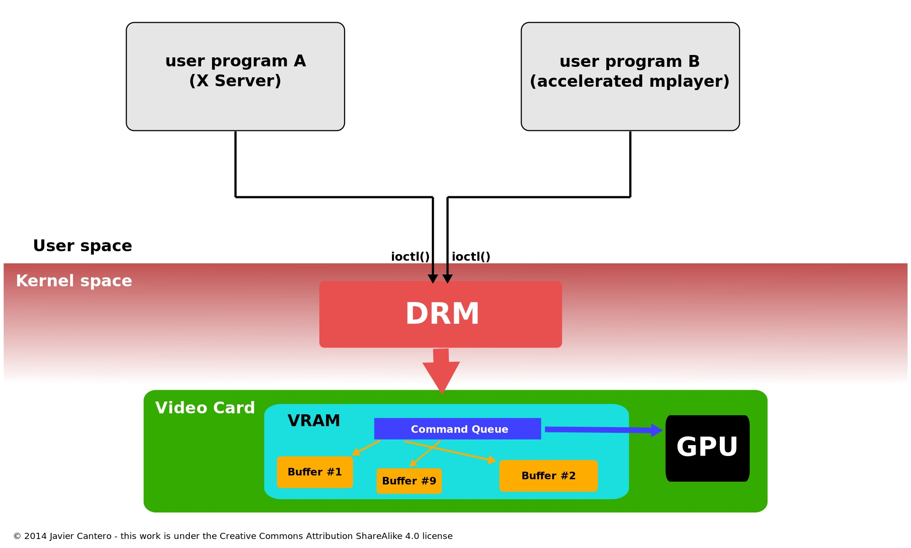

# DRM （Direct Rendering Manager）

## [概念](https://en.wikipedia.org/wiki/Direct_Rendering_Manager)
参考wiki，
下面这段英文通俗易懂，drm就是linux 内核的一个子系统 提供了api 负责控制gpu。

The Direct Rendering Manager (DRM) is a subsystem of the Linux kernel responsible for interfacing with GPUs of modern video cards. DRM exposes an API that user-space programs can use to send commands and data to the GPU and perform operations such as configuring the mode setting of the display.

且用户空间还可以通过DRM API做 GPGPU computing（这个概念之前讲过）.

## 概览
Linux 内核已经有一个名为fbdev的API ，用于管理图形适配器的帧缓冲区[2] ，但它无法满足现代 GPU 的 3D 加速需求。主要原因是无法满足多进程同时控制相同的硬件。所以后来DRM发展起来了。

下图是没有drm

下图是有drm

**所以drm在这种情况充当仲裁者并注意避免可能的冲突。**
创建直接渲染管理器是为了允许多个程序协作使用视频硬件资源。 DRM 获得对 GPU 的独占访问权限，并负责初始化和维护命令队列、内存和任何其他硬件资源。希望使用 GPU 的程序向 DRM 发送请求，DRM 充当仲裁者并注意避免可能的冲突。

多年来，DRM 的范围不断扩大，涵盖了以前由用户空间程序处理的更多功能，例如帧缓冲区管理和模式设置、内存共享对象和内存同步。其中一些扩展被赋予了特定的名称，例如图形执行管理器（**GEM**）或内核模式设置（**KMS**），并且当它们提供的功能为特别提到。但它们实际上是整个内核 DRM 子系统的一部分。

## 软件架构以及基本的概念
### 控制方法
用户空间程序必须使用内核系统调用来请求其服务。但是，DRM 没有定义自己的定制系统调用。相反，它遵循“一切皆文件”的 Unix 原则，通过文件系统名称空间公开 GPU，使用 /dev 层次结构下的设备文件。 DRM 检测到的每个 GPU 称为 DRM 设备，并创建一个设备文件 /dev/dri/cardX （其中 X 是序列号）来与其交互。 想要与 GPU 通信的用户空间程序必须打开此文件并使用 ioctl 调用与 DRM 通信。不同的ioctl对应DRM API的不同功能。

### **libdrm 库**
以促进用户空间程序与 DRM 子系统的接口。该库只是一个包装器，它为 DRM API 的每个 ioctl 提供用 C 编写的函数，以及常量、结构和其他辅助元素。 libdrm 的使用不仅避免了将内核接口直接暴露给应用程序，而且还提供了在程序之间重用和共享代码的常见优点。

### core和驱动
DRM 由两部分组成：通用的“DRM 核心”和针对每种类型支持的硬件的特定部分（“DRM 驱动程序”）。DRM 核心向用户空间应用程序导出多个接口，通常旨在通过相应的 libdrm 包装器函数来使用。此外，驱动程序通过 ioctl 和 sysfs 文件导出特定于设备的接口，供用户空间驱动程序和设备感知应用程序使用。外部接口包括：内存映射、上下文管理、DMA操作、AGP管理、vblank控制、fence管理、内存管理和输出管理。

### Master 和 Auth
DRM 中有DRM-Master DRM-Auth。DRM-Master 被称为 主 进程，在打开设备节点 /dev/dri/cardX 的所有进程中，只有一个进程会将其文件句柄标记为 master，特别是第一个调用 SET_MASTER ioctl 的进程。对于其余的用户空间进程，还有另一种方法可以获取在 DRM 设备上调用某些受限操作的权限，称为 DRM-Auth。它基本上是一种针对 DRM 设备进行身份验证的方法，以向其证明该进程已获得 DRM-Master 的批准以获得此类权限.

### GEM
图形执行管理器 (GEM  Graphics Execution Manager)是管理内核内图形缓冲区的方法。视频内存的大小不断增加以及 OpenGL 等图形 API 的复杂性不断增加，在每次上下文切换时重新初始化显卡状态的策略在性能方面过于昂贵。GEM 提供了具有显式内存管理原语的 API。 通过 GEM，用户空间程序可以创建、处理和销毁存在于 GPU 视频内存中的内存对象。这些对象，称为“GEM 对象”。GEM 还允许两个或多个使用相同 DRM 设备（因此相同的 DRM 驱动程序）的用户空间进程共享 GEM 对象。

### TTM
Translation Table Maps (TTM) 是是在 GEM 之前开发的 GPU 通用内存管理器的名称。这里具体细节不展开讲解。

### KMS Kernel Mode-Setting (KMS)
为了正常工作，视频卡或图形适配器必须设置一种模式（屏幕分辨率、颜色深度和刷新率的组合），该模式应在其自身和所连接的显示屏支持的值范围内。此操作称为模式设置。它通常需要对图形硬件的原始访问，即写入视频卡显示控制器的某些寄存器的能力。 在开始使用帧缓冲区之前，以及当应用程序或用户需要更改模式时，必须执行模式设置操作。
之前，用户空间会设置相关的硬件视频的相关设置，这样会造成很多乱七八糟的问题，具体这里不讲。**为了解决这些问题，模式设置代码被移动到内核内的一个位置，特别是现有的 DRM 模块，然后，每个进程（包括 X Server）都应该能够命令内核执行模式设置操作，并且内核将确保并发操作不会导致不一致的状态。添加到 DRM 模块以执行这些模式设置操作的新内核 API 和代码称为内核模式设置 (KMS)。**

KMS 是内核的一部分，这一事实允许它使用仅在内核空间可用的资源，例如中断。例如，挂起/恢复过程后的模式恢复通过由内核本身管理而简化了很多，并且顺便提高了安全性（不再需要 root 权限的用户空间工具）。该内核还允许轻松热插拔新的显示设备，解决了一个长期存在的问题。 模式设置也与内存管理密切相关——因为帧缓冲区基本上是内存缓冲区——因此强烈建议与图形内存管理器紧密集成。这就是为什么内核模式设置代码被合并到 DRM 中而不是作为单独的子系统的主要原因。

### KMS 设备模型
* **CRTCs**
* Connectors
* Encoders
* Planes

### Atomic Dispaly
近年来，人们一直在努力将原子性引入与 KMS API 相关的一些常规操作，特别是模式设置和页面翻转操作。 [33] [52] 这种增强的 KMS API 称为原子显示（以前称为原子模式设置和原子或核翻页）。

### Render node
“渲染节点”概念试图通过将 DRM 用户空间 API 分成两个接口（一个是特权接口，一个是非特权接口）。

