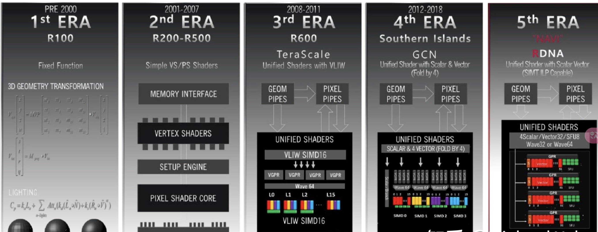

# GPU的初步认知
## GPU 定义
图形处理器（英语：Graphics Processing Unit，缩写：GPU），又称显示核心（display core）、视觉处理器（video processor）、显示芯片（display chip）或图形芯片（graphics chip），是一种专门在个人电脑、工作站、游戏机和一些移动设备（如平板电脑、智能手机等）上执行绘图运算工作的微处理器。以图形处理器为核心的主板扩展卡也称显示卡或“显卡”。

人工智能要用GPU的主要原因是因为GPU拥有强大的并行计算能力，适合处理大规模的矩阵运算和向量计算，而这些计算在人工智能算法中非常常见。在传统的中央处理器（CPU）中，每个核心通常只能处理一个任务，因此在处理大量数据时速度会相对较慢。而GPU拥有大量的计算单元（CUDA核心），可以同时执行许多相似的计算任务，因此能够在短时间内处理大量的数据。这对于机器学习和深度学习等人工智能任务来说非常重要，因为它们通常涉及大量的矩阵运算和向量计算。另外，人工智能算法中经常使用到深度神经网络，这些网络拥有大量的参数需要进行训练。传统的CPU在处理这些大规模神经网络时效率较低，而GPU能够通过并行计算加速神经网络的训练过程，从而大大缩短了训练时间。
## GPU 发展
虽然专用图形硬件从 1944 年 MIT 的 Whirlwind 项目就开始出现，并于 20 世纪 80 年代逐渐成形，但图形处理器或 GPU 这个名词直到 1999 年才由 NVIDIA 公司创造，此后逐渐发展成为同时具备高速图形处理能力和通用计算能力的强大硬件

| 时间| 重大事件|
|--------------|-----------------|
|1944年| MIT 开展的“Whirlwind”项目首次设计实时图形显示硬|
| 1982年  | 以 Geometry Engine 为代表的专用图形处理硬件芯片出现                                              |
| 1985年  | 图形加速硬件出现在大规模市场产品（如 Commodore 公司的 Amiga 计算机）中                             |
| 1991 年 | S3 公司设计首个 2D 图形加速芯片 S3 86C911                                                        |
| 1995 年 | NVIDIA 公司设计首个 3D 图形加速芯片 NV1                                                          |
| 1999 年 | NVIDIA 公司提出 GPU 概念，其 GeForce 256 GPU 首次实现基于硬件的变换与光照（transform and lighting） |
| 2001 年 | NVIDIA 公司推出第一个可编程渲染图形处理器（GeForce 3）                                              |
| 2005 年 | ATI 公司推出首个统一渲染图形处理器，用于 Xbox 360                                                  |
| 2006 年 | NVIDIA 公司推出首个针对计算机统一渲染图形的处理器                                                 |
| 2011 年 | AMD 公司推出 CPU ／ GPU 融合处理器（APU）|                                                           
## AMD GPU的发展

AMD 官方网站上是这样介绍RDNA架构的: AMD RDNA 架构专为新一代高能效、高性能游戏而设计。 它是不断进化的游戏 DNA，赋予游戏动力，让游戏生动逼真

**本学习笔记以最新的RDNA3 为研究对象**
## GPU物理组成
如下图直观的呈现了CPU与GPU的架构区别。

显而易见，ALU 绿色的比较多
算术逻辑单元(arithmetic and logic unit) 是能实现多组算术运算和逻辑运算的组合逻辑电路，简称ALU。

出于GPU的电路比较简单，因此便可在将其制造成多核GPU。这也使得GPU 的运算能力天然支持并行了。利用SIMT实现把多条数据，交给不同的线程去处理，因此一个 GPU 的核里，就可以放下更多的 ALU，同时进行更多的并行运算了。

SIMT:Single instruction, multiple threads (SIMT) is an execution model used in parallel computing where single instruction, multiple data (SIMD) is combined with multithreading. 

**SIMT是在GPU计算中的一种模型，它引入了线程的概念，使得每个线程独立执行相同的指令，但可能处理不同的数据。SIMT模型通常用于大规模数据并行计算，适用于需要处理大量相似数据的应用，例如图形渲染和深度学习。**
特点和优势：软件线程级并行性：每个线程独立执行，但执行相同的指令。
适用于大规模数据集：适合于同时处理大量数据。
应用领域：GPU计算，尤其是在深度学习训练中。

## 参考
[维基 GPU](https://zh.wikipedia.org/wiki/%E5%9C%96%E5%BD%A2%E8%99%95%E7%90%86%E5%99%A8)
[AMD](https://www.amd.com/en.html)
[SIMT](https://zhuanlan.zhihu.com/p/668918695)