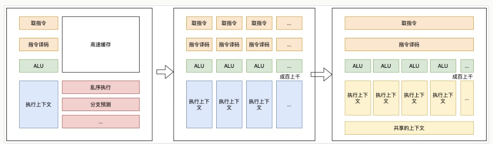
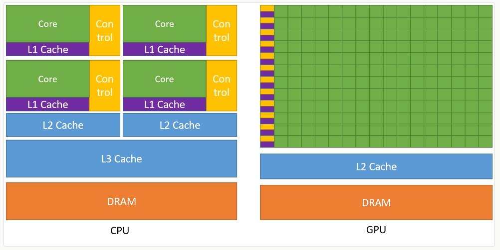
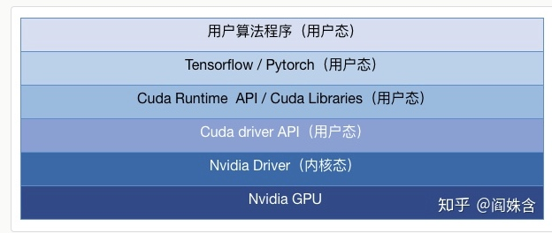
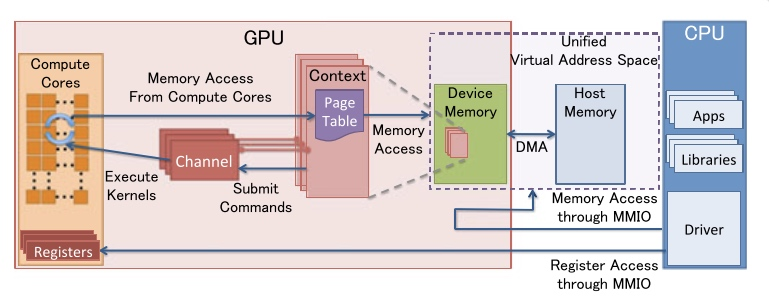
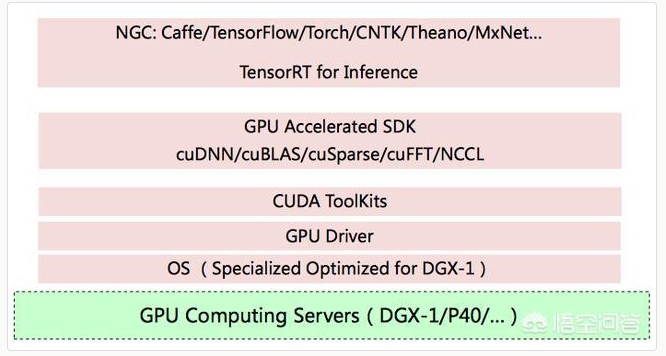
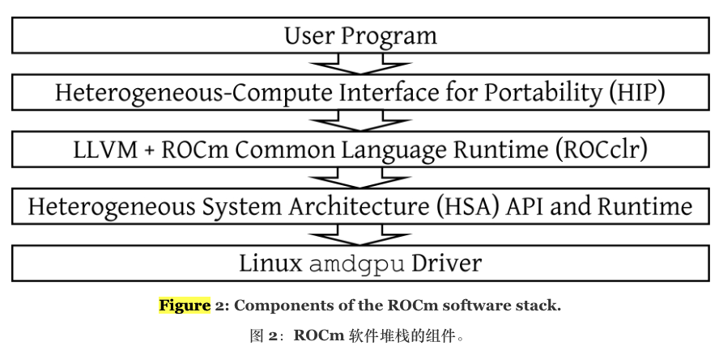
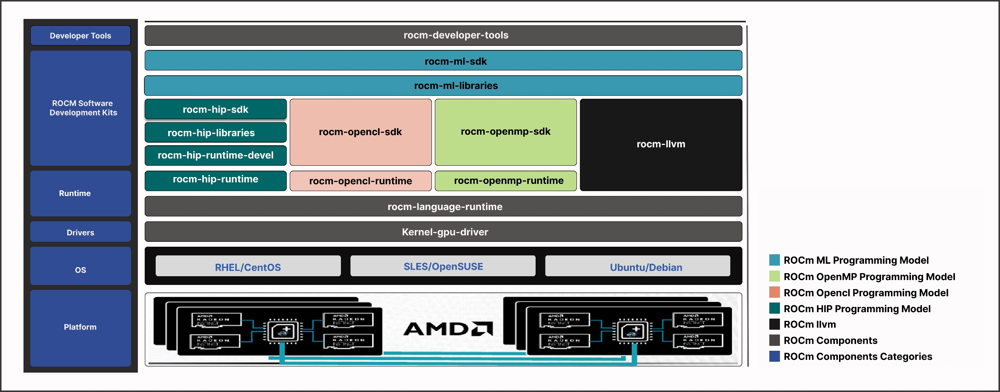
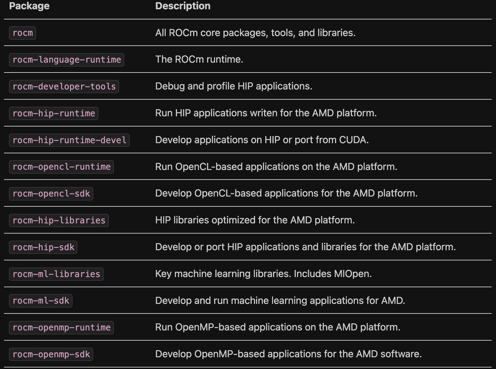

# Linux GPU 背景
GPU 的架构；内存管理；任务管理；数据类型。

## GPU 硬件架构 
现代 CPU 里的晶体管变得越来越多，越来越复杂，其实已经不是用来实现“计算”这个核心功能，而是拿来实现处理乱序执行、进行分支预测，以及高速缓存部分。而在 GPU 里，这些电路就显得有点多余了，GPU 的整个处理过程是一个流式处理（Stream Processing）的过程。因为没有那么多分支条件，或者复杂的依赖关系，我们可以把 GPU 里这些对应的电路都可以去掉，做一次小小的瘦身，只留下取指令、指令译码、ALU 以及执行这些计算需要的寄存器和缓存就好了。

于是，我们就可以在一个 GPU 里面，塞很多个这样并行的 GPU 电路来实现计算，就好像 CPU 里面的多核 CPU 一样。和 CPU 不同的是，我们不需要单独去实现什么多线程的计算。因为 GPU 的运算是天然并行的。无论是对多边形里的顶点进行处理，还是屏幕里面的每一个像素进行处理，每个点的计算都是独立的。

一方面，GPU 是一个可以进行“通用计算”的框架，我们可以通过编程，在 GPU 上实现不同的算法。另一方面，现在的深度学习计算，都是超大的向量和矩阵，海量的训练样本的计算。整个计算过程中，没有复杂的逻辑和分支，非常适合 GPU 这样并行、计算能力强的架构。
## 深度学习中的GPU
1. gpu核心很多，上千个。
2. gpu内存带宽更高，速度快就贵，所以显存容量一般不大。因为 CPU 首先得取得数据， 才能进行运算， 所以很多时候，限制我们程序运行速度的并非是 CPU 核的处理速度， 而是数据访问的速度。
3. 控制流，cpu 控制流很强，alu 只占cpu的一小部分。gpu 则要少用控制语句。
4. 编程，cpu 是各种编程语言，编译器成熟。

如图所示，CPU在芯片领域中主要用于降低指令时延的功能，例如大型缓存、较少的算术逻辑单元（ALU）和更多的控制单元。与此相比，GPU则利用大量的ALU来最大化计算能力和吞吐量，只使用极小的芯片面积用于缓存和控制单元，这些元件主要用于减少CPU时延。

深度学习的模型训练，指的是利用数据通过计算梯度下降的方式迭代地去优化神经网络的参数，最终输出网络模型的过程。在这个过程中，通常在迭代计算的环节，会借助 GPU 进行计算的加速。
## 以CUDA 为例 GPU的框架层次
一个典型的 GPU 设备的工作流程是:

1. 应用层调用 GPU 支持的某个 API，如 OpenGL 或 CUDA
2. OpenGL 或 CUDA 库，通过 UMD (User Mode Driver)，提交 workload 到 KMD (Kernel Mode Driver)
3. Kernel Mode Driver 写 CSR MMIO，把它提交给 GPU 硬件
4. GPU 硬件开始工作… 完成后，DMA 到内存，发出中断给 CPU
5. CPU 找到中断处理程序 —— Kernel Mode Driver 此前向 OS Kernel 注册过的 —— 调用它
6. 中断处理程序找到是哪个 workload 被执行完毕了，…最终驱动唤醒相关的应用

**本质上GPU 还是一个外设，有驱动程序（分为用户态和内核态）和API，用户程序 ==> API ==> CPU ==> 驱动程序 ==> GPU ==> 中断 ==> CPU.**

2006年，NVIDIA公司发布了CUDA，CUDA是建立在NVIDIA的CPUs上的一个通用并行计算平台和编程模型。
GPU/CUDA/驱动和机器学习训练框架的关系

# AMD GPU kernel framework

## 几个重要的概念

### [Free and open-source graphics device driver](https://en.wikipedia.org/wiki/Free_and_open-source_graphics_device_driver#AMDGPU)

A free and open-source graphics device driver is a software stack which controls computer-graphics hardware and supports graphics-rendering application programming interfaces (APIs) and is released under a free and open-source software license.

AMD 的专有驱动程序 AMD Catalyst for Radeon 可用于 Microsoft Windows 和 Linux（以前称为 fglrx）。当前版本可以从 AMD 网站下载，并且某些 Linux 发行版将其包含在其存储库中。它正在被 AMDGPU-PRO 混合驱动程序取代，该驱动程序将开源内核、X 和 Mesa 多媒体驱动程序与源自 Catalyst 的闭源 OpenGL、OpenCL 和 Vulkan 驱动程序相结合。

### [General-purpose computing on graphics processing units](https://en.wikipedia.org/wiki/General-purpose_computing_on_graphics_processing_units)
图形处理单元（GPGPU，或较少见的 GPGP）上的通用计算是使用图形处理单元（GPU）（通常仅处理计算机图形的计算）在传统上由中央处理单元处理的应用程序中执行计算（中央处理器）。 [1] [2] [3] [4] 在一台计算机中使用多个显卡，或者大量的图形芯片，进一步并行化已经并行的功能图形处理的本质。 [5]

### [OpenCL](https://en.wikipedia.org/wiki/OpenCL#:~:text=OpenCL%20(Open%20Computing%20Language)%20is,other%20processors%20or%20hardware%20accelerators)
OpenCL（开放计算语言）是一个框架，用于编写跨异构平台执行的程序，这些平台包括中央处理单元（CPU）、图形处理单元（GPU）、数字信号处理器（DSP）、现场可编程门阵列（FPGA）和其他平台。处理器或硬件加速器。 OpenCL 指定了用于对这些设备进行编程的编程语言（基于 C99、C++14 和 C++17）以及应用程序编程接口 (API)，以控制平台并在计算设备上执行程序。 OpenCL 为使用基于任务和数据的并行性的并行计算提供了标准接口。

### [OpenGL](https://en.wikipedia.org/wiki/OpenGL)
OpenGL（开放图形库 [4] ）是一种跨语言、跨平台的应用程序编程接口（API），用于渲染2D和3D矢量图形。该 API 通常用于与图形处理单元 (GPU) 交互，以实现硬件加速渲染。

### [HSA](https://en.wikipedia.org/wiki/Heterogeneous_System_Architecture)
异构系统架构 (HSA) 是一组跨供应商的规范，允许将中央处理单元和图形处理器集成在同一总线上，并共享内存和任务。 HSA 是由 HSA 基金会开发的，该基金会包括（除其他外）AMD 和 ARM。该平台的既定目标是减少 CPU、GPU 和其他计算设备之间的通信延迟，并从程序员的角度使这些不同的设备更加兼容， 减轻程序员在设备的不相交内存之间规划数据移动的任务（当前必须使用 OpenCL 或 CUDA 完成）。 

HSA 背后的基本原理是减轻程序员将计算卸载到 GPU 时的负担。该想法最初由 AMD 单独推动并称为 FSA，后来扩展到包括 GPU 以外的处理单元，例如其他制造商的 DSP。

AMD HSA（Heterogeneous System Architecture）是一种由AMD提出的软件架构，旨在实现CPU和GPU之间的高效协同工作。HSA架构的目标是提供一种统一的编程模型和硬件接口，使得CPU和GPU可以无缝地协同工作，共享内存和任务调度，从而实现更高的性能和能效。

AMD HSA软件架构涉及以下几个主要组成部分：

1. AMD HSA运行时（HSA Runtime）：HSA运行时是HSA架构的核心组件之一，它负责管理和协调CPU和GPU之间的通信和资源共享。它提供了一系列API和库函数，使得开发人员可以编写使用HSA架构的应用程序，调度计算任务和数据传输等。
2. HSA编译器（HSA Compiler）：HSA编译器是用于将HSA架构的应用程序源代码编译成可执行的机器代码的工具。它将应用程序代码转换为GPU和CPU可以理解和执行的指令，以实现任务的并行执行和数据的传输。
3. HSA内存管理（HSA Memory Management）：HSA架构提供了一种统一的内存模型，使得CPU和GPU可以共享同一块物理内存。HSA内存管理包括内存分配、数据迁移和保护等功能，以确保CPU和GPU之间的数据访问和传输的高效和安全。
4. HSA任务调度（HSA Task Scheduling）：HSA架构允许开发人员将计算任务分解成多个子任务，并通过任务调度器将这些子任务分配给CPU和GPU进行并行执行。HSA任务调度器负责根据任务的优先级和资源可用性等因素，动态地调度任务，以实现最佳的性能和效率。
5. HSA编程模型（HSA Programming Model）：HSA架构提供了一种统一的编程模型，使开发人员可以使用一致的API和编程语言（如C++）来编写并行计算应用程序。这样可以简化开发过程，提高代码可重用性，并充分利用CPU和GPU之间的并行计算能力。

总的来说，AMD HSA软件架构提供了一种统一的编程模型和硬件接口，使得CPU和GPU之间可以实现高效的协同工作。它通过共享内存、任务调度和统一的编程模型等特性，为开发人员提供了一种更简单、高效和可扩展的并行计算平台。

[ROCR代码仓库](https://github.com/RadeonOpenCompute/ROCR-Runtime)。
**ROCR（Radeon Open Compute Runtime）是AMD HSA运行时的一个具体实现。**

### [HSAIL](https://events.csdn.net/AMD/HSA_Programmers_Reference_Manual_0-1.95_1_May_2013.pdf)

The Heterogeneous System Architecture (HSA) is designed to efficiently support a wide assortment of data-parallel and task-parallel programing models. A single HSA system can support multiple instruction sets based on CPU(s), GPU(s), and specialized
processor(s).

HSA supports two machine models: large mode (64-bit address space) and small mode(32-bit address space).Programmers normally build code for HSA in a virtual machine and intermediatelanguage called HSAIL (Heterogeneous System Architecture Intermediate Language).Using HSAIL allows a single program to execute on a wide range of platforms, because the native instruction set has been abstracted away.

HSAIL is required for parallel computing on an HSA platform

Heterogeneous system architecture intermediate language (HSAIL) is a low-level compiler intermediate language, designed to express parallel regions of code and to be portable across multiple vendor platforms and hardware generations. This chapter provides a virtual tour of the HSAIL instruction set, describes the HSA execution model, and introduces tools and compilers, which use HSAIL.

### KFD 
KFD代码在linux仓库中，也是开源的。

AMD KFD（Kernel Fusion Driver）是AMD开发的一个驱动程序，用于支持HSA（Heterogeneous System Architecture）的硬件加速功能。

HSA是由AMD提出的一种软件架构，旨在实现CPU和GPU之间的协同计算和共享内存的能力。而AMD KFD驱动程序是为了支持HSA架构而设计的，它充当了一个中间层，将HSA的功能与底层硬件进行连接。

AMD KFD驱动程序与HSA的关系是密切的。它为HSA提供了必要的硬件支持，使得基于HSA的应用程序能够利用GPU进行加速计算。KFD驱动程序负责管理GPU设备、内存和任务调度等功能，以实现CPU和GPU之间的协同工作和数据共享。

通过AMD KFD驱动程序，开发人员可以使用HSA编程模型和API来开发并运行基于HSA的应用程序。KFD驱动程序通过与底层硬件交互，实现了在GPU上执行HSA任务的能力，以提供高性能的计算加速。

## AMD kernel driver framework linux

下图为维基百科中关于amd gpu的一个架构图

上图中涉及到的深度学习的一个路径即是红框中的。

[Exploring AMD GPU Scheduling Details by Experimenting With “Worst Practices”](https://dl.acm.org/doi/fullHtml/10.1145/3453417.3453432)
论文中的软件平台。在这些实验中，我们使用了 ROCm（Radeon Open Compute）软件堆栈的 3.9 版 下图

针对上述论文的矩阵运算实验 AMD GPU 上的计算内核调度路径为

大概流程为：
1. 用户程序调用 hipLaunchKernelGGL API 函数来启动内核。
2. HIP 运行时将内核启动命令插入到由 ROCclr 运行时库管理的软件队列中。
3. ROCclr 将内核启动命令转换为 AQL（架构排队语言）数据包。
4. ROCclr 将 AQL 数据包插入到 HSA（异构系统架构）队列中。
5. 在硬件中，异步计算引擎 (ACE) 处理 HSA 队列，将内核分配给计算硬件。

内核到 GPU 计算硬件的旅程始于 hipLaunchKernelGGL API 调用，如图 3 顶部所示，负责将内核启动请求排队。程序员与排队结构的典型接触点是通过 2.1 节中介绍的 HIP 的“流”接口。简而言之，HIP 流是程序员在调用 hipLaunchKernelGGL 时可能指定的几个参数之一。每个 HIP 流均由 ROCclr（HIP 使用的后端运行时库）管理的软件队列提供支持（参见图 2）。 ROCclr 将 hipLaunchKernelGGL 的参数存储在 C++ 对象中，然后将该对象插入到软件队列中。

[最新的ROCm软件栈如下图](https://rocm.docs.amd.com/projects/install-on-linux/en/latest/how-to/native-install/package-manager-integration.html)：

