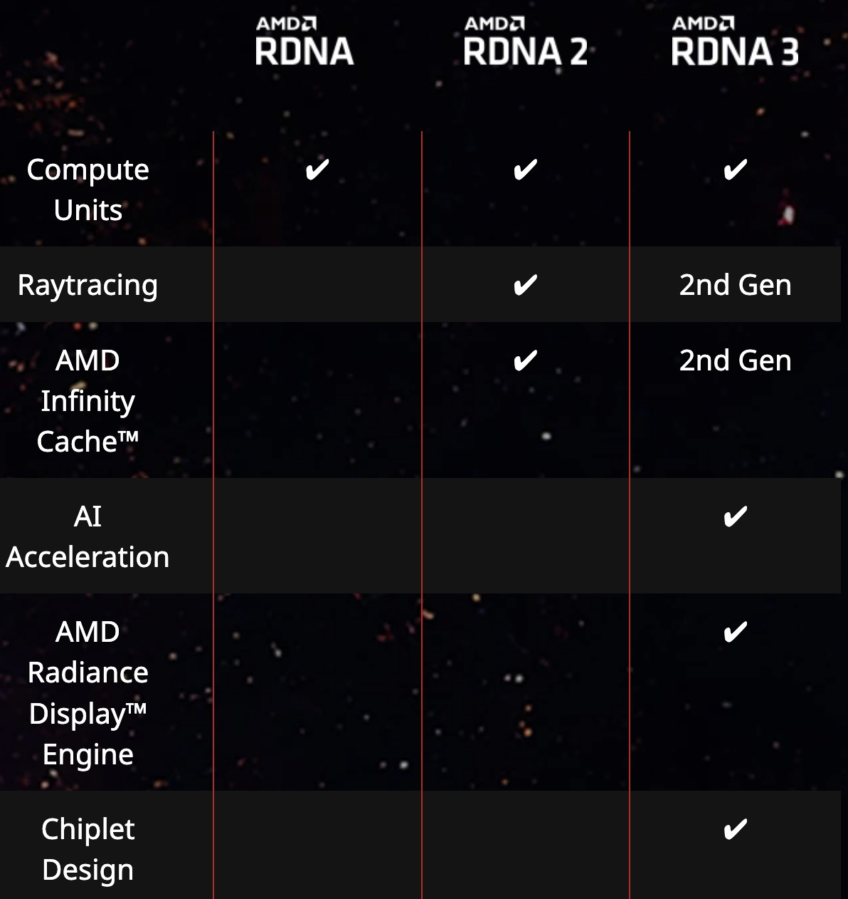

# RDNA3介绍
## 概念
[RDNA3](https://en.wikipedia.org/wiki/RDNA_3)是 AMD 设计的 GPU 微架构，于 2022 年 12 月 13 日随 Radeon RX 7000 系列一起发布。除了为 RX 7000 系列提供动力外，RDNA 3 还出现在 AMD 为华硕 ROG Ally 和 Legion Go 游戏机设计的 SoC 中。

[AMD RDNA™ ](https://www.amd.com/en/technologies/rdna)架构专为下一代高效高性能游戏而设计。它是为您的游戏提供动力的 DNA，是为您的游戏带来生命的 DNA，是不断发展的 DNA。体验 AMD Radeon™ RX 7000 系列显卡中采用的全新 AMD RDNA™ 3 架构在性能和效率方面的新一代进步。

AMD RDNA™ 是从头开始构建的，旨在为各种硬件上的所有游戏玩家提供令人难以置信的性能、效率和功能。游戏玩家可以在台式机、笔记本电脑、游戏机、移动设备和云上体验 AMD RDNA™。

借助 AMD Radeon™ RX 7000 系列显卡所采用的 AMD RDNA™ 3 架构，在全球首款专为游戏玩家设计的小芯片 GPU 设计上，通过全新 AI 加速器体验 GPU 设计的下一代进步。

## 发展
2022年6月9日，AMD举行了财务分析师日，会上他们展示了客户端GPU路线图，其中提到 RDNA3将于2022年推出，RDNA4将于2024年推出。 AMD向投资者宣布他们打算实现RDNA3的每瓦性能提升超过50%，即将推出的架构将使用5nm工艺上的小芯片封装构建。

2022年8月29日，AMDRyzen7000发布会即将结束时，我们对RDNA3进行了抢先预览。预览中包括 RDNA3运行《Lies of P》的游戏，AMD首席执行官苏姿丰 (Lisa Su) 确认将使用小芯片设计，以及部分了解AMD RDNA3 GPU 参考设计。
## 特点
### 小芯片封装
RDNA 3 首次在消费级 GPU 中采用模块化小芯片。 AMD 此前在 Ryzen 台式机和 Epyc 服务器处理器中使用小芯片取得了巨大成功。
### 内存高速缓存芯片（MCD）
每个内存缓存芯片 (MCD)分别拥有20.5亿个晶体管，包含大块L3缓存和两个物理32位GDDR6内存接口，每个MCD具有组合的64位接口。 Radeon RX 7900 XTX 通过使用6个MCD拥有384位内存总线，而RX7900 XT通过使用 5个MCD拥有320位总线。
### 计算单元
RDNA 3 包括改进的双问题着色器 ALU，能够在每个周期执行两条指令。它最多可包含 96 个图形计算单元，可提供高达 61 TFLOPS 的计算能力。
**RDNA 3 采用 Wave MMA（矩阵乘法累加）指令进行专用 AI 加速， 可以将基于 AI 的性能提高 2.7 倍，并且也有利于光线追踪指令，类似于 Nvidia 的 Tensor 核心。**
### 光线追踪
每个 RDNA 3 计算单元包含一个光线追踪加速器。由于计算单元数量增加，光线追踪加速器的总数有所增加，但每个计算单元的光线追踪加速器数量并未比 RDNA 2 有所增加。### 时钟速度
### 缓存和内存子系统
每个 MCD 上包含 16   MB 无限缓存。理论上，由于 MCD 包含未使用的 TSV 连接点，因此可以通过 AMD 的 3D V-Cache 芯片堆叠技术将额外的 L3 缓存添加到 MCD 中。
### 电源效率
AMD声称RDNA3的每瓦性能提高了54%，这与他们之前声称的RDNA和RDNA2的每瓦性能提高了50% 一致。
### 媒体引擎
RDNA 3 是第一个拥有专用媒体引擎的 RDNA 架构。它内置于GCD中，基于VCN 4.0编解码核心。AMD 的 AMF AV1 编码器在质量上与 Nvidia 的 NVENC AV1 编码器相当，但与 GeForce RTX 40 系列上的 3 个限制相比，可以处理更多数量的同时编码流。

