# 介绍
在过去的三十年里，图形世界已经从根本上发展并转向更高的可编程性。最早的图形系统纯粹以软件实现并在 CPU 上运行，但无法提供最基本的视觉效果所需的性能。第一个专用图形架构几乎是纯粹的固定功能，只能加速非常有限范围的特定 2D 或 3D 计算，例如几何或照明转换。下一波（？）架构引入了图形着色器，它为程序员带来了灵活性，但也有严格的限制。最近，图形处理器向可编程性发展——提供可编程图形着色器和完全通用的计算。
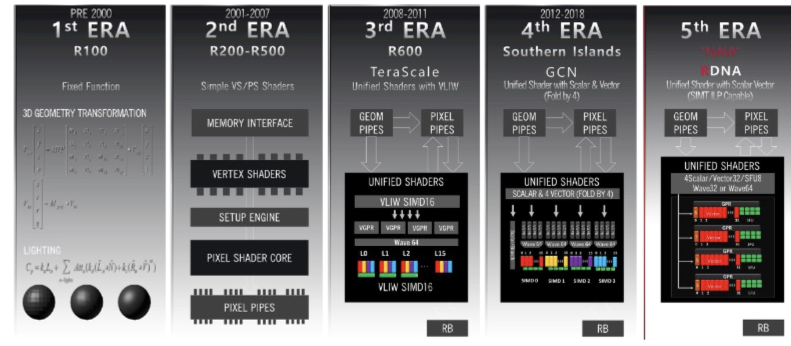
AMD 的 TeraScale 专为可编程图形时代而设计，并通过 DirectX® 11 的 DirectCompute API 和基于 VLIW 的架构开创了通用计算。 Graphics Core Next (GCN) 架构转向了更具可编程性的交错矢量计算模型，并引入了异步计算，使传统图形和通用计算能够高效地协同工作。 GCN 架构是超过 4 亿个系统的核心，这些系统涵盖从笔记本电脑到极限游戏台式机、尖端游戏控制台以及可以覆盖网络上任何消费者的云游戏服务。

展望未来，下一个图形时代的挑战是摆脱传统图形管道及其局限性，转向计算优先的世界，其中视觉效果的唯一限制是开发人员的想象力。为了应对现代图形的挑战，AMD 的 RDNA 架构是一种标量架构，专为高效、灵活的计算而设计，可以跨各种游戏平台进行扩展。 7nm“Navi”GPU 系列是 RDNA 架构的第一个实例，包括 Radeon RX 5700 系列。
# RDNA 架构概述和理念
新的 RDNA 架构针对效率和可编程性进行了优化，同时提供与 GCN 架构的向后兼容性。它仍然使用相同的七种基本指令类型：标量计算、标量内存、向量计算、向量内存、分支、导出和消息。然而，新架构从根本上重新组织了处理器内的数据流，从而提高了性能并提高了效率。

在所有 AMD 图形架构中，内核是对大量数据并行工作项进行操作的单个指令流。工作项被组织成架构上可见的工作组，这些工作组可以通过显式本地数据共享 (LDS) 进行通信。着色器编译器将工作组进一步细分为微架构波前(wavefronts?)，这些微架构波前(wavefronts?)在给定的硬件实现上并行调度和执行。

对于 GCN 架构，着色器编译器创建包含 64 个工作项的波前。当波前中的每个工作项都执行相同的指令时，该组织效率很高。每个GCN计算单元（CU）包括4个SIMD单元，由16个ALU组成；每个 SIMD 在四个时钟周期内执行完整的波前指令。主要挑战就变成了维持足够的活动波前以使 CU 中的四个 SIMD 单元饱和。

RDNA 架构本身是针对具有 32 个工作项的新的更窄波前而设计的，直观地称为 wave32，它针对高效计算进行了优化。 Wave32 为计算提供了几个关键优势，并补充了现有的以图形为中心的 Wave64 模式。

现代计算工作负载的定义特征之一是复杂的控制流：循环、函数调用和其他分支对于更复杂的算法至关重要。然而，当分支迫使波前的部分发散并执行不同的指令时，整体效率会受到影响，因为每个指令将执行部分波前并禁用其他部分。新的更窄的wave32模式通过降低控制流和发散的成本来提高更复杂的计算工作负载的效率。

其次，较窄的波前完成速度更快，并且使用更少的资源来访问数据。每个波前在活动时都需要控制逻辑、寄存器和缓存。作为一个例子，新的 wave32 模式使用了一半数量的寄存器。由于波前完成得更快，寄存器释放得更快，从而实现更活跃的波前。最终，wave32 能够更有效地提供吞吐量和隐藏延迟。

第三，将工作负载分割成更小的wave32数据流会增加波前的总数。这种工作项的细分提高了并行性，并允许 GPU 使用更多核心来执行给定的工作负载，从而提高性能和效率。

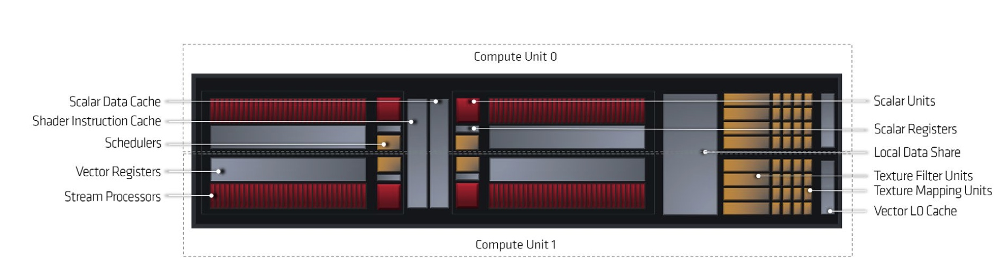

**上述说到波前：**
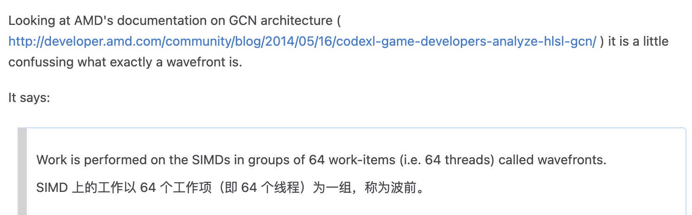

新的双计算单元设计是 RDNA 架构的精髓，并取代 GCN 计算单元成为 GPU 的基本计算构建块。如下图所示，双计算单元仍然包含四个独立运行的 SIMD。然而，这个双计算单元是专门为wave32模式设计的； RDNA SIMD 包括 32 个 ALU，宽度是上一代矢量 ALUS 的两倍，通过将波前执行速度提高 2 倍来提高性能。新的 SIMD 专为混合精度运算而构建，可使用各种数据类型进行高效计算，以实现科学计算和机器学习。下面的图 3 说明了新的双计算单元如何利用简单示例着色器中的指令级并行性在 SIMD 上执行，与上一代 GCN SIMD 相比，wave32 模式下的延迟减少了一半，wave64 模式下的延迟减少了 44%。

指令问题示例如下：
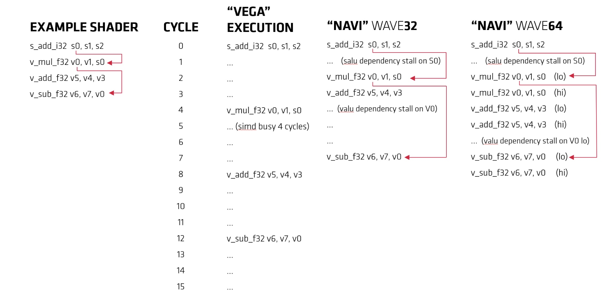
RDNA 架构还重新定义了缓存和内存层次结构，以增加图形和计算的带宽、降低功耗并为未​​来实现更大的扩展。早期的架构采用两级缓存层次结构。一般来说，第一级缓存是每个 GCN 计算单元私有的，并且专注于计算。第二级缓存是全局共享的 L2，它位于内存控制器旁边，并将数据传递给计算单元和图形功能，例如几何引擎和像素管道。

为了满足更强大的双计算单元，标量和矢量数据的 L0 缓存也进行了扩展。新架构引入了专门的中间级缓存层次结构，即为一组双计算单元和像素管道提供服务的共享图形 L1 缓存。这种安排减轻了全局共享二级缓存的压力，该缓存仍然与内存控制器密切相关。
# RDNA系统架构
基于 RDNA 架构构建的图形处理器 (GPU) 将涵盖从节能笔记本电脑和智能手机到一些世界上最大的超级计算机。为了适应如此多的不同场景，整个系统架构的设计实现了极致的可扩展性，同时比前几代产品提升了性能。下面的图 4 显示了 7nm Radeon RX 5700 XT，它是 RDNA 架构的首批版本之一。
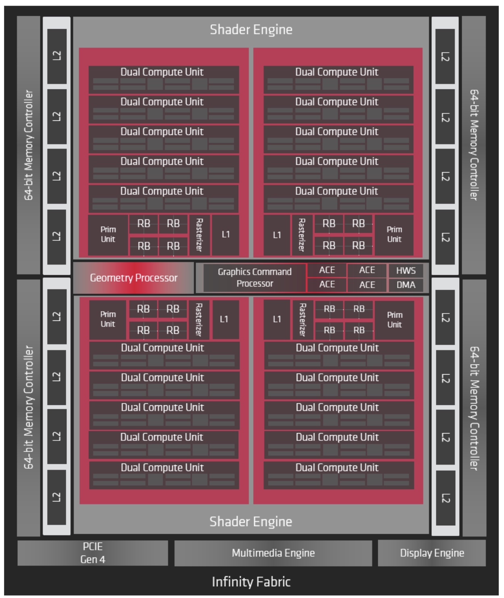

RX 5700 XT 分为几个主要模块，这些模块均使用 AMD 的 Infinity Fabric 连接在一起。命令处理器和 PCI Express 接口将 GPU 连接到外部世界并控制各种功能。两个着色器引擎容纳所有可编程计算资源和一些专用图形硬件。两个着色器引擎均包含两个着色器阵列，其中包括新的双计算单元、共享图形 L1 缓存、基元单元、光栅化器和四个渲染后端 (RB)。此外，GPU 还包括用于多媒体和显示处理的专用逻辑。对内存的访问通过分区的二级缓存和内存控制器进行路由。

RDNA 架构是第一个使用 PCIe® 4.0 与主机处理器连接的 GPU 系列。主机处理器运行驱动程序，该驱动程序发送 API 命令并与 GPU 进行数据通信。全新 PCIe® 4.0 接口的运行速度为 16 GT/s，是早期基于 PCI-E 3.0 的 8 GT/s GPU 吞吐量的两倍。在沉浸式 4K 或 8K 纹理时代，更大的链路带宽可以节省电量并提高性能。

虚拟机管理程序代理使 GPU 能够虚拟化并在不同操作系统之间共享。大多数云游戏服务都位于数据中心，从安全和运营的角度来看，虚拟化至关重要。虽然现代游戏机专注于游戏，但许多游戏机提供了丰富的通信和媒体功能，并受益于虚拟化硬件来为所有任务提供性能。

命令处理器接收API命令并依次操作GPU中的不同处理管道。图形命令处理器管理传统图形管道（例如 DirectX®、Vulkan®、OpenGL®）着色器任务和固定功能硬件。计算任务是使用管理计算着色器的异步计算引擎 (ACE) 实现的。每个 ACE 维护一个独立的命令流，并且可以将计算着色器波前分派到计算单元。类似地，图形命令处理器具有针对每种着色器类型（例如顶点和像素）的流。命令处理器安排的所有工作都分布在固定功能单元和着色器阵列中，以实现最大性能。

RDNA 架构引入了一种新的调度和服务质量功能，称为异步计算隧道，使计算和图形工作负载能够在 GPU 上和谐共存。在正常操作中，许多不同类型的着色器将在 RDNA 计算单元上执行并向前推进。然而，有时一项任务可能比其他工作对延迟更加敏感。在前几代中，命令处理器可以优先考虑计算着色器并减少可用于图形着色器的资源。如下图所示，RDNA 架构可以完全暂停着色器的执行，从而释放所有计算单元来执行高优先级任务。这种调度能力对于确保

RDNA 架构中的异步计算隧道如下：

# RDNA着色器（渲染？）阵列和图形功能
传统的图形管道首先将顶点组装成三角形；应用顶点着色器；可选择应用外壳着色器、曲面细分和域着色器；将三角形光栅化为像素；对像素进行阴影处理；然后混合输出。此外，计算着色器可用于许多不同的阶段以获得高级效果。

命令处理器和调度逻辑将划分计算和图形工作，以便将其分派到阵列以获得最大性能。例如，图形管道的一种非常常见的方法是对屏幕空间进行分区，然后独立地调度每个分区。开发人员还可以创建自己的调度算法，这对于基于计算的效果特别有用。

为了实现可扩展性和性能，RDNA 架构由多个独立阵列构建而成，其中包括固定功能硬件和可编程双计算单元。为了将性能从低端扩展到高端，不同的 GPU 可以增加着色器阵列的数量，并改变每个着色器阵列内的资源平衡。如下所示，Radeon RX 5700 XT 包括四个着色器阵列，每个着色器阵列包括一个基元单元、一个光栅化器、四个 RB、五个双计算单元和一个图形 L1 缓存。

基本单元从顶点组装三角形，并且还负责固定功能镶嵌。每个基元单元都得到了增强，支持每个时钟最多剔除两个基元，速度是上一代的两倍。每个时钟一个基元被输出到光栅化器。命令处理器中的工作分配算法也经过调整，可以在不同的着色器阵列之间更均匀地分配顶点和细分多边形，从而提高几何体的吞吐量。

每个着色器引擎中的光栅化器执行从图形管道的以几何为中心的阶段到以像素为中心的阶段的映射。每个光栅器可以处理一个三角形，测试覆盖范围，并每个时钟发射最多 16 个像素。与其他固定功能硬件一样，屏幕被细分，每个部分都分配给一个光栅器。

最后的固定功能图形阶段是 RB，它执行深度、模板和 Alpha 测试并混合像素以实现抗锯齿。着色器阵列中的每个 RB 都可以以每时钟 4 个输出像素的速率测试、采样和混合像素。 RDNA架构的主要改进之一是RB主要通过图形L1缓存访问数据，这减少了L2缓存的压力，并通过移动更少的数据来节省电量。

最后，着色器阵列由多个双计算单元和一个图形 L1 缓存组成。双计算单元提供用于执行可编程着色器的计算。每个双计算单元包含四个可以执行 wave32 的 SIMD，每个周期总共 256 个单精度 FLOPS，对于可以使用混合精度的应用程序甚至更多。 SIMD 还包含强大的专用标量单元和更高带宽的缓存。新的图形 L1 缓存可满足每个着色器阵列中的大多数请求，从而简化 L2 缓存的设计并提高可用带宽。

# 双计算单元前端
更强大的双计算单元从专用前端开始，如下图所示。L0 指令缓存在双计算单元内的所有四个 SIMD 之间共享，而之前的指令缓存在四个 CU（或 16 个 GCN SIMD）之间共享。指令缓存为32KB，4路组相联；它被组织成 4 个组，每组 128 个缓存行，长度为 64 字节。四个 SIMD 中的每一个都可以在每个周期请求指令，指令缓存可以在每个时钟周期向每个 SIMD 提供 32B（通常是 2-4 条指令）——大约比 GCN 的带宽大 4 倍。

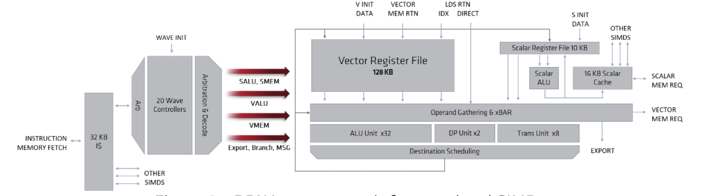
获取的指令被存入波前控制器。每个 SIMD 都有一个单独的指令指针和一个 20 条目波前控制器，每个双计算单元总共有 80 个波前。尽管双计算单元同时维护 32 个工作组，但波前可以来自不同的工作组或内核。新的波前控制器可以在wave32或wave64模式下运行。

虽然 RDNA 架构针对wave32 进行了优化，但现有的wave64 模式对于某些应用来说可能更有效。为了处理wave64指令，波控制器发出和执行两条wave32指令，每条指令操作wave64指令的一半工作项。处理wave64指令的默认方法是简单地连续发出并执行每条指令的上半部分和下半部分——概念上水平分割每条指令。

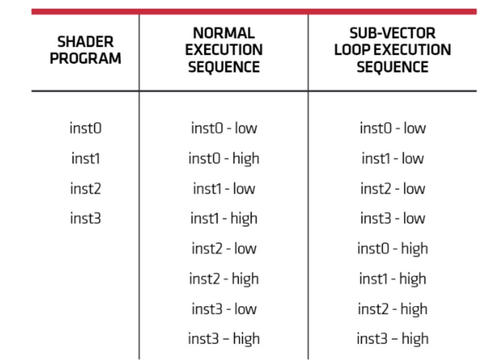

RDNA架构还引入了软件控制的子向量模式，将指令序列切成两半，首先处理所有指令的下半部分，然后处理上半部分。上图在简单的四指令循环上说明了这两种方法。这两种模式将实现相同的执行单元利用率，并在八个周期内完成循环的完整迭代。然而，一旦 inst3 的低半部分在周期 4 中执行完毕，子向量模式就可以释放其一半寄存器，并且可以更有效地使用高速缓存。

RDNA 架构引入的另一个强大工具是子句，它使软件能够更好地控制指令组的执行。子句修改标量和向量 SIMD 管道中的计算和内存指令的行为。特别是，除了软件指定的中断之外，子句中的指令是不可中断的。子句可以实现更智能的调度。例如，向量加载指令的子句保证在被逐出之前从所获取的缓存行中读取所有数据，从而最大限度地提高带宽和功率效率。类似地，形成计算指令子句可确保所有结果均可写回到高速缓存或由后续指令使用。

一旦指令被提​​取到波前缓冲器中，下一步就是在 SIMD 内解码和发出指令。在上一代中，SIMD 以循环方式解码和发出指令，将吞吐量限制为每四个周期一次。 RDNA 架构的核心原则之一是减少延迟，以利用每个波前的指令级并行性。因此，每个 RDNA SIMD 可以在每个周期解码和发出指令，从而提高吞吐量并将延迟减少 4 倍。

双计算单元包括新的调度机制，以确保一致的前进进度。前几代人倾向于从最古老的波前发出指令，有时工作组内的不同波前会取得不平衡的进展。计算单元调度程序具有可由软件激活的新的最旧工作组调度策略。使用这种调度算法，工作组内的波前将倾向于取得更一致的进展，并改善缓存内的局部性，通过更有效地移动数据来节省电力。
# SIMD执行单元
SIMD是 单指令流多数据流（英语：Single Instruction Multiple Data，缩写：SIMD）是一种采用一个控制器来控制多个处理器，同时对一组数据（又称“数据向量”）中的每一个分别执行相同的操作从而实现空间上的并行性的技术。
在微处理器中，单指令流多数据流技术则是一个控制器控制多个平行的处理微元，例如Intel的MMX或SSE，以及AMD的3D Now!指令集。
图形处理器（GPU）拥有强大的并发处理能力和可编程流水线，面对单指令流多数据流时，运算能力远超传统CPU。OpenCL和CUDA分别是目前最广泛使用的开源和专利通用图形处理器（GPGPU）运算语言。
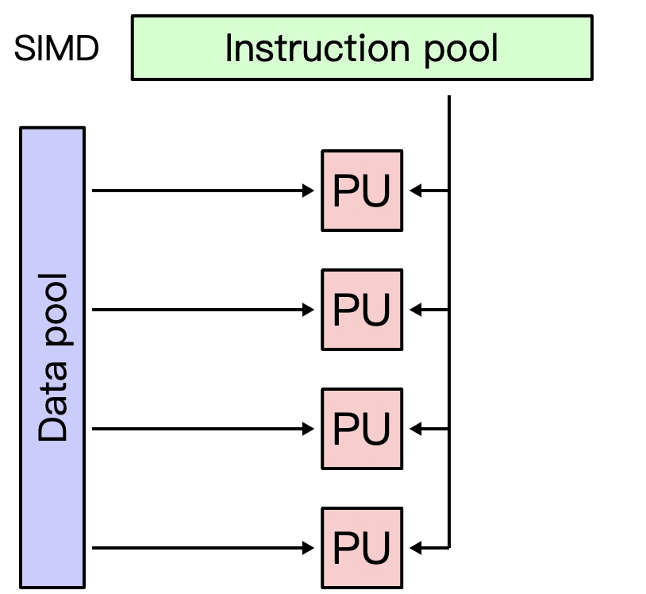
RDNA 前端每个周期可以向每个 SIMD 发出 4 条指令，其中包括向量、标量和内存管道的组合。标量管道通常用于控制流和一些地址计算，而矢量管道为着色器提供计算吞吐量并由内存管道提供。
# 标量执行和控制流
GCN 架构引入了标量执行单元，由四个 GCN SIMD 共享，用于处理计算应用程序的控制流和地址生成。 RDNA 双计算单元通过为每个 SIMD 提供自己的专用标量管道，将其提升到一个新的水平，从而提高通用应用程序的性能。
每个 SIMD 包含一个 10KB 标量寄存器文件，其中 20 个波前各有 128 个条目。寄存器为 32 位宽，可以保存打包的 16 位数据（整数或浮点），相邻的寄存器对保存 64 位数据。当波前启动时，标量寄存器文件可以预加载多达 32 个用户寄存器来传递常量，从而避免显式加载指令并减少波前的启动时间。

尽管已针对较小的波前进行了调整，但分支管道与上一代相比基本没有变化。它处理条件分支和中断。计算分支目标。此外，标量ALU用于在标量数据缓存中读取或写入数据时进行地址计算。

与指令高速缓存一样，标量高速缓存由双计算单元中的所有 SIMD 共享。 16KB 回写标量高速缓存是 4 路关联的，由两组 128 个 64B 高速缓存线组成。每个存储体都可以读取完整的高速缓存行，并且高速缓存可以每个时钟向每个 SIMD 中的标量寄存器文件传送 16B 数据。对于图形着色器，标量缓存通常用于存储常量和工作项自变量。

标量 ALU 访问标量寄存器文件并执行基本的 64 位算术运算。标量 ALU 用于各种控制目的，例如计算将在整个波前广播的值、管理波前的谓词，以及
# 矢量执行
现代图形处理器的卓越性能和效率源自矢量执行单元的并行计算能力。如下 所示，计算单元的最大改进之一是将 SIMD 的大小加倍并支持背靠背执行。当使用更高效的wave32波前时，新的SIMD可提高IPC并将延迟缩短4倍。

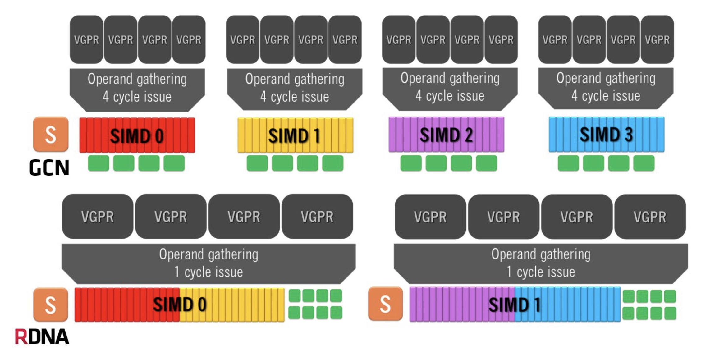

此前，GCN 中的交错向量方法需要围绕四周期向量指令调度其他指令。更大的 RDNA 双计算单元还简化了编译器设计，并通过每个周期调度和发出独立指令来实现更高效的代码处理混合精度。对于较大的 64 位（或双精度）FP 数据，相邻寄存器组合在一起以保存完整的数据波前。更重要的是，计算单元向量寄存器本身支持打包数据，包括两个半精度（16 位）FP 值、四个 8 位整数或八个 4 位整数。
# 矢量 ALU
双计算单元的计算能力位于 SIMD 中，这些 SIMD 已得到全面增强，可实现更高的性能和附加功能。 SIMD向量执行管道包含多种类型的执行单元。每个 SIMD 每个时钟只能向矢量 ALU 发出一个波前，但较长延迟的操作可能会重叠执行。

主向量 ALU 是一个 32 通道管线，其宽度是上一代的两倍，使 SIMD 能够在每个时钟周期完成一个波前，而不是在 GCN 中占用四个周期。各个通道针对融合乘法累加 (FMA) 运算进行了重新设计，与上一代乘加单元相比，提高了计算精度并降低了功耗。

这些通道也经过了重新架构，以便有效地执行各种数据类型，下图所示。执行单元以全速率以及 24 位/32 速率执行单精度 FMA、加法、乘法或其他通用 FP 运算。位整数乘法累加。打包半精度 FP 或 16 位整数运算以两倍的吞吐量运行。矢量 ALU 具有新的混合精度 FMA，可计算 16 位乘法并累加为 32 位结果，以避免丢失整数或 FP 数据的任何精度。虽然矢量 ALU 主要从高带宽 vGPR 读取数据，但标量寄存器文件现在每个时钟向每个通道提供最多两个广播操作数。

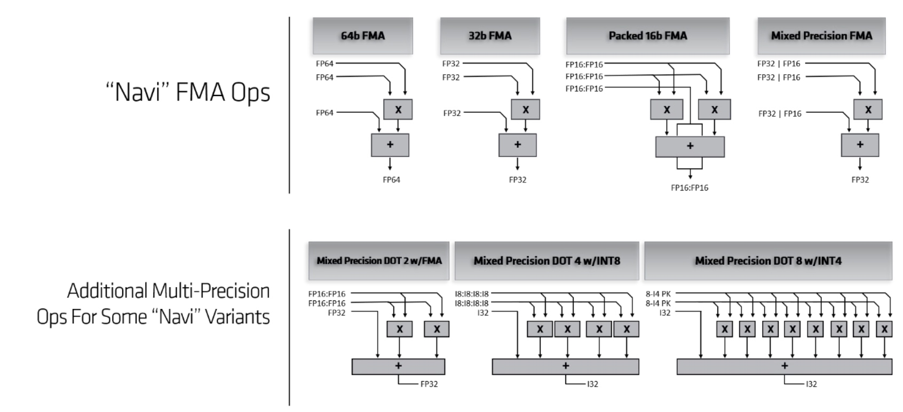

双计算单元的一些变体在 ALU 中公开了额外的混合精度点积模式，主要用于加速机器学习推理。混合精度 FMA dot2 将计算两个半精度乘法，然后将结果添加到单精度累加器。为了获得更大的吞吐量，一些 ALU 将支持 8 位整数 dot4 运算和 4 位 dot8 运算，所有这些运算都使用 32 位累加器来避免任何溢出。
SIMD 对双精度数据使用单独的执行单元。每个实现都包含 2 到 16 个双精度管道，可以执行 FMA 和其他 FP 操作，具体取决于目标市场。因此，双精度波前的延迟从两个周期到十六个周期不等。双精度执行单元与主向量 ALU 分开运行，并且可以重叠执行。

双计算单元包括新的超越执行单元，以加速图形和通用计算中使用的更复杂的数学运算。每个 SIMD 包含一个 8 通道超越单元，可以与主向量 ALU 重叠执行，并将在四个时钟周期内完成波前。

双计算单元在向量执行管道内包括一个交叉开关，并引入了一些新的通信指令。在一些以前的架构中，跨通道操作（即波前中的不同工作项之间）相当昂贵。 SIMD 中的新数据路径专为全速跨通道数据读取、排列、混合和其他操作而设计。
# 双计算单元内存
总的来说，除了标量运算之外，双计算单元中的四个 SIMD 每个周期还可以维持令人印象深刻的 256 次 FLOP。双计算单元内存层次结构已经发展到可以跟上这种性能水平，并提供足够的数据来利用计算资源。为了高效地提供数据，RDNA 架构包括三级缓存：双计算单元内的 L0 缓存、阵列内的共享 L1 缓存以及全局共享的 L2 缓存。此外，显式寻址的本地数据共享 (LDS) 现在是整个地址空间的一部分，从而简化了编程。

内存层次结构从 SIMD 内开始，如下所示。每个 SIMD 中的缓存和内存管道都经过重新设计，可在每个时钟周期维持完整的波形32 – 吞吐量是上一代产品的两倍。每个 SIMD 都有一个 32 宽的请求总线，可以将波前中每个工作项的地址传输到内存层次结构；对于存储操作，请求总线将提供 32x4B 的写入数据。请求的数据通过 32 宽返回总线传回，并可直接提供给 ALU 或 vGPR。请求和返回总线通常与 128 字节高速缓存线一起工作，并扇出到显式寻址的 LDS、高速缓存内存和纹理单元。为了提高效率，成对的 SIMD 共享一条请求和返回总线，尽管单个 SIMD 实际上每个时钟可以接收两条 128 字节高速缓存行，一条来自 LDS，另一条来自 L0 高速缓存。
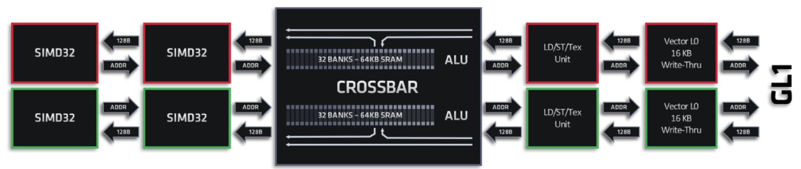

# 本地数据共享和原子（操作？）
计算单元可用的第一种类型的内存是本地数据共享 (LDS)，它是一种低延迟和高带宽的显式寻址内存，用于工作组内的同步以及与纹理相关的一些图形功能。

每个计算单元都可以访问双倍的 LDS 容量和带宽。新的 LDS 由两个 64KB 阵列构建，每个阵列有 32 个存储体。与上一代产品一样，每个存储体包含 512 个 32 位宽的条目，并且可以维持每个周期的读写。每个 LDS Bank 都包含一个执行原子操作（包括 FP 最小值和最大值）的 ALU。保持库大小并增加库数量可确保现有着色器平稳运行，同时使吞吐量和性能加倍。

LDS 包括一个交叉开关，用于在波前通道和组之间移动数据，还可以广播或复制数据。通常，来自波前的所有访问将在单个周期内完成；然而，硬件会自动检测冲突，并将对单个 LDS 组的多次访问串行化。

RDNA 架构有两种 LDS 操作模式：计算单元和工作组处理器模式，由编译器控制。前者旨在匹配 GCN 架构的行为，并将 LDS 容量静态地划分为两对 SIMD 之间的相等部分。通过匹配GCN架构的容量，该模式确保现有着色器能够高效运行。然而，工作组处理器模式允许使用更大的 LDS 分配来提高单个工作组的性能。
# 矢量缓存
第二种类型的可用内存是标准虚拟化地址空间，它在片上缓存以实现高性能。 RDNA 架构从头开始重建了缓存层次结构，以实现更低的延迟、更高的带宽和更高的效率。
新的缓存层次结构以 LDS 使用的相同 SIMD 请求和响应总线开始；由于总线针对 32 宽数据流进行了优化，因此吞吐量是 GCN 的两倍。此外，每个双计算单元包含两条总线，每条总线将一对 SIMD 连接到 L0 矢量缓存和纹理过滤逻辑，从而提供比上一代高 4 倍的总带宽。

地址计算逻辑从请求总线获取 32 个地址，并将针对同一 128 字节高速缓存行的请求合并在一起。通过将潜在请求的数量加倍，合并会更加有效，从而提高性能和能效。

每个 L0 矢量缓存为 16KB 和 4 路组关联，具有 128 字节缓存线，可在每个周期提供完整的数据波前。 L0 缓存是直写式的，并使用 LRU 替换策略。虽然工作组内的每个 L0 都是一致的，但软件必须确保双计算单元内的两个 L0 缓存之间的一致性。当缓存命中时，L0 缓存将读出 128 字节缓存行并通过响应总线将结果传回。对于完全合并的访问，128 字节缓存线对应于每个工作项 32 位，完全满足 wave32。
RDNA 架构的一项新功能是图像加载运行速度必须更快。不执行采样的图像加载将绕过纹理插值硬件，并以与缓冲区加载相同的速率运行，从而将吞吐量提高 8 倍，并在 L0 缓存命中的情况下将延迟减少 35%，即使在执行格式转换时也是如此。这使得通常依赖于图像访问的计算着色效果能够提供更高的性能和效率。
图形纹理存储在 L0 矢量缓存中，其访问方式与数据类似。然而，结果首先被传递到纹理映射单元，该单元可以在每个时钟内对最多八个纹理地址执行过滤——同样是上一代吞吐量的两倍。对于每个地址，TMU 将对四个最近邻居进行采样、解压缩数据并执行插值。最终的纹素值通过响应总线传回 SIMD。纹理映射单元还将 64 位双线性过滤的性能提高了一倍（每个 RGBA 通道使用 16 位 FP）。
在以前的架构中，AMD 引入了增量颜色压缩来减少带宽并节省功耗。 RDNA 架构包括增强的压缩算法，可以节省额外的带宽。此外，纹理映射单元可以将压缩的颜色数据写入L2缓存和内存层次结构的其他部分，而在早期的架构中，压缩的数据只能写回内存。
向量 L0 高速缓存中未命中的数据访问将继续到内存层次结构的外层。 SIMD 按程序顺序从 L0 缓存读取数据。然而，整个缓存层次结构是为积极的重新排序而设计的，以便可以从许多不同的来源（例如图形 L1、L2 缓存、内存）收集数据并有效地组合。
# 导出和GDS
导出指令将向量寄存器文件中保存的可编程着色器的结果传输到系统其余部分可访问的专用缓冲区。例如，当像素着色器完成计算时，它将导出像素的颜色和/或深度，以便可以在显示之前混合像素。
导出指令可以针对全局数据共享 (GDS)。 GDS 是一种全局共享的显式寻址存储器，与 LDS 类似，可以同步所有波前以及固定功能硬件。 GDS 还包含用于全局原子操作的 ALU。每个双计算单元中的导出单元最多可以向原始单元、RB 或 GDS 发送 4 个 vGPR。
# 共享图形 L1 缓存
虽然转向 7nm 等新工艺技术会减少晶体管的面积和功耗，但最大的挑战之一是电线的性能和效率往往保持不变或变得更糟。因此，长距离发送数据变得越来越昂贵。为了应对这一挑战，RDNA 架构引入了新的图形 L1 缓存，如下图所示。图形 L1 缓存在一组双计算单元之间共享，可以满足许多数据请求，减少了跨芯片传输的数据，从而提高了性能。性能并改善功耗。此外，中间图形L1缓存提高了可扩展性并简化了L2缓存的设计。
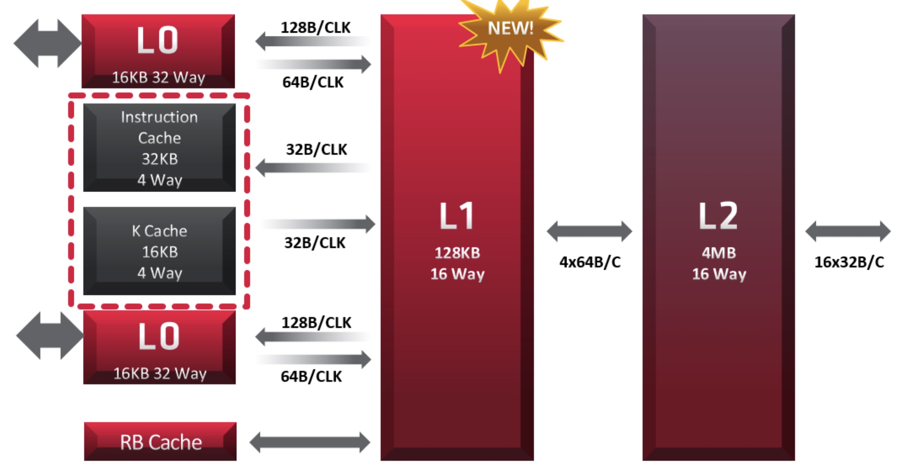

在 GCN 架构中，全局 L2 缓存负责服务来自每核 L1 缓存的所有未命中、来自几何引擎和像素后端的请求以及任何其他内存请求。相比之下，RDNA 图形 L1 将所有缓存功能集中在每个着色器阵列内。来自任何 L0 高速缓存（指令、标量或矢量数据）的访问都会继续到图形 L1。此外，图形 L1 还为来自着色器阵列中相关像素引擎的请求提供服务。

图形L1缓存是只读缓存，由全局共享图形L2支持；对图形 L1 中任何行的写入都会使该行无效并命中 L2 或内存。有一个显式的旁路控制模式，以便着色器可以避免将数据放入图形 L1 中。

与 L0 矢量缓存一样，每行都是 128 字节 - 与双计算单元的典型请求一致。每个 L1 大小为 128KB，有 4 个组，并且是 16 路组关联。 L1 缓存控制器将在传入的内存请求之间进行仲裁，并选择四个来为每个时钟周期提供服务。图形 L1 高速缓存中未命中的内存访问将被路由到 L2 高速缓存。
# L2 缓存和内存
RDNA 缓存层次结构的一个显着优势是，对 L2 缓存的所有内存请求均通过图形 L1 缓存进行路由。每个着色器阵列包含10-20个请求数据的不同代理，但从L2缓存的角度来看，只有图形L1在请求数据。通过减少可能的请求者数量，片上数据总线变得更简单且更易于布线。

L2 缓存在整个芯片上共享，并在物理上划分为多个片。四个 L2 高速缓存片与每个 64 位内存控制器关联，以吸收和减少流量。该高速缓存是 16 路组关联的，并通过更大的 128 字节高速缓存行进行了增强，以匹配典型的 wave32 内存请求。切片非常灵活，可以配置为 64KB-512KB，具体取决于特定产品。在RX 5700 XT中，每个片为256KB，总容量为4MB。
RDNA 架构的内存控制器和接口旨在利用最快的主流图形内存 GDDR6。每个内存控制器驱动两个具有 16 Gbit/s 接口的 32 位 GDDR6 DRAM，在大致相同的功耗预算内将上一代 GDDR5 的可用带宽提高了一倍。
# Radeon 多媒体和显示引擎
“Navi”GPU 系列还包括用于视频解码、编码和显示的极其高效的专用处理引擎。
在许多情况下，视频编码和解码可以在 RDNA 双计算单元上的软件中执行，以获得最高质量。然而，专用硬件始终会产生最佳的吞吐量和功效，同时还可以释放双计算单元来执行其他任务。视频引擎通过支持 VP9 解码得到了增强，而前几代则依赖于软件实现。
该视频引擎可以高吞吐量解码 H.264 流：1080p（600 帧/秒 (fps)）和 4K（150 fps）。它可以同时以大约一半的速度进行编码：1080p（360 fps）和 4K（90 fps）。 HVEC 和 VP9 均可以 24 fps 进行 8K 解码。为了实现更高级的压缩，视频引擎可为 8 位或 10 位颜色提供高吞吐量解码：1080p 流为 360 fps，4K 流为 90 fps，8K 流为 24 fps。编码器专为 HVEC 设计，而解码器也可以处理 VP9。
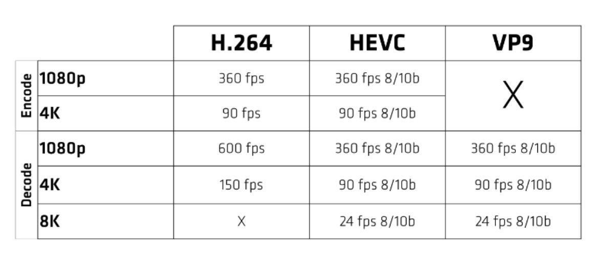

最终，计算机图形学是一个端到端的问题。随着应用程序利用附加功能和新的计算效果来创建更加身临其境的体验，显示器必须跟上步伐并将计算机生成的可视化效果转化为现实。 RDNA 显示引擎主要针对 4K 和 8K 显示器以及高动态范围 (HDR) 进行了重新设计和优化。

HMDI® 输出提供 HDMI® 2.0b 的全 18 Gbps 速度，支持 60 Hz 的 4K 或 240 Hz 的 1080P。 DisplayPort 1.4a 连接具有相同的原始带宽，在现有电缆上高达 32.4 Gbps，但增加了显示流压缩 (DSC)，这使得未来能够支持高达 60 Hz 的 8K HDR 和 240 Hz 的 4K HDR 显示器。

DSC 是一种行业标准、低延迟、视觉无损的压缩算法，由 VESA® 开发和批准。对于 HDR 和 SDR，DSC 可以将无需色度子采样 (4:4:4) 的视频压缩至低至 8 位/像素。这使得 4K HDR 显示器能够以 144 Hz 及以上的频率运行，而不会牺牲图像质量；例如，没有 DSC 的传统系统需要色度子采样（4:2:2 或 4:2:0），这会引入色彩伪影。 DSC 将 HDR 和 SDR 流压缩到相同的比特率，这使得它们可以互换使用，并避免显示电缆限制造成的任何视觉质量（例如，降低分辨率或刷新率）损失。