# 代码结构

## Kconifg 路径
ROCK-Kernel-Driver/drivers/Kconfig
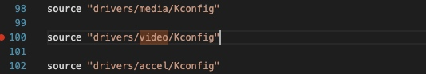
/ROCK-Kernel-Driver/drivers/video/Kconfig
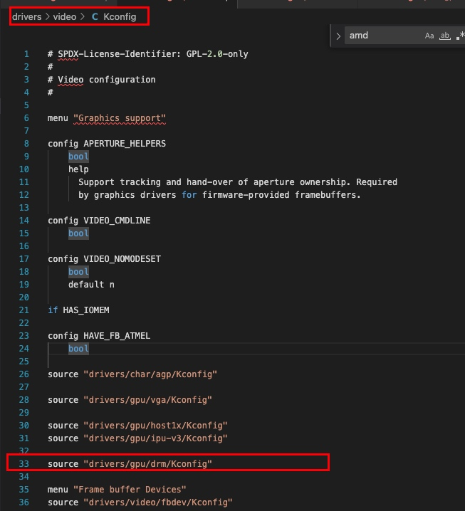


drivers/gpu/drm/Kconfig
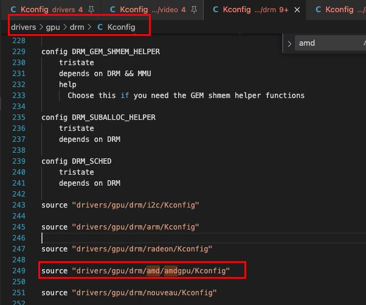
drivers/gpu/drm/amd/amdgpu/Kconfig
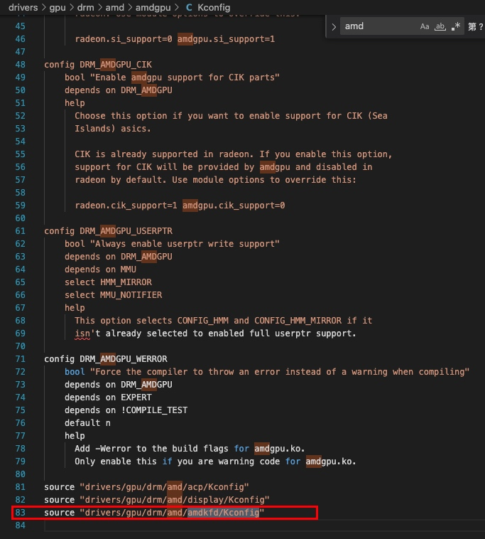

drivers/gpu/drm/amd/amdkfd/Kconfig

```
# SPDX-License-Identifier: MIT
#
# Heterogeneous system architecture configuration
#

config HSA_AMD
	bool "HSA kernel driver for AMD GPU devices"
	depends on DRM_AMDGPU && (X86_64 || ARM64 || PPC64)
	select HMM_MIRROR
	select MMU_NOTIFIER
	select DRM_AMDGPU_USERPTR
	help
	  Enable this if you want to use HSA features on AMD GPU devices.

config HSA_AMD_SVM
	bool "Enable HMM-based shared virtual memory manager"
	depends on HSA_AMD && DEVICE_PRIVATE
	default y
	select HMM_MIRROR
	select MMU_NOTIFIER
	help
	  Enable this to use unified memory and managed memory in HIP. This
	  memory manager supports two modes of operation. One based on
	  preemptions and one based on page faults. To enable page fault
	  based memory management on most GFXv9 GPUs, set the module
	  parameter amdgpu.noretry=0.

config HSA_AMD_P2P
	bool "HSA kernel driver support for peer-to-peer for AMD GPU devices"
	depends on HSA_AMD && PCI_P2PDMA && DMABUF_MOVE_NOTIFY
	help
	  Enable peer-to-peer (P2P) communication between AMD GPUs over
	  the PCIe bus. This can improve performance of multi-GPU compute
	  applications and libraries by enabling GPUs to access data directly
	  in peer GPUs' memory without intermediate copies in system memory.

	  This P2P feature is only enabled on compatible chipsets, and between
	  GPUs with large memory BARs that expose the entire VRAM in PCIe bus
	  address space within the physical address limits of the GPUs.
```
上图对应到下面
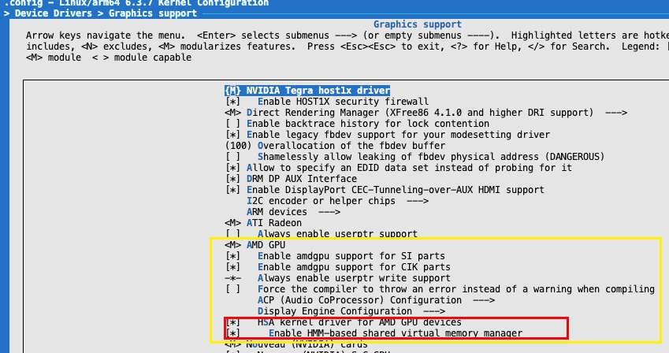
## 源文件
amd gpukfd 路径在：

**drivers/gpu/drm/amd/amdkfd/**

整体文件夹如下：
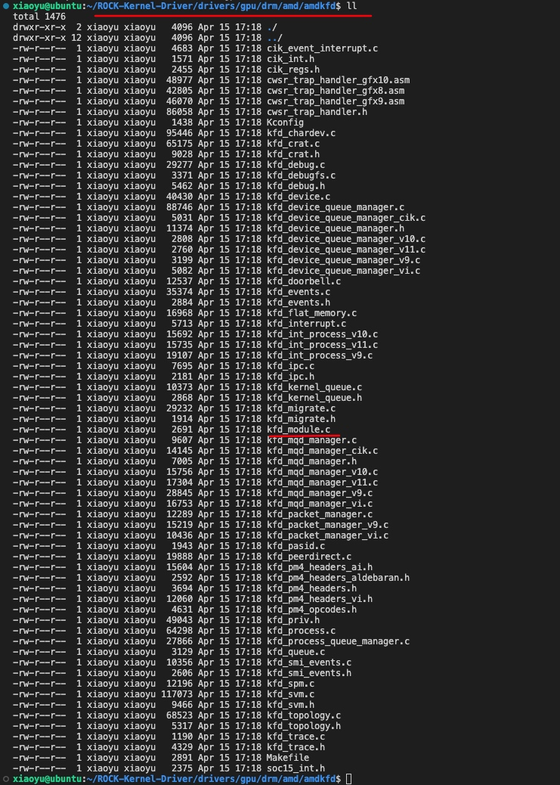

## Makefile 编译规则
第一个关键的makefile文件路径为：
**ROCK-Kernel-Driver/drivers/gpu/Makefile**

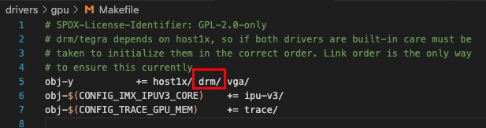

第二个关键的makefile文件路径为：
**drivers/gpu/drm/Makefile****
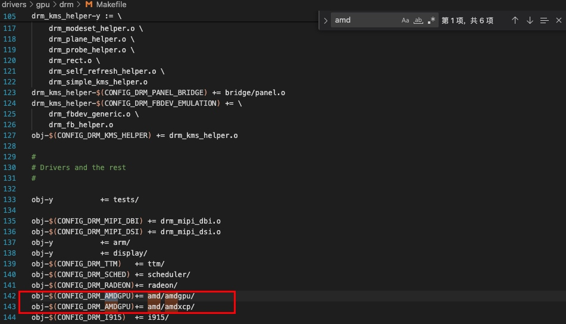

其中 **CONFIG_DRM_AMDGPU**和 ROCK-Kernel-Driver/drivers/gpu/drm/amd/amdgpu/Kconfig 中的**DRM_AMDGPU** 相对应。

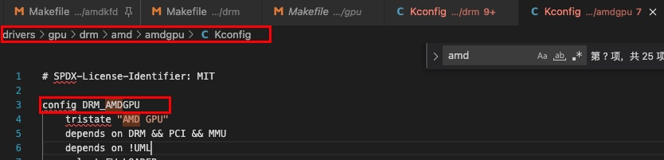

第三个关键的makefile文件路径为：
drivers/gpu/drm/amd/amdgpu/Makefile

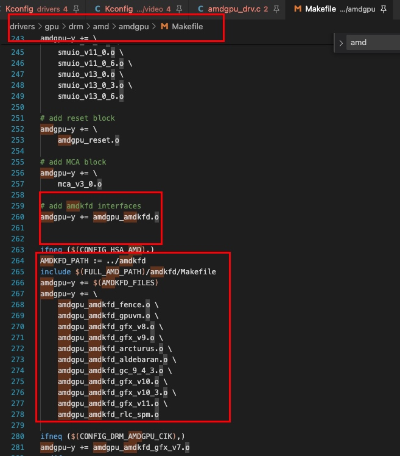

从上面的Makefile中  **CONFIG_HSA_AMD**生效了才会编译KFD相关的东西，该选项和drivers/gpu/drm/amd/amdkfd/Kconfig中的**HSA_AMD** 对应

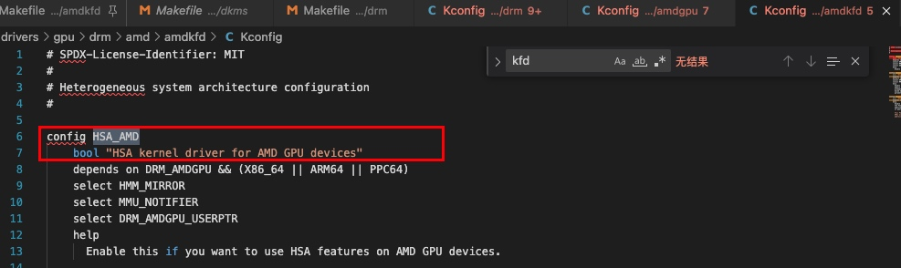

第四个关键的makefile文件路径为：**/drivers/gpu/drm/amd/amdkfd/Makefile**
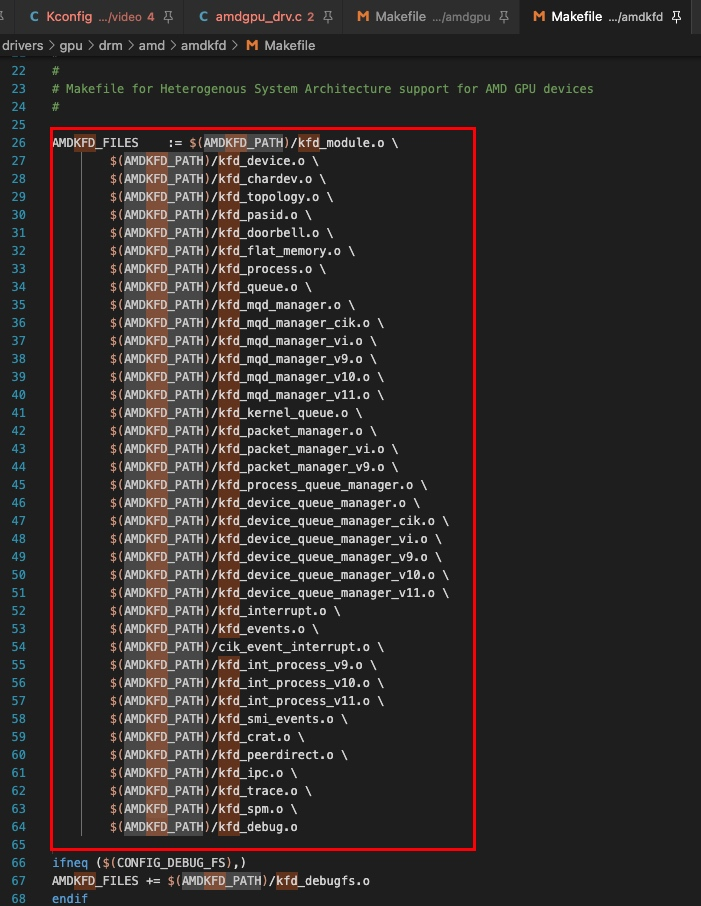
所以基本上上述的编译关系和相关Kconfig 宏控制的依赖就是这样。

## 整体代码统计
通过上面的分析，主要有两个文件夹比较有用，分别是

* /ROCK-Kernel-Driver/drivers/gpu/drm/amd/amdgpu
* /ROCK-Kernel-Driver/drivers/gpu/drm/amd/amdkfd

下面是初步的一个代码统计
**ROCK-Kernel-Driver/drivers/gpu/drm/amd/amdgpu**
Total : 519 files,  228201 codes, 45106 comments, 42858 blanks, all 316165 lines
### Languages
| language | files | code | comment | blank | total |
| :--- | ---: | ---: | ---: | ---: | ---: |
| C | 254 | 194,248 | 32,289 | 36,228 | 262,765 |
| C++ | 264 | 33,727 | 12,767 | 6,581 | 53,075 |
| Makefile | 1 | 226 | 50 | 49 | 325 |

### Directories
| path | files | code | comment | blank | total |
| :--- | ---: | ---: | ---: | ---: | ---: |
| . | 519 | 228,201 | 45,106 | 42,858 | 316,165 |


**/ROCK-Kernel-Driver/drivers/gpu/drm/amd/amdkfd**
Total : 66 files,  31860 codes, 5505 comments, 6097 blanks, all 43462 lines

### Languages
| language | files | code | comment | blank | total |
| :--- | ---: | ---: | ---: | ---: | ---: |
| C | 43 | 25,049 | 4,307 | 5,323 | 34,679 |
| C++ | 22 | 6,765 | 1,174 | 770 | 8,709 |
| Makefile | 1 | 46 | 24 | 4 | 74 |

### Directories
| path | files | code | comment | blank | total |
| :--- | ---: | ---: | ---: | ---: | ---: |
| . | 66 | 31,860 | 5,505 | 6,097 | 43,462 |

## 代码初探
**amdgpu_init**
这个是GPU的初始化入口


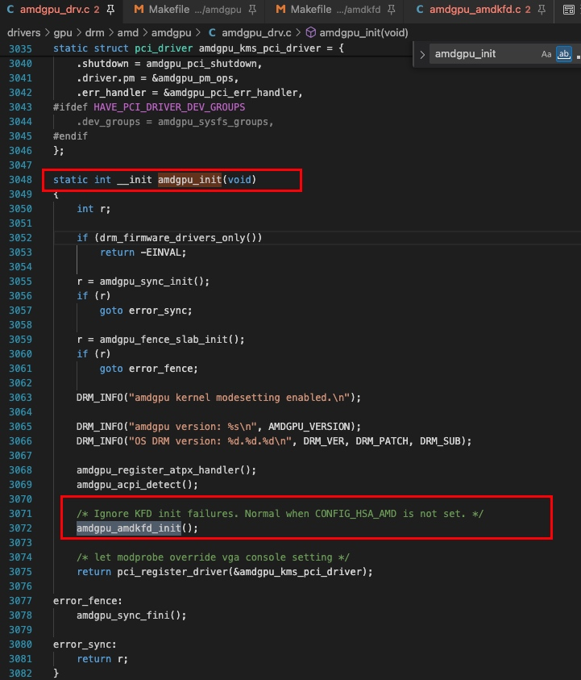

**amdgpu_amdkfd_init();**
这个是amd GPU中kfd 模块初始化的入口