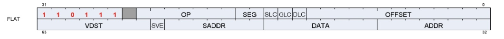
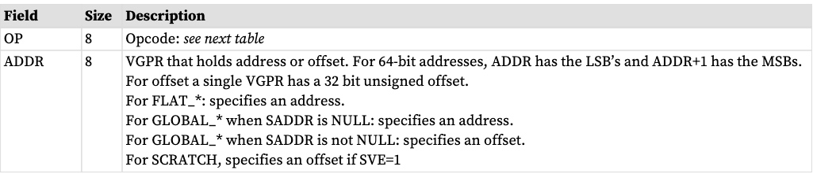
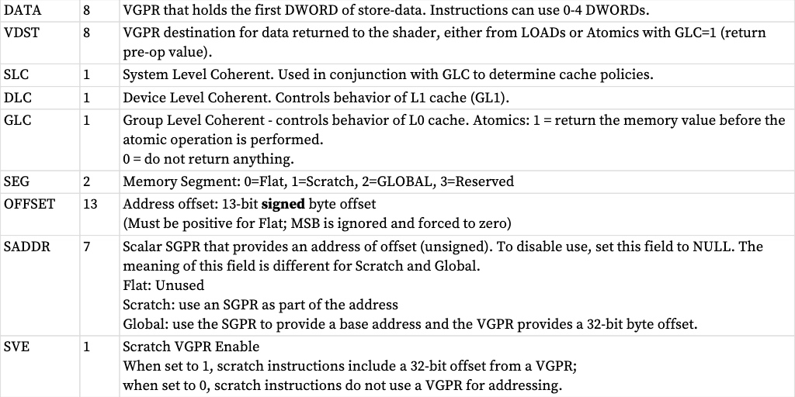
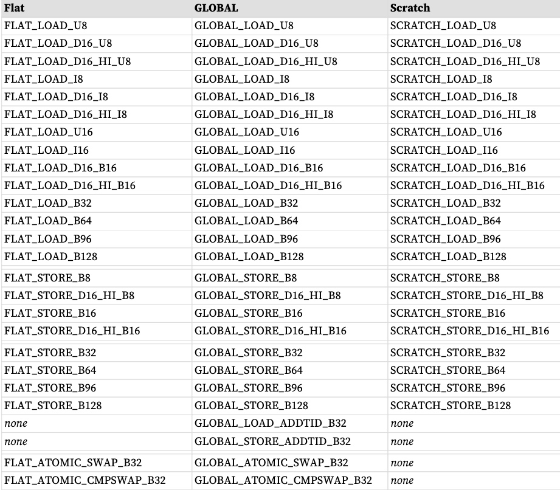
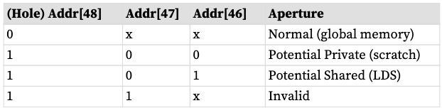
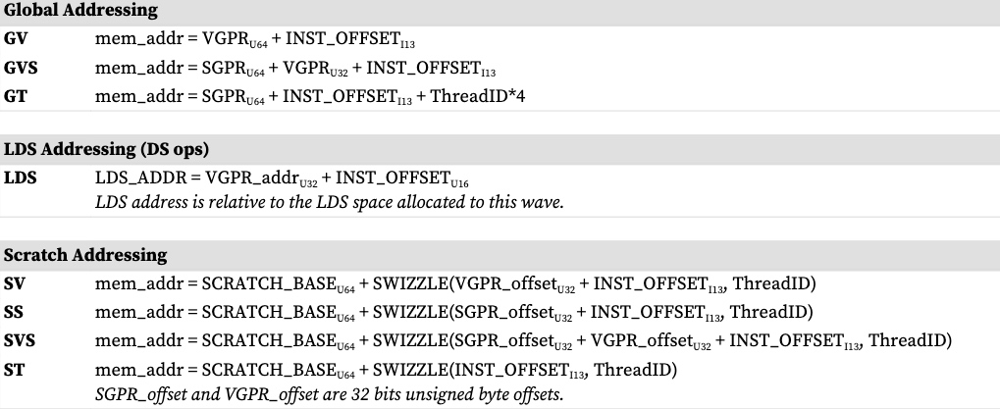
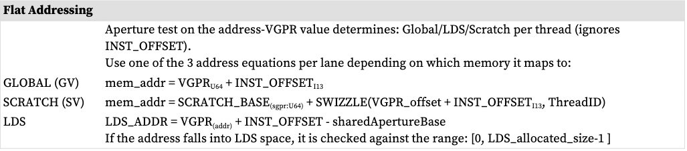
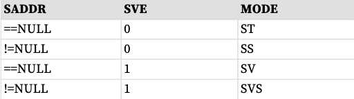
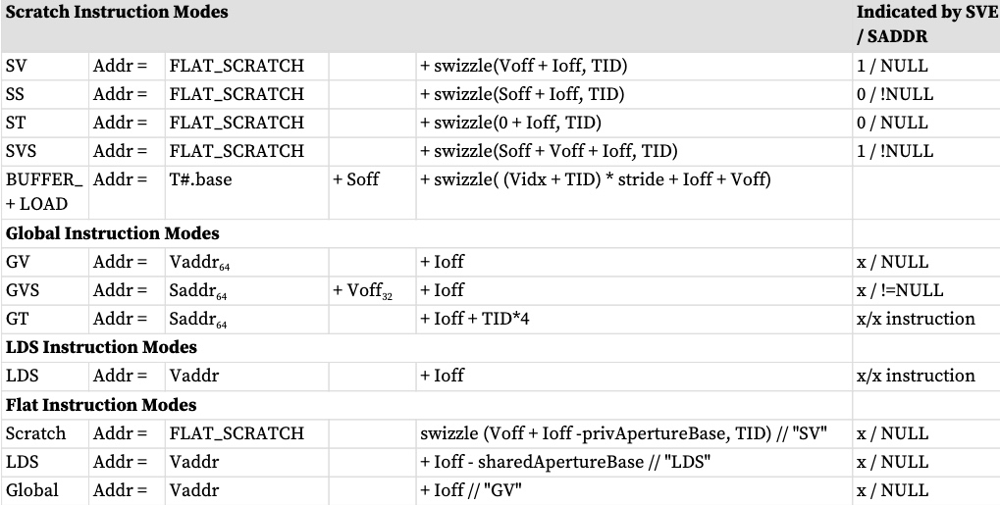

Flat、Global 和 Scratch 是 VMEM 指令的集合，允许每个线程访问全局内存、共享内存和私有内存。与缓冲区和图像指令不同，它们不使用 SRD（资源常量）。

**Flat** 是 3 种类型中最通用的一种，其中每个线程的地址可以映射到全局、私有或共享内存。内存被寻址为单个平面地址空间，其中某些内存地址孔径映射这些区域。地址映射到的存储器空间的确定由一组“存储器孔径”基址和大小寄存器控制。平面加载/存储/原子指令实际上是使用相同地址同时发出 LDS 和 GLOBAL 指令。从 ADDR VGPR 读取每个线程的地址，然后进行测试以查看数据存在于哪个地址空间中。

Flat 地址空间（“平面”）指令允许对通用内存地址指针进行加载/存储/原子访问，该指针可以解析为以下任何物理内存：
* 全局内存
* Scratch（私人）
* LDS （共享）
* 无效的
* 但是不适用于：GPR、GDS 或 LDS 参数

当所有地址都落入全局内存而不是 LDS 或 Scratch 时，使用 GLOBAL。应尽可能使用此选项（而不是“Flat”），因为 Global 不会占用 LDS 资源。 SCRATCH 类似，但用于访问暂存（私有）内存空间。

Scratch（线程私有内存）是由孔径寄存器定义的内存区域。当地址落入暂存空间时，硬件会自动执行额外的地址计算。对于分配了暂存存储器空间的wave，64位FLAT_SCRATCH寄存器使用指向该wave的私有暂存存储器的指针进行初始化。没有暂存存储器的 Wave 将 FLAT_SCRATCH 初始化为零。 FLAT_SCRATCH 是一个 64 位字节地址，由 Flat 和 Scratch 内存指令隐式使用，并且可以通过 S_GETREG 手动读取。

该指令指定哪个 VGPR 提供地址（每个工作项），并且每个工作项的该地址可以位于这些地址空间中的任何一个中。

指令字段：

下表为说明

# 指令
## FLAT  
Flat 指令集几乎与 BUFFER 指令集相同，减去 FORMAT 加载和存储。

平面指令不使用资源常量 (V#) 或采样器 (S#)，但它们确实使用特定的 SGPR 对 (FLAT_SCRATCH) 来保存暂存空间信息，以防任何线程的地址解析为暂存空间。请参阅下面的部分。

由于 Flat 指令既作为 LDS 指令又作为全局指令执行，因此 Flat 指令会同时递增 VMcnt（或 VScnt）和 LGKMcnt，并且在两者都递减之前不会被视为完成。无法先验地确定 Flat 指令是否仅使用 LDS 还是全局内存空间。

当 Flat 指令的地址落入暂存（私有）空间时，会采用不同的寻址机制用过的。 VGPR 中的地址指向该线程拥有的临时数据的特定 DWORD 的内存空间。硬件将此地址映射到保存波形中所有线程数据的实际内存地址。映射到暂存的平面原子：支持 4 字节原子，8 字节原子返回 MEMVIOL。

Wave 为每个 Flat 请求提供偏移量（分配给该 Wave 的空间）。它存储在专用的每波寄存器中：FLAT_SCRATCH，它保存 64 位字节地址。

当读取 VGPR 时，会进行孔径检查，并将无效地址路由到纹理单元。 “孔径检查”是在将“inst_offset”添加到地址之前执行的，因此未定义如果添加 inst_offset 将地址推入不同的内存孔径会发生什么。

**排序**
平面指令可能会相互乱序完成。如果一条 Flat 指令在纹理缓存中找到其所有数据，而下一条指令在 LDS 中找到其所有数据，则第二条指令可能会先完成。如果两次提取将数据返回到同一个 VGPR，则结果未知（顺序不确定）。平面指令递减 VMcnt 以便线程进入全局内存，并且这些线程与其他暂存、全局、纹理和缓冲区指令按顺序排列。每个 Flat 指令分别递增和递减 LGKMcnt。这与 VMcnt 路径是无序的，但与其他 DS (LDS) 指令是有序的。由于平面加载的数据可以来自 LDS 或纹理缓存，并且由于这些单元具有不同的延迟，因此 VMcnt/VScnt 和 LGKMcnt 计数器存在潜在的竞争条件。因此，在 Flat 指令之后使用的唯一合理的 S_WAITCNT 值为零。

## Global
全局操作在 VGPR 和全局内存之间传输数据。全局指令与 Flat 类似，但程序员有责任确保没有线程访问 LDS 或私有空间。因此，全局指令不使用 LDS 带宽。

由于这些指令不访问 LDS，因此仅使用 VMcnt（或 VScnt），而不使用 LGKMcnt。如果全局指令确实尝试访问 LDS，则该指令将返回 MEMVIOL。

Global 包括两条不使用任何 VGPR 进行寻址的指令，仅使用 SGPR 和 INST_OFFSET：
* GLOBAL_LOAD_ADDTID_B32 
* GLOBAL_STORE_ADDTID_B32
## Scratch
Scratch 指令与全局指令类似，但它们访问经过调配的私有（每线程）内存空间。因此，暂存指令不使用 LDS 带宽。 Scratch指令还支持多DWORD访问和未对齐访问（尽管未对齐速度较慢）。
由于这些指令不访问 LDS，因此仅使用 VMcnt（或 VScnt），而不使用 LGKMcnt。暂存指令不可能访问 LDS，因此不会进行错误检查（并且不会执行孔径检查）。
# 寻址
Global、Flat 和 Scratch 各有自己的寻址模式。平面寻址是全局模式和临时模式的子集。 64 位地址的 LSB 存储在位于 ADDR 的 VGPR 中，MSB 存储在位于 ADDR+1 的 VGPR 中。

有 4 种不同的着色器指令：
* GLOBAL
* SCRATCH
* LDS
* FLAT - 基于每线程地址(VGPR)，可以加载/存储：全局内存、LDS 或暂存内存。

没有对该地址进行范围检查。

Scratch 的寻址方式

**限制**
* Inst_offset：
    *  Flat 和 Scratch-ST 模式：不得为负 
    * Global、Scratch-SS 和 -SV 模式：可以为负 
    * 在 Scratch SS 模式下，inst_offset 必须与有效负载大小对齐：4 字节对齐为 1 -DWORD，16 字节对齐为 4-DWORD
        * 另外 (SADDR + INST_OFFSET) 必须至少是 DWORD 对齐的

* Scratch：Voff 和Soff 是32 位、无符号字节
* 全局：地址为64 位，偏移量为32 位
* FLAT_SCRATCH 是SGPR 对64 位地址
* “Ioff”是相对于指令字段的偏移量。
* “x”= 不关心（任一值都有效）

#  内存错误检查
纹理和 LDS 都可以报告由于地址错误而发生错误。发生这种情况的原因可能是：
* 无效地址（在任何孔径之外）
* 写入只读全局内存地址
* 数据未对齐（临时访问可能会未对齐）
* 超出范围的地址

对于地址错误的线程的策略是：超出此范围的存储不写入值，读取返回零。对无效地址的孔径检查发生在添加任何地址偏移之前 - 它仅基于基地址；其他检查是在添加偏移量后执行的。

来自 LDS 或 TA 的寻址错误将作为 MEMVIOL 返回到各自的“指令完成”总线上。这会设置波形的 MEMVIOL TrapStatus 位，并且还会导致异常（陷阱）。

# 数据
FLAT 指令可以使用 VGPR 和/或内存中的零到四个连续 DWORD 数据。 DATA 字段确定哪些 VGPR 提供源数据（如果有）并且 VDST VGPR 保存返回数据（如果有）。
不执行数据格式转换。

“D16”指令仅使用 VGPR 的 16 位，而不是完整的 32 位。 “D16_HI”指令仅读取或写入高16位，而“D16”指令使用低16位。
