矢量 ALU 指令 (VALU) 对 32 或 64 个线程中的每个线程的数据执行算术或逻辑运算，并将结果写回 VGPR、SGPR 或 EXEC 掩码。

参数插值是一个两步过程，涉及 LDS 指令和 VALU 指令，描述见：参数插值
矢量 ALU (VALU) 指令控制 SIMD32 的数学单元，并一次对 32 个数据工作项进行运算。
每条指令可以从 VGPR、SGPR 或常量获取输入，并且通常将结果返回到 VGPR。掩码结果和进位返回到 SGPR。 ALU 提供可处理整数和浮点类型的 16、32 和 64 位数据的运算。 ALU 还支持“打包”数据类型，将 2 个 16 位值打包到一个 VGPR 中，或将 4 个 8 位值打包到一个 VGPR 中。
# 微码编码
VALU 指令以下列方式之一编码：

许多 VALU 指令有两种编码：使用 64 位指令的 VOP3，以及提供有限功能集但代码大小较小的三种 32 位编码之一。有些指令仅在 VOP3 编码中可用。当一条指令有两种微码格式时，由用户决定使用哪一种。建议尽可能使用 32 位编码。也可以使用VOP2，对于“ACCUM”类型操作，其中第三个输入隐含与目标相同。
使用 VOP3 的优点包括：
* 源寻址更加灵活（所有源字段均为 9 位）
* NEG、ABS 和 OMOD 字段（仅适用于浮点）
* 用于限制输出范围的 CLAMP 字段
* 能够为VCC 选择备用源和目标寄存器（进位和出位）

以下 VOP1 和 VOP2 指令可能无法提升为 VOP3：
* 互换和互换
* fmamk、fmaak、pk_fmac

VOP3 编码有两种变体：
* VOP3 - 用于大多数指令，包括V_CMP*；具有OPSEL 和ABS 字段 
* VOP3SD - 具有SDST 字段而不是OPSEL 和ABS。此编码仅用于： 
    * V_{ADD,SUB,SUBREV}_CO_CI_U32、V_{ADD,SUB,SUBREV}_CO_U32（带进位相加） 
    * V_DIV_SCALE_{F32, F64}、V_MAD_U64_U32、V_MAD_I64_I32。
    * V_DOT2ACC_F32_F16
    * VOP3SD 不用于 V_CMP*。

任何 VALU 微代码格式都可以使用 32 位文字常量，以及 VOP3。但请注意，VOP3 加上文字构成 96 位指令，过度使用此组合可能会降低性能。

VOP3P 适用于使用“打包数学”的指令：对打包到每个操作数的高 16 位和低 16 位中的一对输入值执行运算的指令；两个 16 位结果作为两个打包值写入单个 VGPR。

# 操作数
大多数 VALU 指令至少需要一个输入操作数。操作数的数据大小在指令名称中明确定义。例如，V_FMA_F32 对 32 位浮点数据进行操作。

VGPR 对齐：对于单浮点或双浮点操作没有对齐限制。
下表 VALU 指令操作数 

## 操作数字段的非标准使用
一些指令以非标准方式使用操作数字段：

readlane 通道选择通过忽略通道号的高位来限制通道的有效范围（wave32 为 0-31，wave64 为 0-63）。

**DOT2_F16_F16 和 DOT2_BF16_BF16 的内联常量**
对于这 2 条指令，源 0 和 1 的内联常量将内联常量值复制到位 [31:16] 中。对于source2，OPSEL位用于控制是否复制（如果不复制低位则为零）。
## 输入操作数
VALU 指令可以使用以下任何输入源，但须遵守下列限制：
* VOP1、VOP2、VOPC： 
    * SRC0 为 9 位，可以是 VGPR、SGPR（包括 TTMP 和 VCC）、M0、EXEC、内联常量或文字常量。
    * SRC1 是 8 位，并且只能指定 VGPR
* VOP3：所有 3 个源都是 9 位，但仍然有限制： 
    * 并非所有 VOPC/1/2 指令都在 VOP3 中可用（仅那些受益于 VOP3 编码的指令） 
    * 查看完整的操作数列表：VALU 指令操作数
### 输入操作数修饰符
输入修饰符 ABS 和 NEG 适用于浮点输入，对于任何其他类型的输入未定义。此外，还支持以下输入修饰符：V_MOV_B32、V_MOV_B16、V_MOVREL*_B32 和 V_CNDMASK。ABS 返回绝对值，NEG 对输入求反。
**不支持输入修饰符：**
* readlane、readfirstlane、writelane 
* 整数算术或按位运算 
* permlane
* QSAD
### 字面扩展至64位
文字常量是 32 位，但它们可以用作通常需要 64 位数据的源。
它们按照以下规则扩展为 64 位：
* 64 位浮点数：低 32 位用零填充
* 64 位无符号整数：零扩展到 64 位
* 64 位有符号整数：符号扩展至 64 位
### 源操作数限制
并非所有可以用微码格式表示的源操作数组合都是合法的。本节介绍合法和非法设置。
本节的术语：“标量值”= SGPR、EXEC、VCC、M0、SCC 或文字常量；可以是 32 位或 64 位。

* 指令最多可以使用两个标量值：SGPR、VCC、M0、EXEC、SCC、文字 •
* 包括VOP3 和VOP3P 在内的所有指令格式都可以使用一个文字常量 
    * 内联常量是自由的（不计入2 个标量值限制）
    * 文字不能与 DPP 一起使用 
    * 尽管 VCC 也算作 SGPR，但允许两个标量值都是 SGPR。
        * 使用 VCC 时隐式计入此限制：addci、subci、fmas、cndmask 
    * 64 位移位指令只能使用一个标量值输入，并且不能使用相同的标量值两次（内联不计入此限制）
    * 使用相同的标量值两次仅算作单个标量值，但是使用相同的标量，值两次，但不同大小有特定的规则和限制：
        * 使用不同大小的相同文字算作 2 个标量值，而不是 1。
        * S[0] 和 S[0:1] 可以被视为 1 标量值，但 S[1] 和 S[0:1] 算作 2。一般来说，这些规则适用于任何 S[2n] 和 S[2n:2n+1] 计为 1，但 S[2n+1] 和 S[2n:2n+1] 计为 2。
        * Wave64 的两次传递都必须满足SGPR 源规则，请记住，读取掩码（每通道位）的源会增加第二次传递的SGPR 地址，并且它们不得与其他源共享。
### OPSEL 领域限制
(VOP3 的) OPSEL 字段仅可用于 VOP3 指令的子集以及升级到 VOP3 的 VOP1/2/C 指令。

下表可与 OPSEL 一起使用的操作码
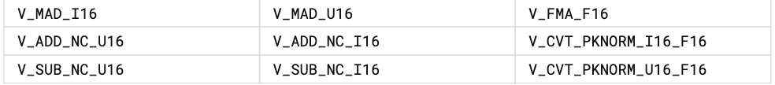
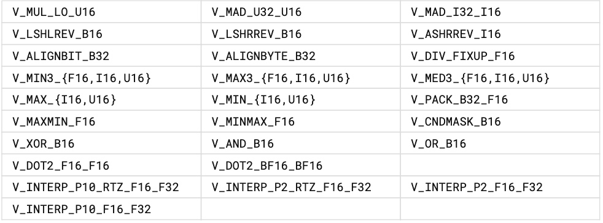
## 输出操作数
VALU 指令通常将其结果写入微码字的 VDST 字段中指定的 VGPR。仅当 EXEC 掩码中的相关位设置为 1 时，线程才会写入结果。
V_CMPX 指令将比较结果（每个线程一位）写入 EXEC 掩码。
当用于 VOP2 形式时，产生进位（整数加法和减法）的指令将其结果写入 VCC，当用于 VOP3 形式时，将其结果写入任意 SGPR 对。
当使用 VOP3 形式时，具有浮点结果的指令可以应用将结果乘以 0.5、2.0 或 4.0 的输出修饰符（OMOD 字段）。或者，可以将结果钳位（CLAMP 字段）到最小和最大可表示范围（请参阅下一节）。
### 输出操作数修饰符
**输出修饰符 (OMOD)** 仅适用于半浮点、单浮点和双浮点结果，并将结果按以下比例缩放：0.5、2.0、4.0 或不缩放。整数和压缩浮点数 16 结果忽略 omod 设置。输出修饰符与输出非正规化不兼容：如果启用输出非正规化，则输出修饰符将被忽略。如果禁用输出非正规数，则应用输出修饰符并将非正规数刷新为零。这些与 IEEE 不兼容：-0 刷新为 +0。如果 IEEE 模式位设置为 1，则忽略输出修饰符。一些操作码强制禁用输出分规范。

不支持输出修饰符：
* V_PERMLANE
* DOT2_F16_F16
* DOT2_BF16_BF16

对于 V_CMP 指令，将钳位位设置为 1 表示如果发生浮点异常，则比较信号。对于整数运算，它将结果限制为最大和最小可表示值。对于浮点运算，它将结果限制在范围：[0.0, 1.0]。

输出钳位（clamp）：钳位指令位适用于以下操作和数据类型：
* 浮动钳位至 [0.0, 1.0]
* 有符号整数 [-max_int, +max_int]
* 无符号整数[0, +max_int]
* Bool (V_CMP) 启用信令比较

不支持钳位（忽略）：
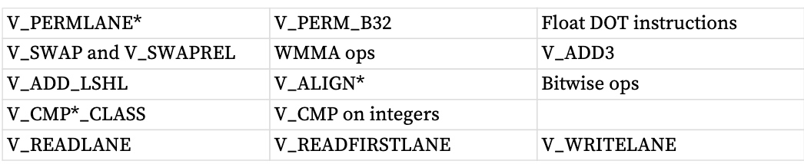
### WAVE 64目的地址限制
当从wave64 发出VALU 指令时，它发出的指令可能是两条wave32 指令的两倍。虽然在大多数情况下程序员不需要意识到这一点，但它确实禁止写入和读取相同 SGPR 值的 wave64 VALU 指令。这样做可能会导致不可预测的结果。具体来说，wave64 VALU 指令的第一遍可能不会覆盖后半部分使用的标量值。
## 非规范化和舍入模式
着色器程序可以明确控制所应用的舍入模式以及非规范化输入和结果的处理。 MODE寄存器使用S_SETREG指令设置；它有单独的位来控制单精度和双精度浮点数的行为。

还可以使用 S_ROUND_MODE 和 S_DENORM_MODE 设置舍入和非正规模式，这是优于使用 S_SETREG 的首选方法。

16 位浮点数支持非正规数、无穷大和 NaN。

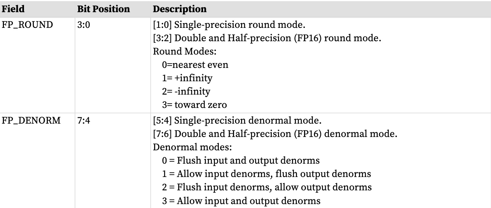

这些模式位不影响 F32 全局内存原子的舍入和非正规处理。

DOT2_F16_F16 和 DOT2_BF16_BF16 支持舍入到最接近的偶数舍入。 DOT2_F16_F16 支持分母，DOT2_BF16_BF16 禁用所有分母。
## 使用 SGPR 作为面罩或携带的说明
每个 VALU 指令都可以使用 SGPR 作为常量，但以下指令可以将 SGPR 作为掩码或进位来读取或写入：

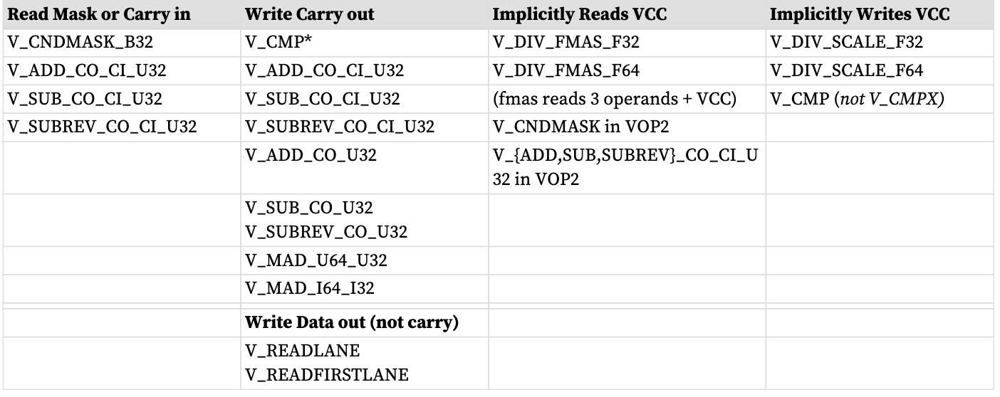

上表中的“VCC”是指VOP2或VOPC编码中的VCC，或VOP3编码的SRC2或SDST字段中指定的任何SGPR，除了隐式读取VCC的DIV_FMAS（无选择）。

V_CMPX 是唯一写入 EXEC 的 VALU 指令。
##  Wave64 使用 SGPR
VALU指令可以使用SGPR作为统一输入，由所有工作项共享。如果该值用作简单数据值，则相同的SGPR被分配给所有64个工作项。另一方面，如果数据值表示掩码（例如进位、CNDMASK 的掩码），则每个工作项接收一个单独的值，并读取两个连续的 SGPR。
## 探地雷达超出范围
当源 VGPR 超出范围时，指令使用 VGPR0 的值作为输入。

当目标 GPR 超出范围时，指令执行但不写入结果。

有关详细信息，请参阅 VGPR 超出范围行为。
## PERMLANE 特定规则
V_PERMLANE 可能不会在 V_CMPX 之后立即发生。为了防止这种情况，可以插入任何其他 VALU 操作码（例如 V_NOP）。
# 指令
下表列出了微码编码的完整 VALU 指令集，但后面部分列出的 VOP3P 指令除外。
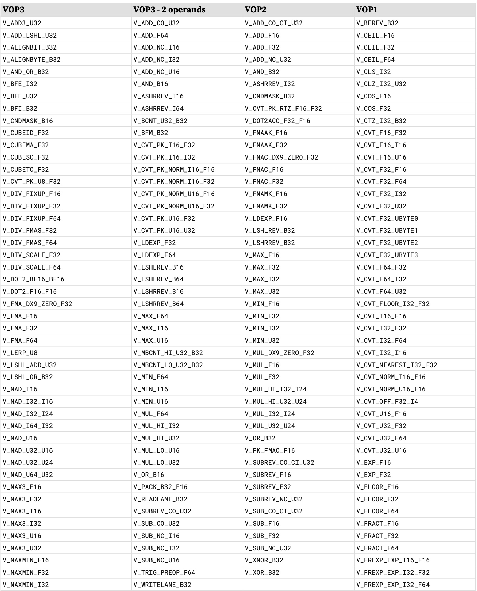
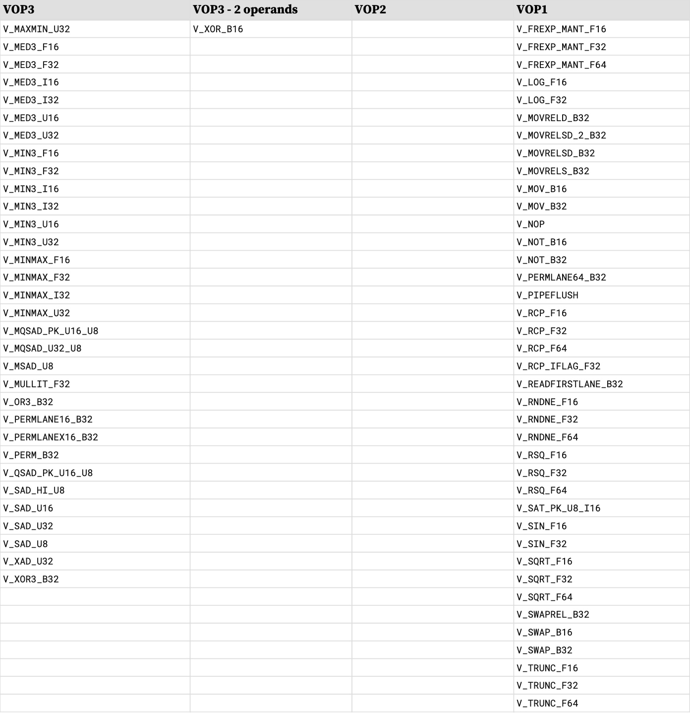
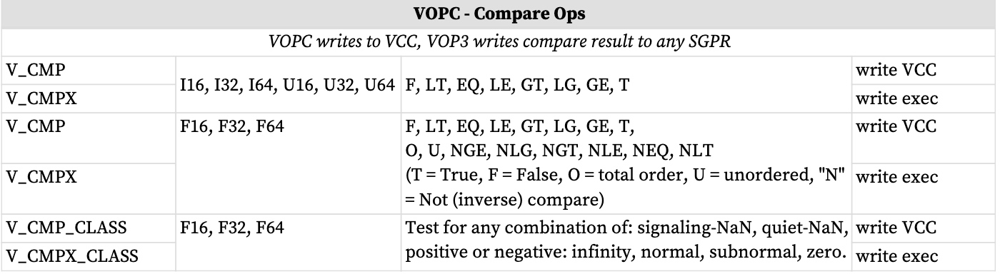
# 16位数和VGPR
对 16 位数据（非压缩）进行操作的 VALU 指令可以分别对 32 位 VGPR 的两半进行寻址。

16位VGPR对被打包成32位VGPR：32位VGPR“V0”包含两个16位VGPR：“V0.L”代表V0[15:0]，“V0.H”代表V0 [31:16]。

该寻址在 ISA 中的编码方式因指令编码而异： 16 位指令可以使用 VOP1/2/C 以及 VOP3/VOP3P/VINTERP 进行编码。

**我们的 16 位 VGPR**
32位VGPR是“V0”。两半称为“V0.L”和“V0.H”。

**VOP1、VOP2、VOPC 编码**
16 位 VGPR 编码为：
 SRC/DST[6:0] = 32 位 VGPR 地址； SRC/DST[7] = (1=hi, 0=lo half) 在此编码中，只能寻址 256 个 16 位 VGPR。

**VOP3、VOP3P、VINTERP**
16 位 VGPR 编码为：SRC/DST[7:0] = 32 位 VGPR 地址，OPSEL = 高/低。在这种编码中，一个波可以寻址 512 个 16 位 VGPR。

如下所示的打包允许在一个周期内进行读或写：
* 1 个 32 位 VGPR 的 32 个通道：V0
* 64 个通道的 1 个 16 位 VGPR：V0.L
* 32 个通道的两个 16 位 VGPR（一对，用于打包数学）：V0.L 和 V0.H

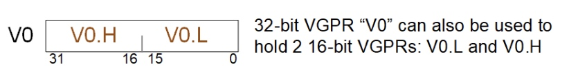
# 打包数学（？ packed math）
打包数学是一种运算形式，可加速打包到同一 VGPR 中的两个值的算术。它对 DWORD 内的两个 16 位值执行操作，就好像它们是单独的线程一样。例如，V0=V1+V2 的压缩加法实际上是两个单独的加法：将每个 DWORD 的低 16 位相加并将结果存储在 V0 的低 16 位中，将高半部分相加并将结果存储在高位中V0的16位。

打包数学使用以下指令和微代码格式“VOP3P”。此格式的低操作数和高操作数都有 OPSEL 和 NEG 字段，但没有 ABS 和 OMOD。

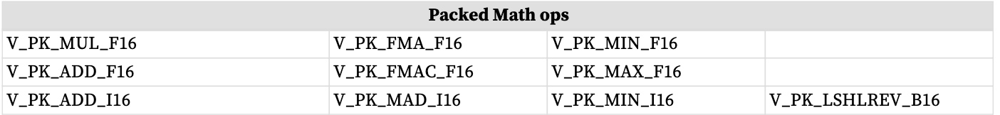
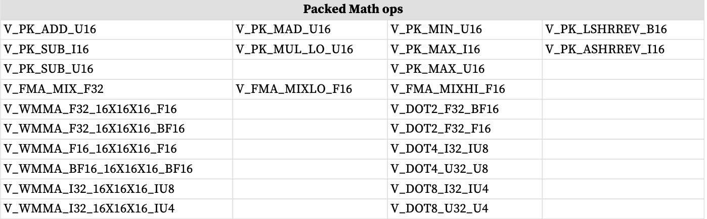

VOP3P指令字段
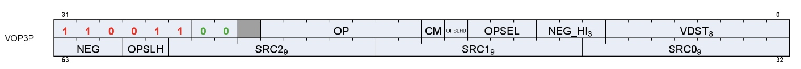

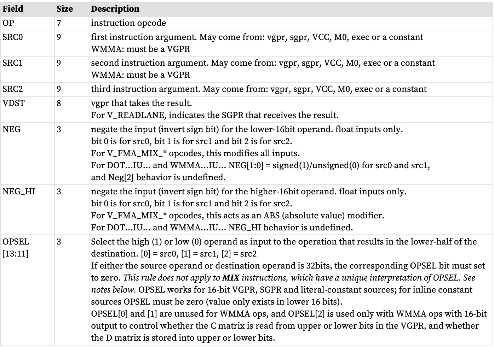
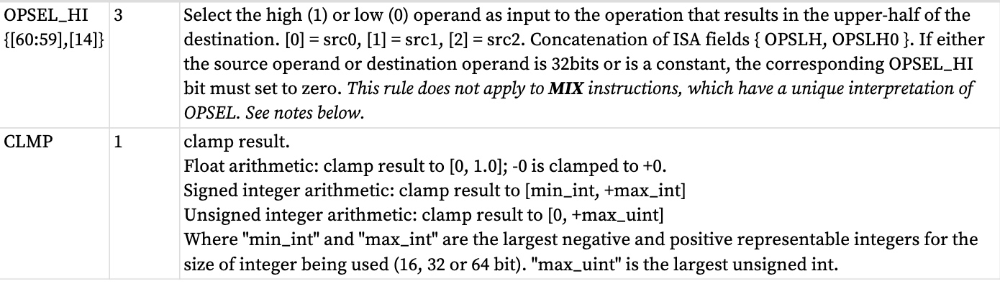

用于 MIX 指令的 OPSEL
## 带有压缩数学的内联常量
内联常量可以与打包数学一起使用，但它们需要使用 OPSEL。内联常量仅在 32 位常量值的低 16 位中生成值。与浮点 16 位源一起使用的内联常量会生成 F16 常量值。如果不使用 OPSEL，则只有源的下半部分包含该常量。要在两半中使用内联常数，请使用 OPSEL 为低源和高源选择较低的输入。

BF16 使用 32 位浮点常量，然后 BF16 操作数选择 FP32 常量的高 16 位（与 BF16 的定义匹配）。

对于 WMMA_F16_F16_16x16x16 或 VOPD DOT2_F32_F16，硬件自动选择常量的低 16 位。

除以下 DOT 指令外，任何使用小于 16 位数据大小的打包数学指令都不适用于内联常量：
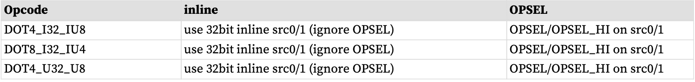
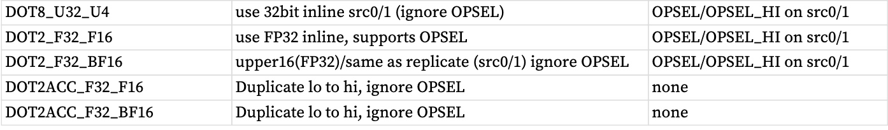
# 双发行VALU
VOPD 指令编码允许单个着色器指令对并行执行的两个单独的 VALU 操作进行编码。这两个操作必须相互独立。该指令具有必须满足的某些限制 - 如果不满足这些限制，硬件将无法正常工作。该指令格式仅对wave32 合法。它不能被 wave64 使用。 wave64 会跳过它。

该指令定义了 2 个操作，分别命名为“X”和“Y”，每个操作都有自己的源和目标 VGPR。
打包到这一 ISA 中的两条指令称为 OpcodeX 和 OpcodeY。

• OpcodeX 从SRC0X（VGPR、SGPR 或常数）和SRC1X（VGPR）获取数据； 
• OpcodeY 从SRC0Y（VGPR、SGPR 或常数）和SRC1Y（VGPR）获取数据。

VOPD 中的两条指令同时执行，因此如果一条指令读取 VGPR 而另一条指令写入相同的 VGPR，则它们之间不会出现竞争。 “读取”得到旧值。

限制
* 两条指令中的每条指令最多可使用 2 个 VGPR 
* 该对中的每条指令最多可使用 1 个 SGPR，或者它们可共享一个文字 
    * 双操作的合法组合：最多 2 个 SGPR，或 1 SGPR + 1文字，或共享文字。
* SRC0 可以是 VGPR 或 SGPR（或常量） 
* VSRC1 只能是 VGPR 
* 指令不得超过 VGPR 源缓存端口限制 
    *  有 4 个 VGPR 存储体（由 SRC[1:0] 索引），并且每个存储体都有一个高速缓存 
    *  每个高速缓存有 3 个读取端口：一个专用于 SRC0，一个专用于 SRC1，一个专用于 SRC2
        *  缓存可以一次读取全部 3 个，但不能一次读取两个 SRC0（或 SRC1/2）。
    * SRCX0 和 SRCY0 必须使用不同的 VGPR Bank； 
    * VSRCX1 和 VSRCY1 必须使用不同的存储体。
        * FMAMK 是一个例外：V = S0 + K * S1（“S1”使用 SRC2 读取端口）
    * 如果两个操作都使用 SRC2 输入，则一个 SRC2 输入必须为偶数，另一个 SRC2 输入必须为奇数。以下操作使用 SRC2： FMAMK_F32（第二个输入操作数）DOT2ACC_F32_F16、DOT2ACC_F32_BF16、FMAC_F32（目标操作数）
    * 这些是硬性规则 - 如果违反这些规则，指令将不起作用 
* 组合的指令对具有以下限制：
    *  最多一个文字常量，或者它们可以共享相同的文字 
    *  目标 VGPR：其中一个必须是偶数且另一个奇数 
    *  指令必须相互独立 
* 不得使用 DPP 
* 必须是wave32。

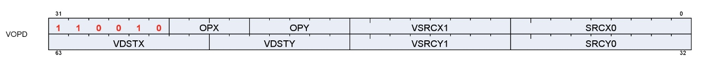

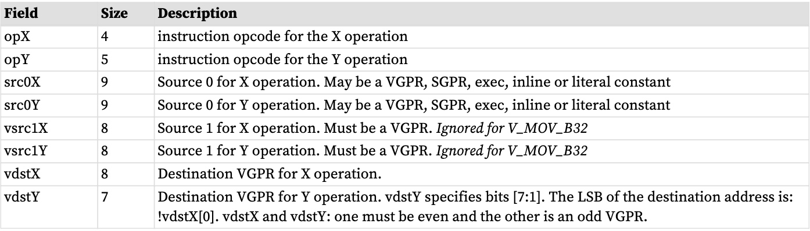

有关 X 和 Y 操作码字段中可用的操作码列表，请参阅 VOPD。
V_CNDMASK_B32 是使用 VCC 作为选择的“VOP2”形式。 VCC 算作一次 SGPR 读取。
如果其中一个或两个都引发异常，VOPD 指令对仅生成一个异常。
# 数据并行处理
数据并行处理 (DPP) 操作允许 VALU 指令从不同通道（线程）选择操作数，而不仅仅是使用线程自己的数据。 DPP 操作通过使用 SRC0 操作数中的内联常量：DPP8 或 DPP16 来指示。请注意，由于 SRC0 设置为 DPP 值，因此 SRC0 的实际 VGPR 地址来自 DPP DWORD。

使用 DPP 的一个示例是扫描操作。扫描操作是计算每个线程的值的操作，该值基于先前线程的值以及可能本身的值。例如。运行总和是向量中先前线程的值的总和。归约操作本质上是一种扫描，它从编号最高的活动线程返回单个值。扫描操作要求 EXEC 掩码设置为全 1 才能正常操作。未使用的线程（通道）应设置为在扫描之前不会更改结果的值。

DPP指令字有两种形式：
* **DPP8** 允许在 8 个通道组之间任意混合
* **DPP16** 允许在 16 个通道组之间进行一组预定义的混合

DPP 只能用于：VOP1、VOP2、VOPC、VOP3 和 VOP3P（但不能用于“打包数学”运算）。DPP 指令会产生额外的执行延迟周期。

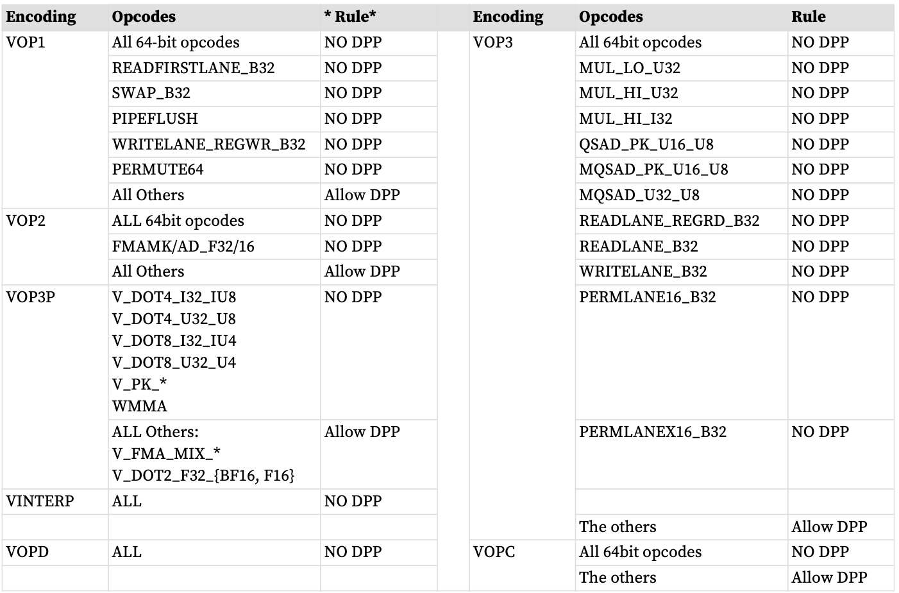

V_CMP 和 V_CMPX 写入完整掩码，而不是部分掩码。当将 DPP 与 V_CMP 或 V_CMPX 结合使用并设置bound_ctrl=0 时，其 EXEC 掩码位设置为零的通道将写入零位，而不是不写入该位。 DPP16 的“FI”（获取非活动）会导致通道在提供数据时表现得好像处于活动状态，但该通道的比较结果对于 V_CMPX 仍然为零（FI=1 的 V_CMPX 不会打开已关闭的通道）。
## DPP16
DPP16 允许在 16 个通道组内选择数据，并具有一组固定的可能混合模式。

VOP3/VOP3P和DPP16都有ABS和NEG字段：
* 使用VOP3 的ABS 和NEG 字段，并忽略DPP16 的字段。 
* 使用VOP3P 的NEG/NEG_HI 字段，并忽略DPP16 的ABS 和NEG。

DPP16 指令字段
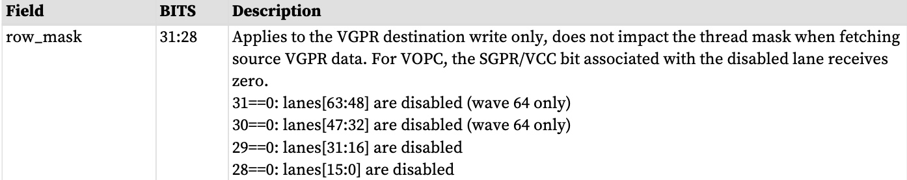
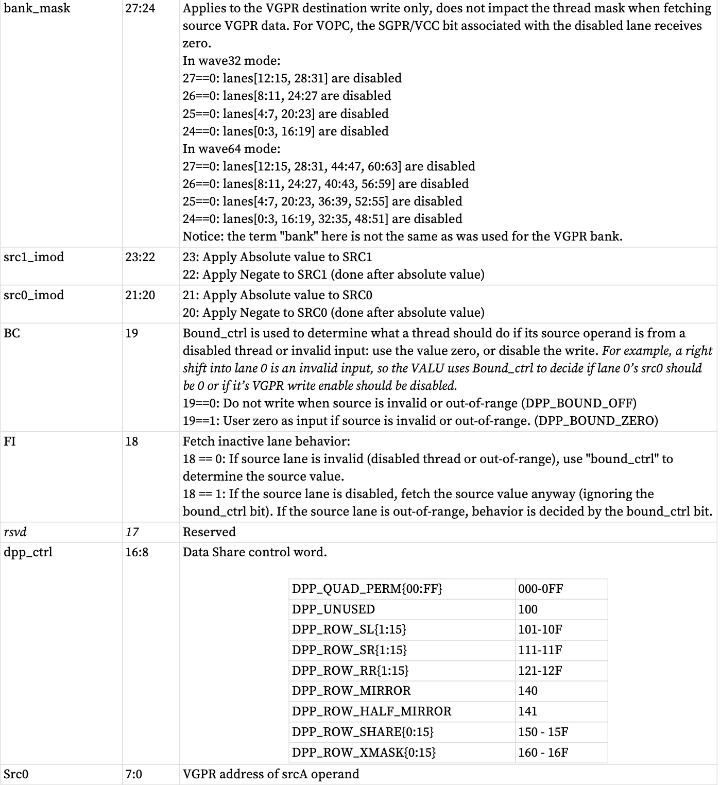

 BC 和 FI 行为
 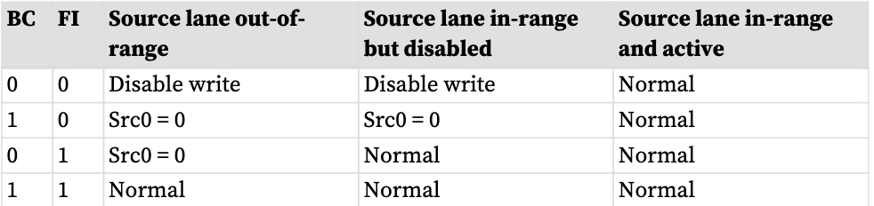

其中“超出范围”表示车道偏移超出 16 个车道组（例如 0..15 或 16..31）。

## DPP8
DPP8 允许在 8 个通道组内任意跨通道混合。 DPP8 有两种形式：正常，从 EXEC 掩码位为零的通道读取零；以及 DPP8FI，从非活动通道获取数据，而不是使用值零。
DPP8 遵循 DPP16 的“BC = 1”行为，并假设所有源通道均在范围内。
**DPP8 指令字段**
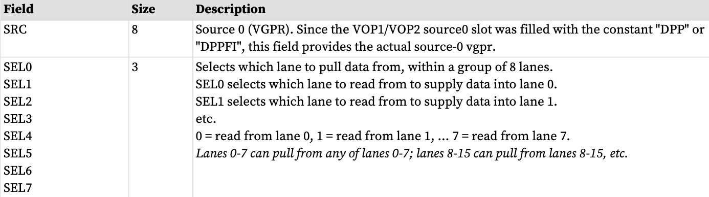
# VGPR索引
VALU 提供一组移动或交换 VGPR 的指令，其中源、目标或两者均由 M0 寄存器中的值索引。索引是无符号的。

# 波矩阵乘法累加（WMMA）
波矩阵乘法累加 (WMMA) 指令为常见矩阵算术运算提供加速。这些指令使用 VOP3P 编码进行编码。
它们执行：A * B + C ⇒ D，其中 A、B、C 和 D 是矩阵。

其他信息可以在 GPUOpen 博客上找到：https://gpuopen.com/learn/wmma_o​​n_rdna3/

AMD 矩阵指令计算器 (https://github.com/RadeonOpenCompute/amd_matrix_instruction_calculator) 包含一个帮助工具，允许开发人员查看有关 RDNA 架构中 WMMA 指令的详细信息。它允许用户查询指令级信息，例如计算吞吐量和寄存器使用情况。它还允许用户为每个矩阵指令及其修饰符生成矩阵元素和硬件寄存器之间的映射。

WMMA 不会生成任何 ALU 异常。

这些都是使用VOP3P编码的。 NEG[1:0] 字段被重新用于“IU”整数类型，以指示输入是否有符号（0=无符号，1=有符号）。对于WMMA_* UI8/UI4，NEG[1:0]指示SRC0和1是有符号还是无符号，NEG[2]和NEG_HI[2:0]必须为零。对于WMMA*_F16/BF16，NEG[1:0]应用于SRC1和SRC0的低16位。 NEG_HI[1:0]应用于SRC1和SRC0的高16位。 {NEG_HI[2], NEG[2]}应用于SRC2，充当{ABS, NEG}。目的地是有符号的整数类型。 Neg[0] 适用于 A 矩阵，Neg[1] 适用于 B 矩阵。 Neg[2] 必须设置为零。

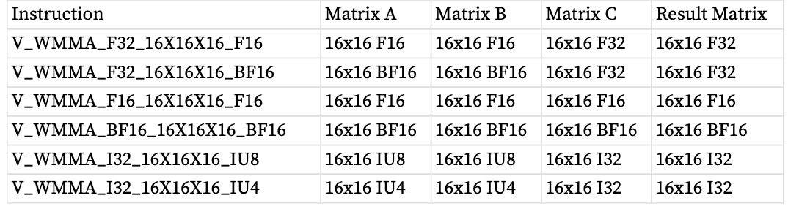

“IU4”和“IU8”表示操作数是有符号的或无符号的（4 或 8 位），如 NEG 位所示。

这些指令在多个周期内工作以计算结果矩阵并在内部使用 DOT 指令。为了实现此性能，用户必须按以下方式排列数据：

* A 和B 矩阵：泳道0-15 数据复制到泳道16-31（对于wave64：也复制到泳道32-47 和4863）。
WMMA 仅支持浮点类型的舍入到最接近的偶数舍入。

内联常量：只能用于 C 矩阵。对于 F16 和 BF16，内联值被复制到 DWORD 的低半部分和高半部分。

如果第一条指令的矩阵 D 与第二条指令的矩阵 A 或 B 相同或重叠，则背对背相关的 WMMA 指令需要在它们之间有一个 V_NOP（或独立的 VALU 操作）。只要 C 满足，矩阵 A/B 就可以与 C 重叠与D不同。典型的情况是C和D相同。

4x4 矩阵上的矩阵乘法的简化示例：
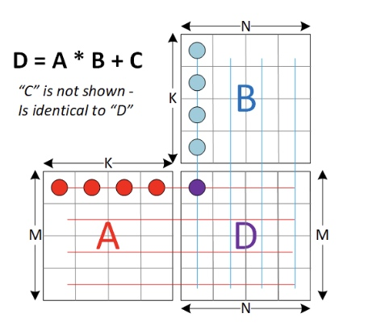

下图显示了传统观点中的 A、B、C 和 D 矩阵：一行是水平条带的条目，列是垂直条带。这就是线性代数视图，无论内存或 VGPR 中的布局如何。矩阵运算定义为：D = A * B + C。D 中的每个条目都是 A 中的行与 B 中的列相乘的结果，并添加到该条目的 C 值。

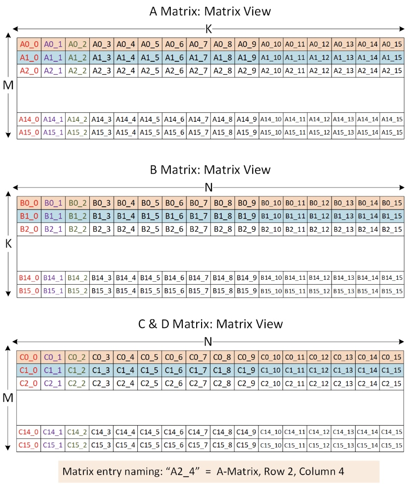

下图显示了当 M = N = K = 16 时，矩阵在 VGPR 中的布局方式。请注意，A 矩阵是列优先的，而其他矩阵是行优先的。

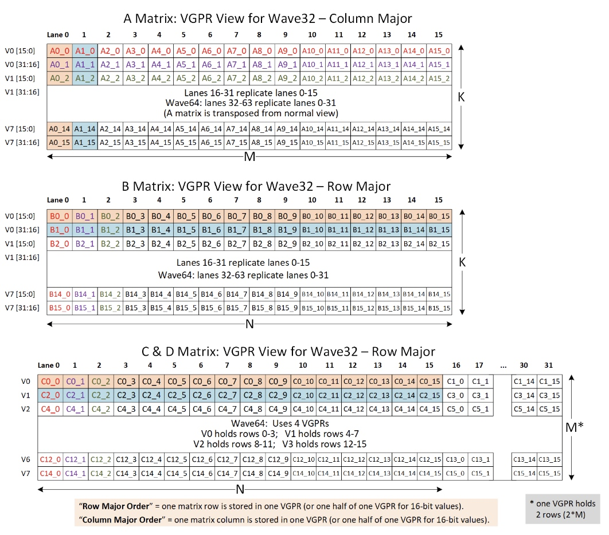

