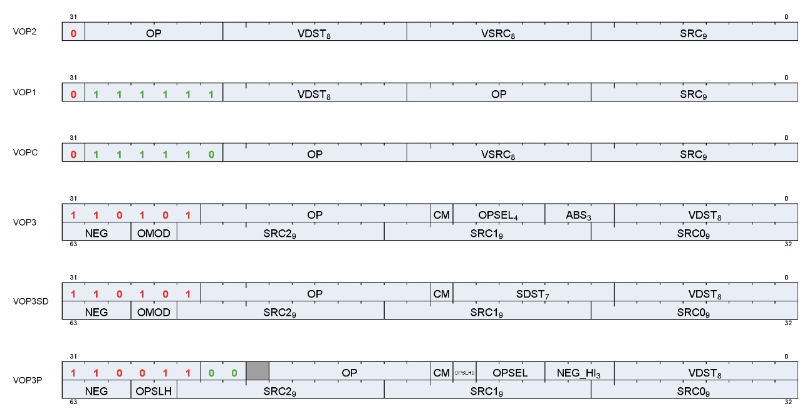
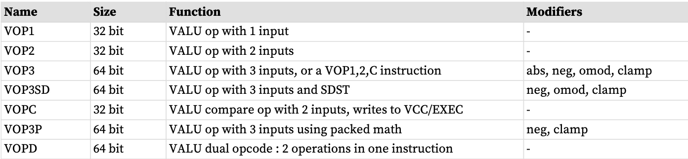
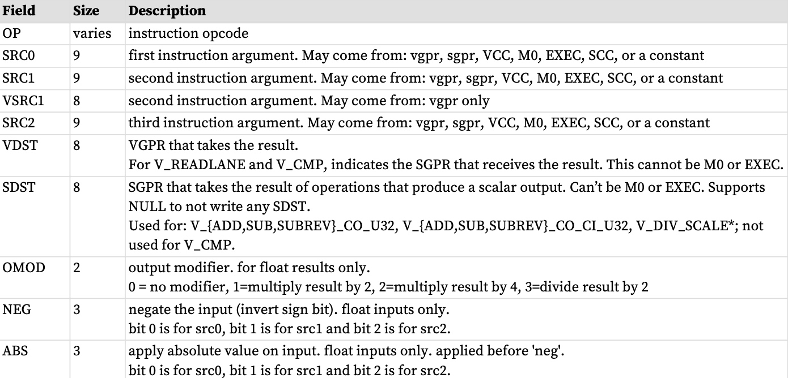
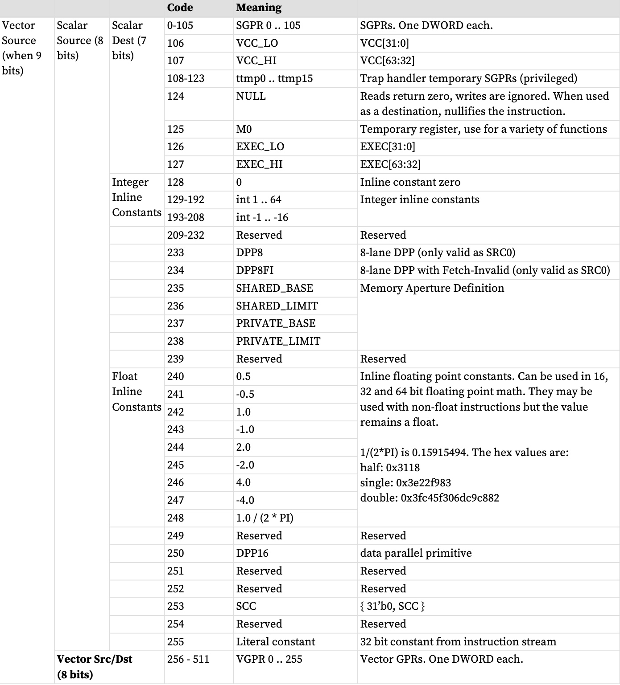
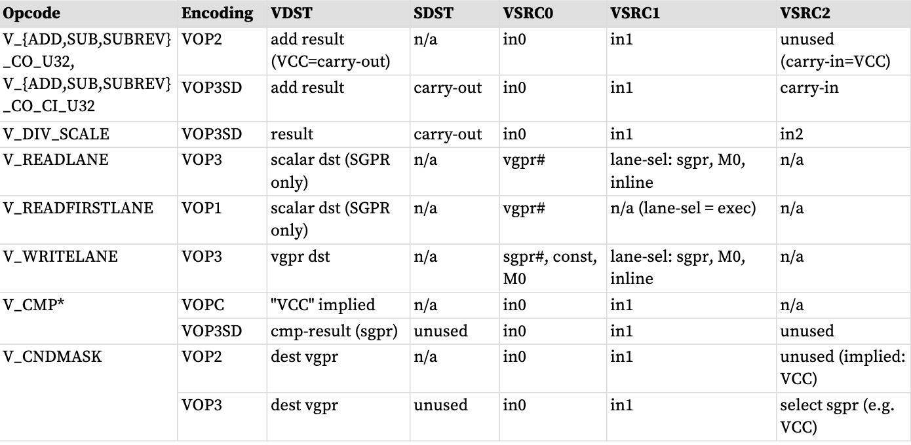

矢量 ALU 指令 (VALU) 对 32 或 64 个线程中的每个线程的数据执行算术或逻辑运算，并将结果写回 VGPR、SGPR 或 EXEC 掩码。

参数插值是一个两步过程，涉及 LDS 指令和 VALU 指令，描述见：参数插值
矢量 ALU (VALU) 指令控制 SIMD32 的数学单元，并一次对 32 个数据工作项进行运算。
每条指令可以从 VGPR、SGPR 或常量获取输入，并且通常将结果返回到 VGPR。掩码结果和进位返回到 SGPR。 ALU 提供可处理整数和浮点类型的 16、32 和 64 位数据的运算。 ALU 还支持“打包”数据类型，将 2 个 16 位值打包到一个 VGPR 中，或将 4 个 8 位值打包到一个 VGPR 中。
# 微码编码
VALU 指令以下列方式之一编码：

许多 VALU 指令有两种编码：使用 64 位指令的 VOP3，以及提供有限功能集但代码大小较小的三种 32 位编码之一。有些指令仅在 VOP3 编码中可用。当一条指令有两种微码格式时，由用户决定使用哪一种。建议尽可能使用 32 位编码。也可以使用VOP2，对于“ACCUM”类型操作，其中第三个输入隐含与目标相同。
使用 VOP3 的优点包括：
* 源寻址更加灵活（所有源字段均为 9 位）
* NEG、ABS 和 OMOD 字段（仅适用于浮点）
* 用于限制输出范围的 CLAMP 字段
* 能够为VCC 选择备用源和目标寄存器（进位和出位）

以下 VOP1 和 VOP2 指令可能无法提升为 VOP3：
* 互换和互换
* fmamk、fmaak、pk_fmac

VOP3 编码有两种变体：
* VOP3 - 用于大多数指令，包括V_CMP*；具有OPSEL 和ABS 字段 
* VOP3SD - 具有SDST 字段而不是OPSEL 和ABS。此编码仅用于： 
    * V_{ADD,SUB,SUBREV}_CO_CI_U32、V_{ADD,SUB,SUBREV}_CO_U32（带进位相加） 
    * V_DIV_SCALE_{F32, F64}、V_MAD_U64_U32、V_MAD_I64_I32。
    * V_DOT2ACC_F32_F16
    * VOP3SD 不用于 V_CMP*。

任何 VALU 微代码格式都可以使用 32 位文字常量，以及 VOP3。但请注意，VOP3 加上文字构成 96 位指令，过度使用此组合可能会降低性能。

VOP3P 适用于使用“打包数学”的指令：对打包到每个操作数的高 16 位和低 16 位中的一对输入值执行运算的指令；两个 16 位结果作为两个打包值写入单个 VGPR。

# 操作数
大多数 VALU 指令至少需要一个输入操作数。操作数的数据大小在指令名称中明确定义。例如，V_FMA_F32 对 32 位浮点数据进行操作。

VGPR 对齐：对于单浮点或双浮点操作没有对齐限制。
下表 VALU 指令操作数 

## 操作数字段的非标准使用
一些指令以非标准方式使用操作数字段：

readlane 通道选择通过忽略通道号的高位来限制通道的有效范围（wave32 为 0-31，wave64 为 0-63）。

**DOT2_F16_F16 和 DOT2_BF16_BF16 的内联常量**
对于这 2 条指令，源 0 和 1 的内联常量将内联常量值复制到位 [31:16] 中。对于source2，OPSEL位用于控制是否复制（如果不复制低位则为零）。
## 输入操作数
VALU 指令可以使用以下任何输入源，但须遵守下列限制：
* VOP1、VOP2、VOPC： 
    * SRC0 为 9 位，可以是 VGPR、SGPR（包括 TTMP 和 VCC）、M0、EXEC、内联常量或文字常量。
    * SRC1 是 8 位，并且只能指定 VGPR
* VOP3：所有 3 个源都是 9 位，但仍然有限制： 
    * 并非所有 VOPC/1/2 指令都在 VOP3 中可用（仅那些受益于 VOP3 编码的指令） 
    * 查看完整的操作数列表：VALU 指令操作数
### 输入操作数修饰符
输入修饰符 ABS 和 NEG 适用于浮点输入，对于任何其他类型的输入未定义。此外，还支持以下输入修饰符：V_MOV_B32、V_MOV_B16、V_MOVREL*_B32 和 V_CNDMASK。ABS 返回绝对值，NEG 对输入求反。
**不支持输入修饰符：**
* readlane、readfirstlane、writelane 
* 整数算术或按位运算 
* permlane
* QSAD
### 字面扩展至64位
文字常量是 32 位，但它们可以用作通常需要 64 位数据的源。
它们按照以下规则扩展为 64 位：
* 64 位浮点数：低 32 位用零填充
* 64 位无符号整数：零扩展到 64 位
* 64 位有符号整数：符号扩展至 64 位

### 源操作数限制

### OPSEL 领域限制

## 输出操作数

### 输出操作数修饰符

### WAVE 64目的地址限制

## 非规范化和舍入模式

## 使用 SGPR 作为面罩或携带的说明

##  Wave64 使用 SGPR

## 探地雷达超出范围

## PERMLANE 特定规则

# 指令

# 16位数和VGPR

# 打包数学（？ packed math）

## 带有压缩数学的内联常量

# 双发行VALU

# 数据并行处理

## DPP16

## DPP8

# VGPR索引

# 波矩阵乘法累加（WMMA）

