# 图片说明
本节介绍图像指令集以及这些指令可用的微代码字段。
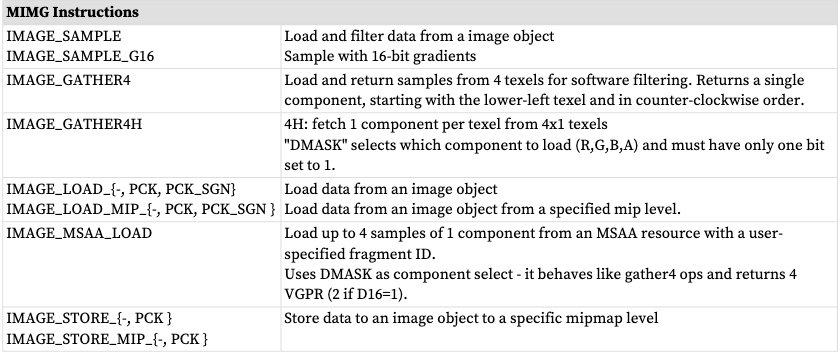
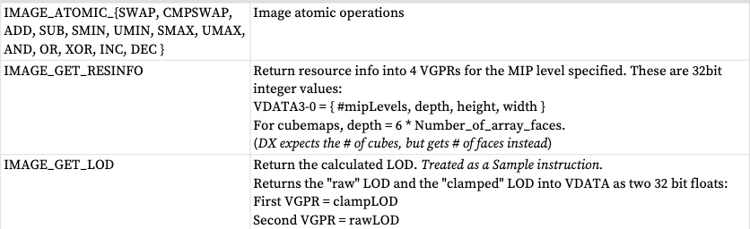

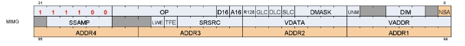

指令字段
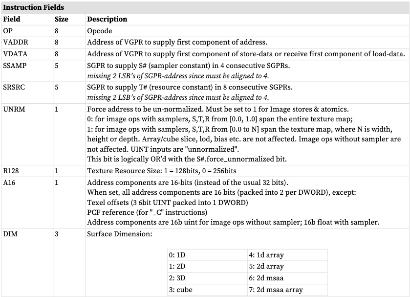
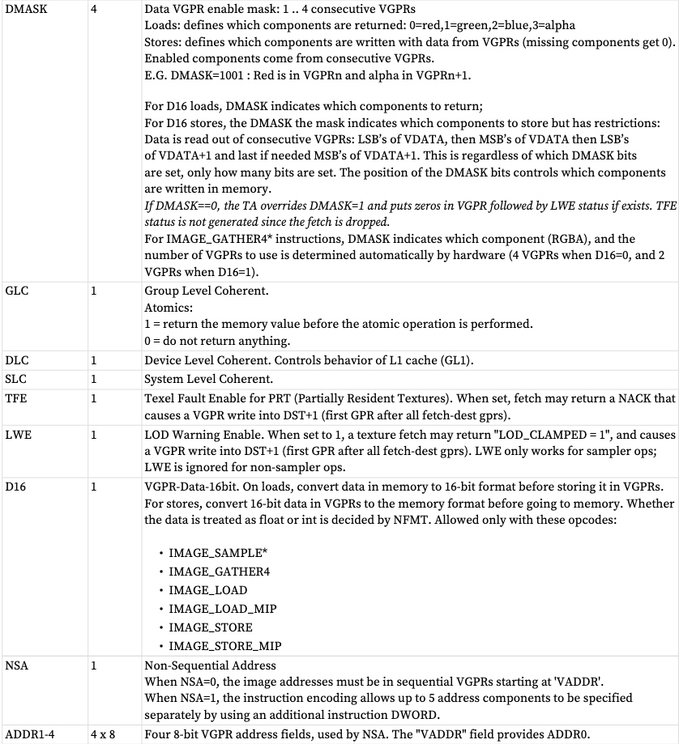
## TFE(texture 纹理 fault enable) 和 LWE（LOD warning enable）
这与“部分驻留纹理”有关。
当在指令中设置这些位中的任何一个时，任何纹理获取都可能在所有数据返回 VGPR 之后返回一个额外的 VGPR。该数据唯一地返回给每个线程，并指示该线程的错误/警告状态。

返回的数据是：TEXEL_FAIL | (LOD_WARNING << 1) | (LOD << 16）
* TEXEL_FAIL：1 位指示该像素的1 个或多个纹素产生了NACK。“失败”意味着访问未映射的页面。
    * TFE == 0
        * TD 将未 NACK 的线程的数据写入 VGPR DST
        * TD 将 NACK 到 VGPR DST 的样本写入零或使用零的混合结果 
    * TFE == 1
        * VGPR DST 的写法与上面类似
        * TD 写入 VGPR DST+1，其状态为与 NACKed 线程对应的位设置为 1
* LOD_WARNING：1 位指示像素试图以太小的LOD 访问纹素：warn = ( LOD < T#.min_lod_warning）
*  LOD：指示尝试访问哪个LOD 导致NACK。返回所请求的 LOD 的楼层。
像素不能同时接收 TEXEL_FAIL 和 LOD_WARNING：TEXEL_FAIL 优先。
## D16 指令
加载格式和存储格式指令也有“d16”变体。对于存储，每个 32 位 VGPR 保存两个传递到纹理单元的 16 位数据元素。纹理单元在写入内存之前将它们转换为纹理格式。对于加载，从纹理单元返回的数据被转换为 16 位，并且一对数据存储在每个 32 位 VGPR 中（首先是 LSB，然后是 MSB）。 DMASK 位代表各个 16 位元素；因此，当 DMASK=0011 进行图像加载时，两个 16 位组件将加载到单个 32 位 VGPR 中。
## A16 指令
A16指令位表示地址部分是16位而不是通常的32位。组件被打包，使得第一个地址组件进入低 16 位 ([15:0])，下一个地址组件进入高 16 位 ([31:16])。
## G16 指令
名称中带有“G16”的指令意味着用户提供的导数是 16 位而不是通常的 32 位。导数被打包，使得一阶导数进入低 16 位 ([15:0])，下一个导数进入高 16 位 ([31:16])。
## 图像非连续地址
为了避免使用许多 V_MOV 指令将图像地址 VGPR 打包在一起，MIMG 支持该指令的“非顺序地址”版本，其中每个地址组件的 VGPR 都是唯一定义的。数据组件仍然打包。此格式创建较大的指令字，最长可达 3 个 DWORD。第一个地址进入 VADDR 字段，后续地址进入 ADDR1-4。该指令的这个 3 DWORD 形式最多可以提供 5 个地址。NSA 允许图像指令指定最多 5 个唯一地址 VGPR。这些是 NSA 如何处理需要 5 个以上地址的指令的规则。允许使用非 NSA 模式，其中所有地址都位于顺序 VGPR 中。

* VADDR 提供第一个地址组件
* ADDR1 提供第二个地址组件
* ADDR2 提供第三个地址组件
* ADDR3 提供第四个地址组件
* ADDR4 在顺序VGPR 中提供所有附加组件：VADDR4、VADDR4+1 等。

当使用 16 位地址时，每个 VGPR 保存一对地址，并且这些地址不能位于不同的 VGPR 中。较低编号的 16 位值位于 VGPR 的 LSB 中。

对于光线追踪，VGPR 分为 5 组 VGPR。每个组内的 VGPR 必须是连续的，但组可以是分散的。当A16=1时，打包是不同的，因为RayDir.Z和RayInvDir.x在同一个DWORD中。在 A16 模式下，RayDir 和 RayInvDir 合并为 3 个 VGPR，但顺序不同：每个组件的 RayDir 和 RayInvDir 共享一个 VGPR。
# 没有采集器的图像操作码
对于没有采样器的图像操作码，所有 VGPR 地址值均采用 uint。
对于立方体贴图，face_id = 切片 * 6 + 面。

MSAA 表面仅支持加载、存储和原子；不是加载 mip 或存储 mip。

下表显示了各种图像操作码的地址 VGPR 的内容。
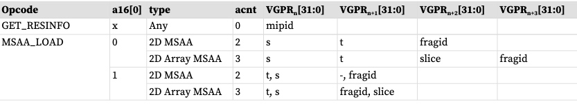
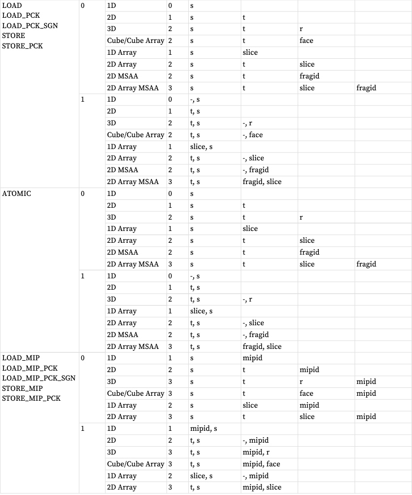
“ACNT”是地址计数：提供地址“主体”的 VGPR 数量，源自指令的 DIM 字段和操作码。
# 带有采集器的图像操作码
带采样器的操作码：除 Texel 偏移量为 UINT 外，所有 VGPR 地址值均采用 FLOAT。
对于立方体贴图，face_id = 切片 * 8 + 面。（请注意，“*8”与非采样器情况下的“*6”不同）。
某些采样和收集操作码需要 VGPR 中超出下表所示值的附加值。这些值是：偏移、偏差、z 比较和梯度。详细信息请参阅下一节。 MSAA 表面不支持采样或gather4 操作。

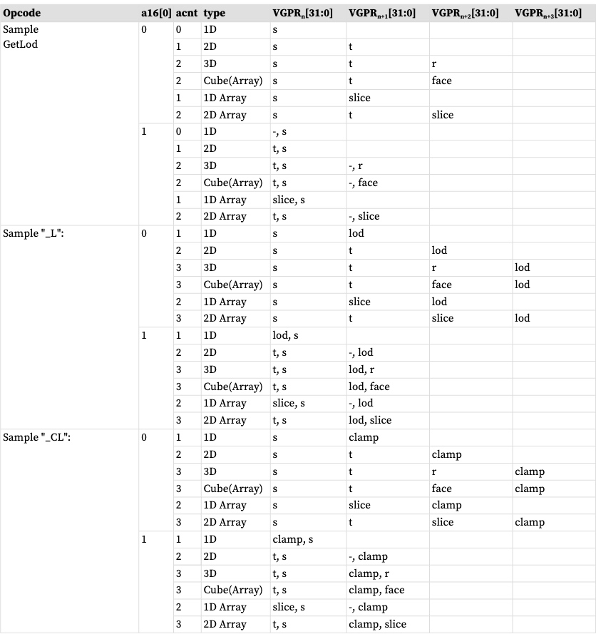
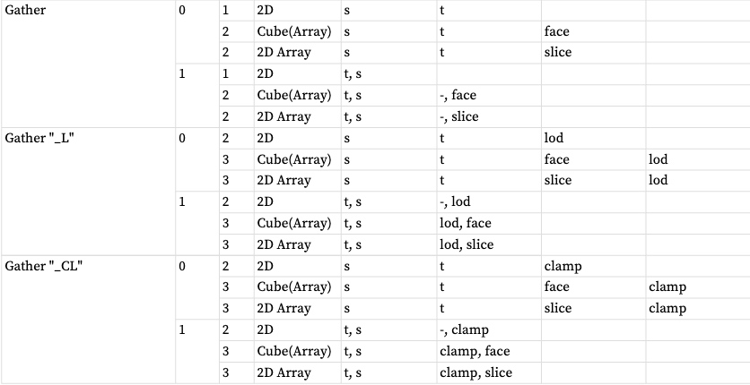
下表列出并简要描述了图像指令的合法后缀：
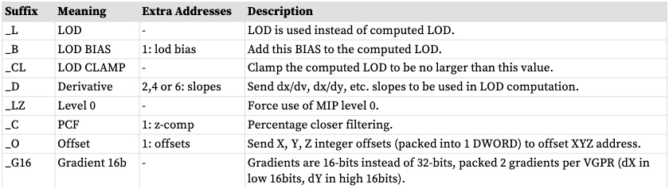
# VGPR 用法
地址：地址最多由5部分组成：{offset}{bias}{z-compare}{derivative}{body}
这些都被打包到连续的 VGPR 中（如果使用“NSA”，则可能是不连续的），并且最多可以包含 12 个值。

* 偏移量：SAMPLE* O*、GATHER *O *  1 DWORD of 'offset_xyz' 。偏移量是 6 位有符号整数：X=[5:0]、Y=[13:8]、Z=[21:16]
* 偏差：样本 * B*，收集 * B*。 1 个 DWORD 浮点数。
* Z 比较：SAMPLE*C*、GATHER*C*。 1 个双字。
* 导数 (SAMPLE_D)：2,4 或 6 个 DWORD - 每个导数打包 1 个 DWORD，如下所示 (F32)。
* 主体：一到四个 DWORD，如表中所定义：具有采样器地址组件的图像操作码为 X、Y、Z、W，其中 X 在 VGPR[M] 中，Y 在 VGPR[M]+1 中，等等。

“body”中的组件数量是表中 ACNT 字段的值加一。地址分量为 X、Y、Z、W，其中 X 在 VGPR[M] 中，Y 在 VGPR[M]+1 中，等等。
注意：偏差和导数是互斥的 - 着色器可以使用其中之一，但不能同时使用两者。

**32位倒数**
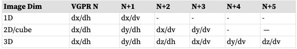
**16位倒数**
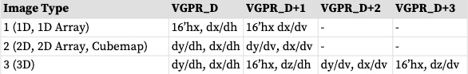
“A16”指令位指定地址组件是 16 位而不是通常的 32 位。

**数据：**
数据从 1-4 个连续的 VGPR 存储或返回。加载或存储的数据量完全由指令的 DMASK 字段决定。

**负载：**
DMASK 指定资源的哪些元素返回到连续的 VGPR。纹理系统从内存加载数据，并根据数据格式将其扩展为规范的 RGBA 形式，并根据 T#.dst_sel 填充缺失组件的值。然后应用 DMASK，并且只有那些选定的组件才会返回到着色器。

**存储:**
编写图像对象时，只能编写整个元素（所有组件） - 而不仅仅是单个组件。这些组件来自连续的 VGPR，纹理系统为图像数据格式的任何缺失组件填充值零，并忽略不属于该组件的任何值存储的数据格式。例如，如果 DMASK=1001，则着色器将来自 VGPR_N 的红色和来自 VGPR_N+1 的 Alpha 发送到纹理单元。如果图像对象是 RGB，则纹素将被 VGPR_N 中的红色覆盖，绿色和蓝色设置为零，并且忽略着色器中的 Alpha。当 D16=1 时，DMASK 对于从 VGPR 写入存储器的每 16 位数据设置 1 位。 DMASK 中的位位置无关，只是设置为 1 的位数。

**D16指令：**
加载和存储指令也有“d16”变体。对于存储，每个 32 位 VGPR 保存两个 16 位数据元素，这些数据元素被传递到纹理单元，而纹理单元又在写入内存之前转换为纹理格式。对于加载，从纹理单元返回的数据被转换为 16 位，并且一对数据存储在每个 32 位 VGPR 中（首先是 LSB，然后是 MSB）。如果只有一个组件，则数据将进入 VGPR 的下半部分，除非使用“HI”指令变体，在这种情况下，VGPR 的上半部分将加载数据。

**原子操作：**
仅在每像素 32 位和 64 位表面上支持图像原子操作。表面数据格式在资源常量中指定。原子操作将元素视为 32 位或 64 位的单个组件。对于原子操作，DMASK 设置为要发送到纹理单元的 VGPR (DWORD) 数量。

原子图像操作的 DMASK 合法值： DMASK 的所有其他值都是非法的。
* 0x1 = 32 位原子（cmpswap 除外）
* 0x3 = 32 位原子 cmpswap
* 0x3 = 64 位原子（cmpswap 除外）
* 0xf = 64 位原子 cmpswap
* 带返回的原子：从VDATA 开始，从VGPR 中读出数据，以提供给原子操作。如果原子向 VGPR 返回一个值，则该数据将返回到从 VDATA 开始的相同 VGPR。

DMASK 必须与资源的格式兼容。

**浮点数的非正规化**
示例操作会刷新非正规值，并且加载不会修改非正规值。
## VGPR 数据格式
发送到纹理（存储）或从纹理（加载）返回的 VGPR 中的数据采用几种标准格式之一，并且纹理单元与内存格式相互转换。
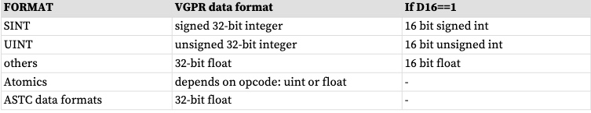
# 图片资源
图像资源（也称为 T#）定义内存中图像缓冲区的位置、其尺寸、平铺和数据格式。这些资源存储在四个或八个连续的 SGPR 中，并由 MIMG 指令读取。除非另有说明，所有未定义或保留位必须设置为零。

下表图像资源定义
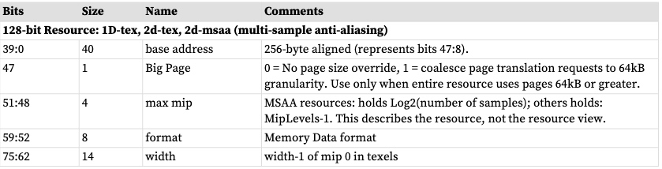
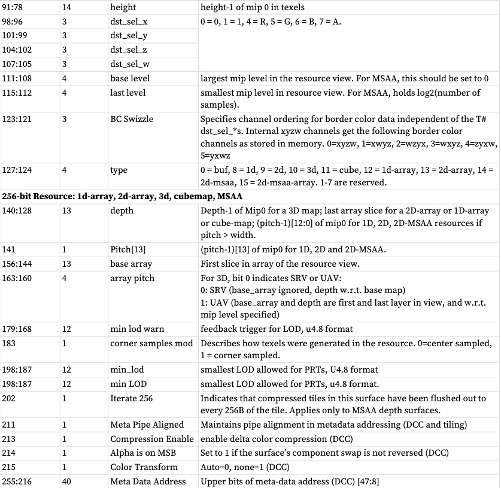
全零的资源被视为“未绑定”：它返回全零并且不生成内存事务。检查“全零”时，将忽略“资源级别”字段。
# 图片采集器
采样器资源（也称为 S#）定义对采样指令加载的纹理贴图数据执行哪些操作。这些主要是地址钳位和滤波器选项。采样器资源在四个连续的 SGPR 中定义，并通过每个采样指令提供给纹理缓存。

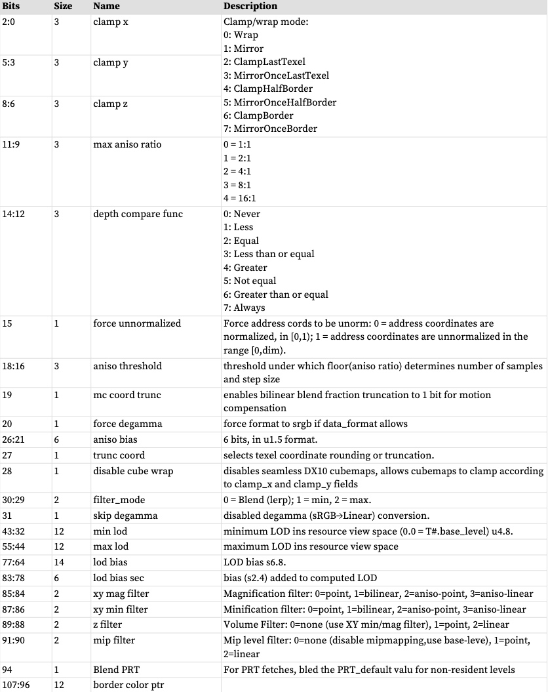
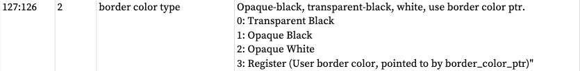
# 数据格式
下表详细介绍了图像和缓冲区资源可以使用的所有数据格式。
缓冲区和图像数据格式
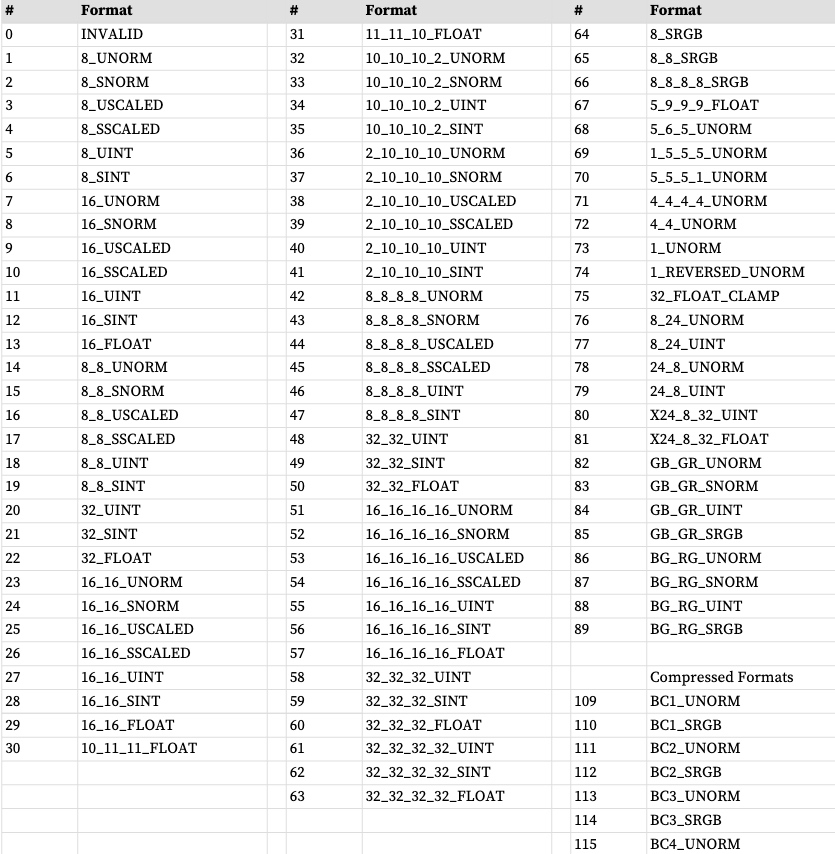
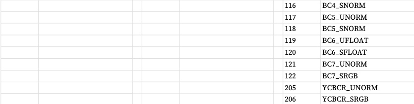
# 向量存储指令依赖性
当发出 VM 指令时，它会安排从 VGPR 读取地址和存储数据并将其发送到纹理单元。在将数据发送到纹理单元之前尝试写入此数据的任何 ALU 指令都会被停止。

着色器开发人员有责任避免与 VMEM 指令相关的数据危险，包括在读取从缓存（VMCNT 和 VSCNT）获取的数据之前等待 VMEM 加载指令完成。

这在以下部分中进行了解释：数据依赖性解析
# 光线追踪
光线追踪支持包括以下说明：
* IMAGE_BVH_INTERSECT_RAY 
* IMAGE_BVH64_INTERSECT_RAY
这些指令从 VGPR 接收光线数据并从内存中获取 BVH（边界体积层次结构）。
* Box BVH 节点执行4x Ray/Box 相交，根据相交距离对4 个子节点进行排序，并返回子节点指针和命中状态。
* 三角形节点执行1 条射线/三角形相交测试并返回相交点和三角形ID。

这两个指令是相同的，只是“64”版本支持 64 位地址，而普通版本仅支持 32 位地址。两条指令都可以使用“A16”指令字段将一些（但不是全部）地址组件减少到 16 位（从 32 位）。这些地址是：ray_dir 和 ray_inv_dir。

## 指令定义和字段
```
image_bvh_intersect_ray vgpr_d[4], vgpr_a[11], sgpr_r[4]
image_bvh_intersect_ray vgpr_d[4], vgpr_a[8], sgpr_r[4] A16=1
image_bvh64_intersect_ray vgpr_d[4], vgpr_a[12], sgpr_r[4]
image_bvh64_intersect_ray vgpr_d[4], vgpr_a[9], sgpr_r[4] A16=1
```
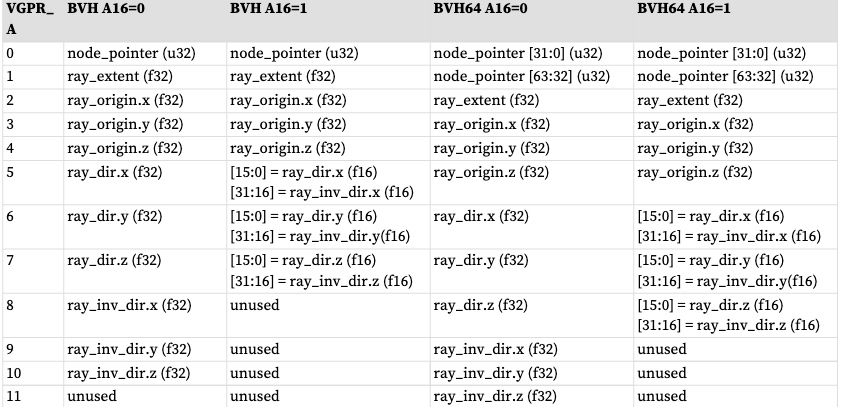

Vgpr_d[4]是相交测试结果的目标VGPR。此处返回的值根据获取的 BVH 节点的类型而有所不同。对于框节点，结果包含按交集时间排序的子框的 4 个指针。对于三角形 BVH 节点，结果包含所测试三角形的相交时间和三角形 ID。

Sgpr_r[4] 是该操作的纹理描述符。该指令使用 use_128bit_resource=1 进行编码。

image_bvh 指令的限制
* DMASK 必须设置为 0xf（指令返回所有四个 DWORD）
* D16 必须设置为0（不支持16 位返回数据）
* R128 必须设置为 1（不支持 256 位 T#）
* UNRM 必须设置为 1（仅支持非标准化坐标）
* DIM 必须设置为 0（BVH 纹理为 1D）
* LWE 必须设置为 0（不支持 LOD 警告）
* TFE 必须设置为 0（不支持为 PRT 命中状态写出额外的 DWORD）
* SSAMP 必须设置为 0（只是一个占位符，因为指令不使用采样器）

BVH 操作的返回顺序设置将被忽略，而是使用按顺序加载返回队列。
## BVH和NSA的结合使用
当使用具有非顺序地址的 BVH 指令时，BVH 组件分为 5 组，每组由 NSA 地址 VGPR 指定。
* 节点指针：1 vgpr
* 射线范围：1 vgpr
* 射线源：3 个连续 vgprs
* ray dir：3 个连续的 vgprs
* ray inv dir：3 个连续的 vgpr（与 ray-dir 配对用于 16 位地址）

NSA和A16:
* A16=0，MIMG-NSA 指定5 组连续VGPR：node_pointer、ray_extent、ray_origin、ray_dir 和ray_inv_dir。
* A16=1，MIMG-NSA 指定4 个组。在上面的集合中，ray_dir和ray_inv_dir被打包到3个VGPR中。
当使用A16=1模式时，ray-dir和ray-inv-dir共享相同的vgprs并且ADDR4未被使用。
## 纹理资源定义
这些指令使用的 T# 与其他图像指令不同。

BVH 资源定义
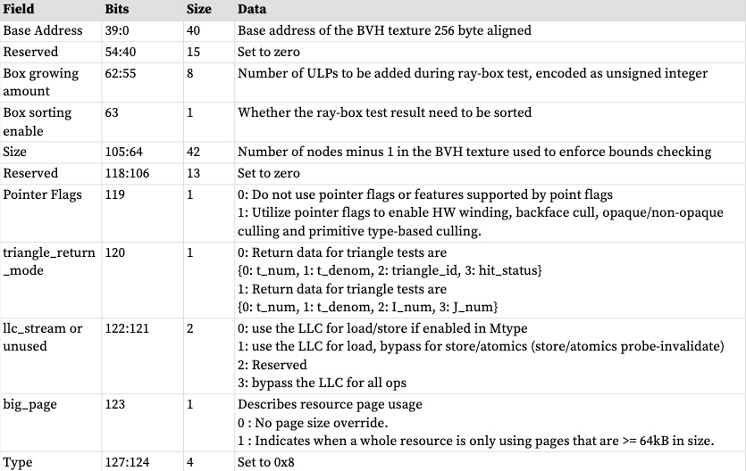
重心论
光线追踪硬件旨在支持直接在硬件中计算重心坐标。这使用了上一节表中的“triangle_return_mode”（T# 描述符）。

下表为 光线追返回模式
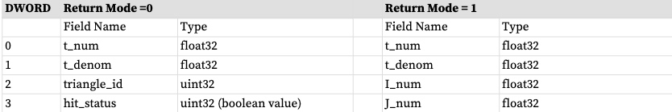
# 部分驻留纹理
“部分驻留纹理”为纹理贴图提供支持，其中并非所有细节级别都驻留在内存中。着色器编译器将纹理贴图声明为 P.R.T.但着色器程序也必须意识到这一点，因为如果纹理获取访问不存在的 MIP 级别，纹理单元会将额外的 DWORD 状态返回到 VGPR 中，指示获取失败。如果内存中不存在任何纹素，则纹理缓存将返回 NACK，这会导致每个失败线程将非零值写入 DST_VGPR+1。该值可以代表所请求的LOD。着色器程序必须为所有 PRT 纹理获取分配这个额外的 VGPR，并在获取后检查它是否为零。此 PRT VGPR 必须先前已由着色器初始化为零。

当纹理资源 MIN_LOD_WARN 值非零时启用 PRT。普通纹理无法 NACK，因此只有 PRT 可以获得 NACK，并且 NACK 会导致写入 DST_VGPR+Num_VGPRS。例如。如果 SAMPLE 将 4 个值加载到 4 个 VGPR：4、5、6、7，则 PRT 可能会将 NACK 状态返回到 VGPR_8。