矢量内存 (VM) 缓冲区操作通过纹理缓存 (TC) 在 VGPR 和内存中的缓冲区对象之间传输数据。矢量意味着为 wave 中的每个线程唯一地传输一个或多个数据，这与仅传输由 wave 中的所有线程共享的一个值的标量内存加载不同。

该指令定义哪些 VGPR 为操作提供地址、哪些 VGPR 为操作提供或接收数据，以及一系列包含内存缓冲区描述符 (V#) 的 SGPR。缓冲区原子可以选择将预操作内存值返回给 VGPR。

缓冲区对象的示例有顶点缓冲区、原始缓冲区、流输出缓冲区和结构化缓冲区。

缓冲区对象支持同质和异构数据，但不过滤加载数据（无采样器）。缓冲区指令分为两组：
**MUBUF: Untyped buffer objects**
* 数据格式在资源常量中指定。
* 加载、存储、原子操作，带或不带数据格式转换。

**MTBUF: Typed buffer objects**
* 数据格式在指令中指定。
* 唯一的操作是加载和存储，两者都带有数据格式转换

所有缓冲区操作都使用缓冲区资源常量 (V#)，该常量是 SGPR 中的 128 位值。当指令执行时，该常量被发送到纹理缓存。该常量定义了内存中缓冲区的地址和特性。通常，这些常量是在执行 VM 指令之前使用标量内存加载从内存中获取的，但这些常量也可以在着色器内生成。

不同类型（加载、存储）的内存操作可能会相互乱序完成。

缓冲区寻址的简化视图

下面的等式显示了如何计算缓冲区访问的内存地址：
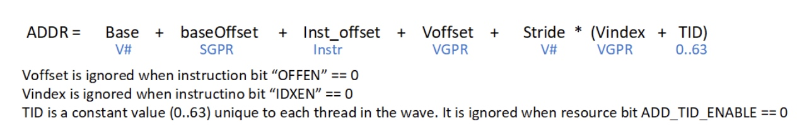
当对齐模式不允许时，内存指令会针对任何未对齐的访问返回 MEMVIOL。

# 缓冲区指令
缓冲区指令（MTBUF 和 MUBUF）允许着色器程序从内存中的线性缓冲区加载和存储。这些操作可以对小至一个字节的数据进行操作，每个工作项最多可操作四个 DWORD。原子操作从 VGPR 获取数据，并将它们与内存中已有的数据进行算术组合。或者，可以将操作发生之前内存中的值返回给着色器。缓冲区操作的 D16 指令变体将结果与打包 16 位值相互转换。例如，BUFFER_LOAD_D16_FORMAT_XYZW 存储两个具有 4 个 16 位值的 VGPR。
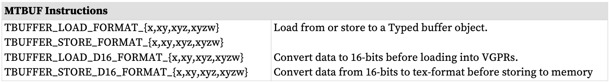

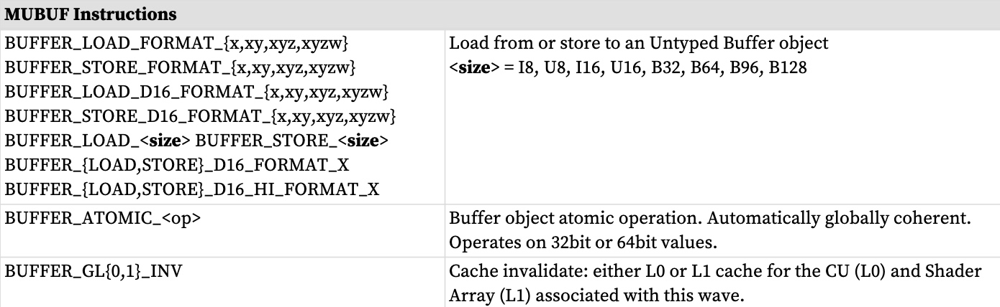
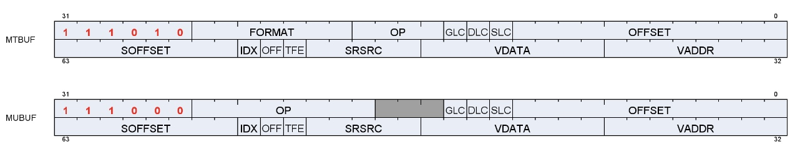

微代码格式
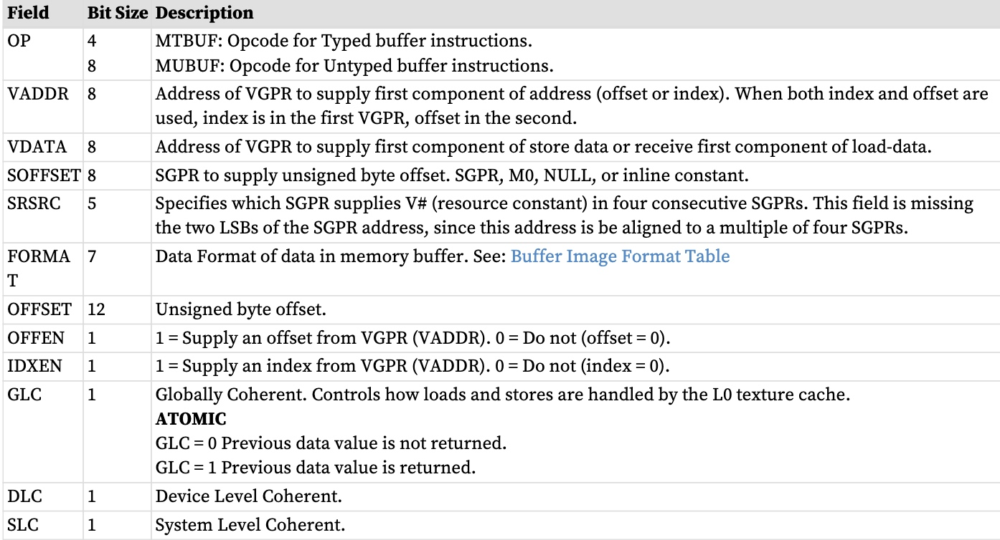
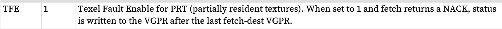

MTBUF 指令
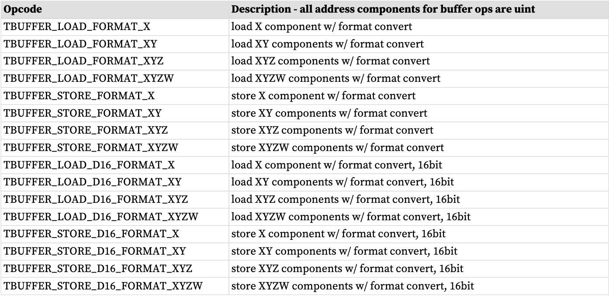

TBUFFER*_FORMAT 指令包括指令中指定的数据格式转换。

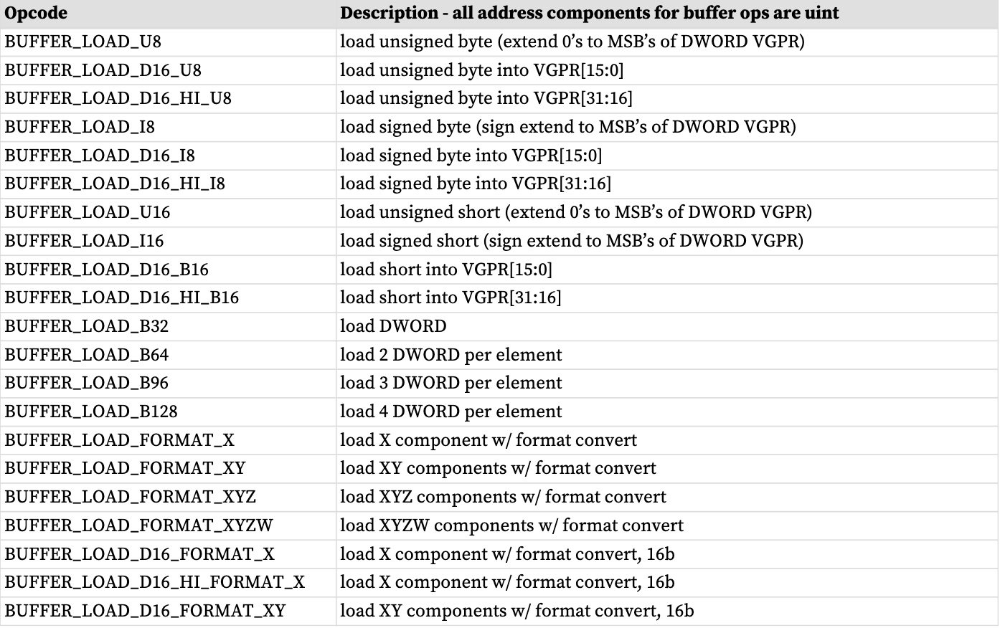
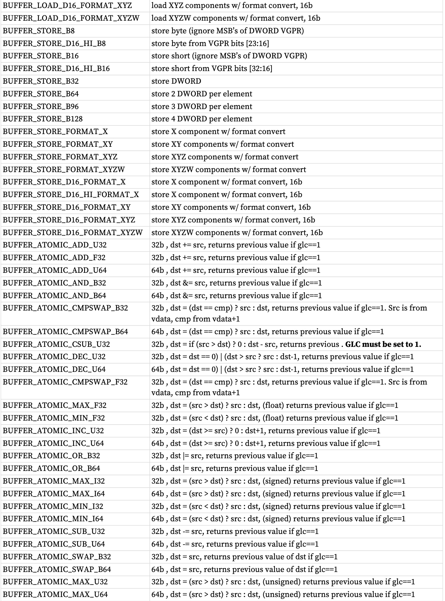
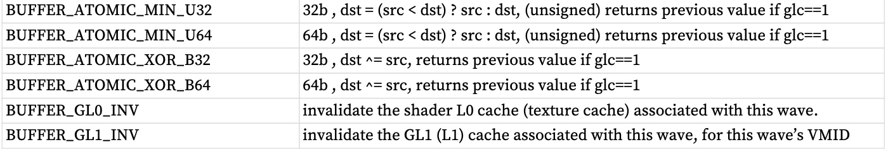

* BUFFER*_FORMAT 指令包括资源常量(V#) 中指定的数据格式转换。
* 在上表中，“D16”表示VGPR 中的数据是16 位，而不是通常的32 位。“D16_HI”表示使用VGPR的高16位，而不是使用低16位的“D16”。
# VGPR 用法
VGPR 提供地址和存储数据，并且它们可以作为返回数据的目的地。

**地址**
使用零个、一个或两个 VGPR，具体取决于指令字中的索引启用 (IDXEN) 和偏移启用 (OFFEN)。这些是无符号整数。

对于 64 位地址，LSB 位于 VGPRn 中，MSB 位于 VGPRn+1 中。

下表地址 VGPR
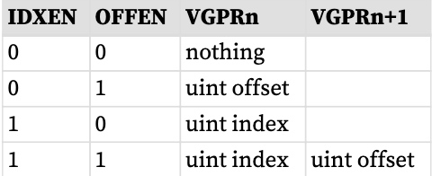

**存储数据**：N 个连续的 VGPR，从 VDATA 开始。指令字的操作码和 D16 设置中指定的数据格式决定着色器提供存储的 DWORD 数量。

**加载数据**：与商店相同。数据返回到连续的 VGPR。

**带返回的原子**：从 VDATA 开始从 VGPR 中读取数据以提供给原子操作。如果原子向 VGPR 返回一个值，则该数据将返回到从 VDATA 开始的相同 VGPR。

VGPR 和内存中的数据格式
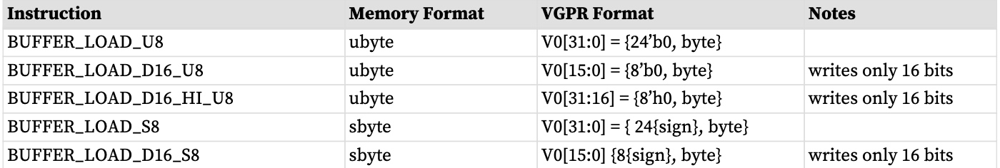
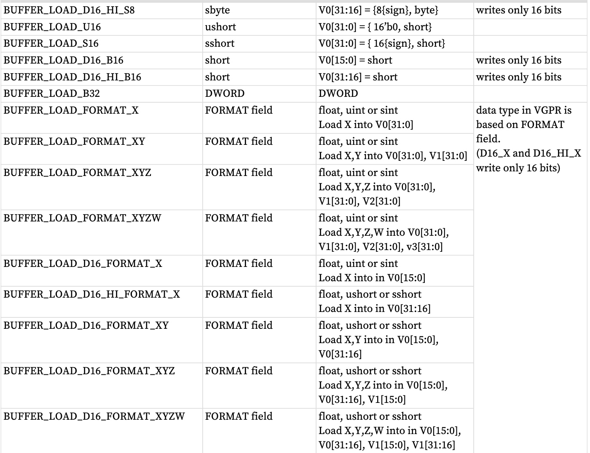

其中“V0”是VDATA VGPR； V1 是 VDATA+1 VGPR 等。
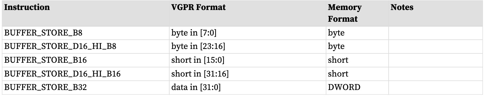
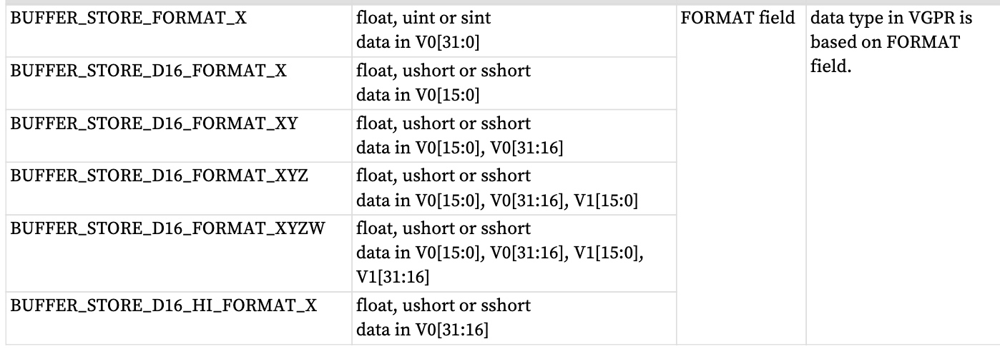
# 缓冲数据
加载或存储的数据量和类型由以下各项控制：资源格式字段、目标组件选择 (dst_sel) 和操作码。
数据格式可以来自资源、指令字段或操作码本身。 MTBUF 从指令中导出数据格式，MUBUF-“格式”指令使用来自资源的格式，而其他 MUBUF 操作码从指令本身导出数据格式。

DST_SEL 来自资源，但在许多操作中被忽略。

**指令**：使用指令的格式字段而不是资源的字段。

**数据格式派生**：数据格式从操作码派生，忽略资源定义。例如，BUFFER_LOAD_U8 将数据格式设置为 uint-8。

**DST_SEL 标识**：根据数据格式中的组件数量，为：X000、XY00、XYZ0 或 XYZW。
## D16 说明
加载格式和存储格式指令也有“D16”变体。 D16 缓冲区指令允许着色器程序在 VGPR 和内存之间加载或存储每个工作项的 16 位。对于存储，每个 32 位 VGPR 保存两个 16 位数据元素，这些数据元素被传递到纹理单元，纹理单元又在写入内存之前转换为纹理格式。对于加载，从纹理单元返回的数据被转换为 16 位，并且一对数据存储在每个 32 位 VGPR 中（首先是 LSB，然后是 MSB）。对 int 与 float 的控制由 FORMAT 控制。 float32 到 float16 的转换使用截断；其他输入数据格式的转换使用舍入到最接近的偶数。

这些指令有两种变体：
* D16 将数据加载到VGPR 的低16 位或存储来自VGPR 的低16 位的数据。
* D16_HI 将数据加载到VGPR 的高16 位或存储来自VGPR 的高16 位的数据。

例如，BUFFER_LOAD_D16_U8 从内存中为每个工作项加载一个字节，将其转换为 16 位整数，然后将其加载到数据 VGPR 的低 16 位中。
## LOAD/STORE_FORMAT 和 DATA-FORMAT 不匹配
“格式”指令指定多个元素（x、xy、xyz 或 xyzw），这可能与指令或资源的数据格式字段中指定的数据格式中的元素数量不匹配。当这种情况发生时。

* buffer_load_format_x 和 dfmt 为“32_32_32_32”：从内存加载 4 个 DWORD，但仅首先加载到着色器中
* buffer_store_format_x 和 dfmt 为“32_32_32_32”：根据 dst_sel 将 4 个 DWORD 存储到内存
* buffer_load_format_xyzw 和 dfmt 为“32”：从内存加载 1 个 DWORD，将 4 返回到着色器 (dst_sel)
* buffer_store_format_xyzw 和dfmt 为“32”：将1 个DWORD (X) 存储到内存，忽略YZW。
# 缓冲区寻址
缓冲区是内存中的数据结构，通过索引和偏移量进行寻址。索引指向大小为 stride 字节的特定记录，偏移量是记录内的字节偏移量。步长来自资源、来自 VGPR（或零）的索引、来自 SGPR 或 VGPR 以及指令本身的偏移量。

用于寻址的 BUFFER 指令字段
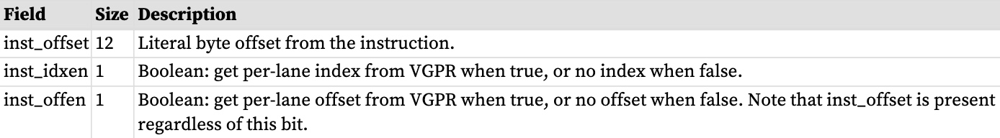

缓冲区指令的“元素大小”是指令传输的数据量（以字节为单位）。它由 MTBUF 指令的 FORMAT 字段或 MBUF 指令的操作码决定，为：1、2、4、8、12 或 16 字节。例如，格式“16_16”的元素大小为 4 字节。

用于寻址的缓冲区资源常量字段
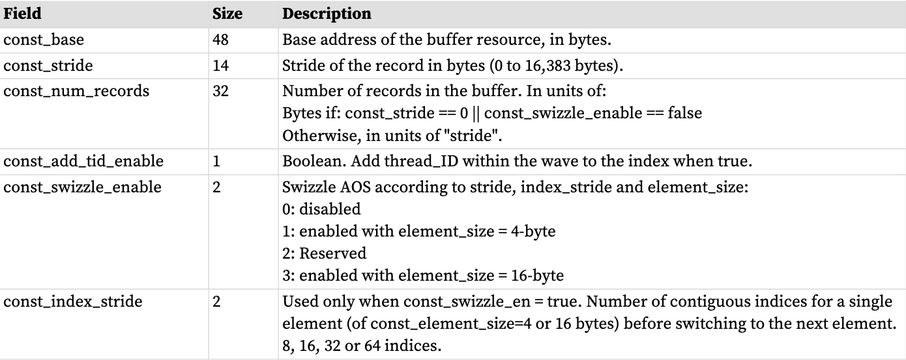

GPR 的地址组件
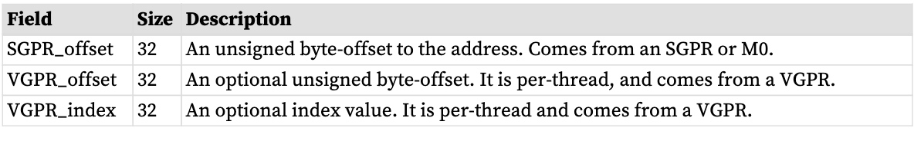

最终的缓冲存储器地址由三部分组成：
* 缓冲区资源的基地址 (V#)， 
* SGPR 的偏移量，以及
* 根据缓冲区是线性寻址（简单的结构数组计算）还是以不同方式计算的缓冲区偏移量是调配的。

线性缓冲器的地址计算
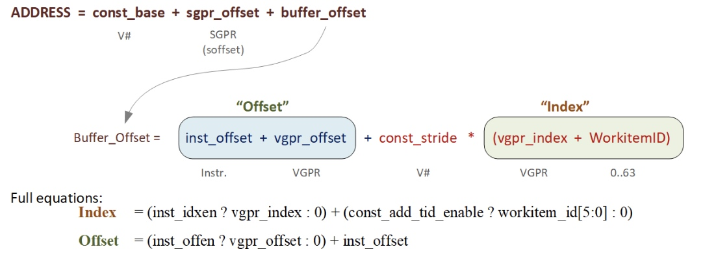
## 范围检查
根据内存缓冲区的大小检查缓冲区地址。超出范围的加载返回零，并且存储和原子被删除。范围检查是针对大于 1 DWORD 的非格式化加载和存储的每个组件进行的。请注意，load/store_B64、B96 和 B128 被视为“2-DWORD/3-DWORD/4DWORD 加载/存储”，并且每个 DWORD 均单独进行边界检查。夹紧方式由以下控制缓冲区资源中的 2 位字段：OOB_SELECT（越界选择）。

缓冲区越界选择
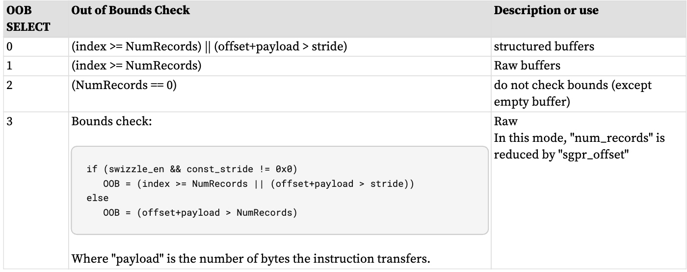

**注意：**
* 超出范围的负载返回零（V#.dst_sel = SEL_1 的组件返回 1 的组件除外）
* 超出范围的商店不存储任何东西。
* 加载/存储格式-* 指令和原子是“全有或全无”范围检查的 - 要么完全输入，要么完全输出。
* 加载/存储-B{64,96,128}并对每个组件进行范围检查。对于MTBUF，如果线程的任何组件越界，则整个线程被认为越界并返回零。对于 MUBUF，只有超出范围的分量才返回零。
### 结构化缓冲区
swizzle_en==0 的地址计算为：（结构化缓冲区）
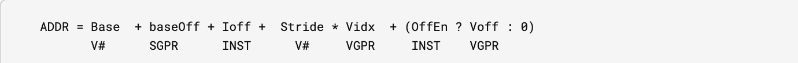
结构化缓冲区的 NumRecords 以步长为单位。
### 原始缓冲区 
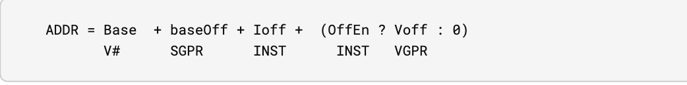
原始缓冲区的 NumRecords 以字节为单位。这是精确的范围检查，这意味着它包括有效负载并正确处理多 DWORD 和未对齐。步幅字段被忽略。
### 暂存缓冲区
swizzle_en = 0 的地址计算是…（未swizzle 暂存缓冲区）
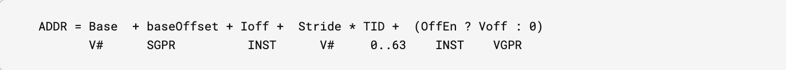
还支持暂存缓冲区的混合（并且是典型的）。 TID (TID / 64) 的 MSB 被折叠到 baseOffset 中。无范围检查（使用 OOB 模式 2）。
### 标量内存
标量内存执行以下操作，与 RAW 缓冲区和未混合的结构化缓冲区一起使用：
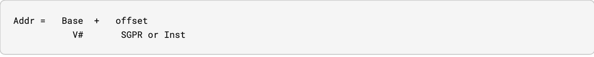
如果：offset >= ( (stride==0 ? 1 : stride) * num_records)，则地址超出范围。

**注意：**
1. 超出范围的负载返回零（V#.dst_sel = SEL_1 的组件返回 1 的组件除外）。超出范围的商店不会写任何内容。
2. 加载/存储格式-*指令和原子是“全有或全无”范围检查的——要么完全输入，要么完全输出。
3. Load/store-DWORD-x{2,3,4} 对每个组件执行范围检查。
### 混合缓冲区寻址
混合寻址会重新排列缓冲区中的数据，这可能会提高结构数组的缓存局部性。混合寻址还需要 DWORD 对齐访问。单个获取指令不得获取大于 const_element_size 的单元。缓冲区的 STRIDE 必须是 const_element_size 的倍数。

const_element_size 为 4 或 16 字节，具体取决于 V#.swizzle_enable 的设置
```
Index = (inst_idxen ? vgpr_index : 0) + (const_add_tid_enable ? thread_id[5:0] : 0)
Offset = (inst_offen ? vgpr_offset : 0) + inst_offset
index_msb = index / const_index_stride
index_lsb = index % const_index_stride
offset_msb = offset / const_element_size
offset_lsb = offset % const_element_size
buffer_offset = (index_msb * const_stride + offset_msb * const_element_size) * const_index_stride +
index_lsb * const_element_size + offset_lsb
Final Address = const_base + sgpr_offset + buffer_offset
The "sgpr_offset" is not a part of the "offset" term in the above equations - it's in the "base"
```
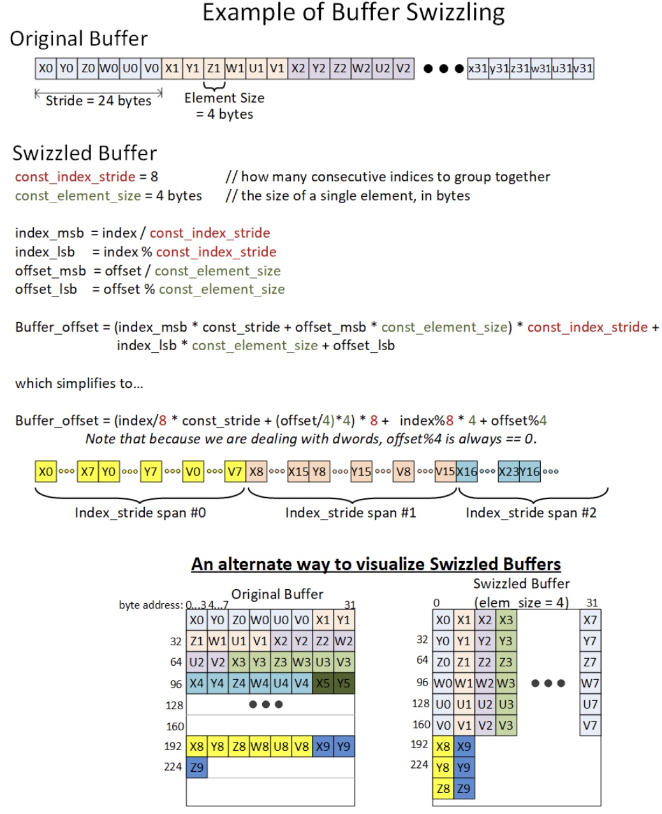
# 联盟
BUFFER_LOAD_FORMAT_* 等格式化操作必须按如下方式对齐：
* 1 字节格式需要 1 字节对齐 
* 2 字节格式需要 2 字节对齐 
* 4 字节及更大格式需要 4 字节对齐

原子必须与数据大小对齐，否则会触发 MEMVIOL。
非格式化操作的内存对齐强制由配置寄存器控制：SH_MEM_CONFIG.alignment_mode。

选项有：
0 : DWORD - 硬件自动将请求与以下较小者对齐：元素大小或 DWORD。对于 DWORD 或更大的非格式化操作的加载或存储（例如 BUFFER_LOAD_DWORD），字节地址的两个 LSB 将被忽略，从而强制 DWORD 对齐。
1 : DWORD_STRICT - 必须与以下较小者对齐：元素大小或 DWORD。
2. : STRICT - 访问必须与数据大小对齐 
3. : UNALIGNED - 允许任何对齐

如果请求的地址对齐不正确，选项 1 和 2 会报告 MEMVIOL。在选项 1 和 2 中，未对齐的加载返回零，并且丢弃未对齐的存储。请注意，在此上下文中，“元素大小”是指指令指示的数据传输的大小，而不是 const_element_size。

# 缓冲资源
缓冲区资源（V#）描述了缓冲区在内存中的位置以及缓冲区中数据的格式。它在四个连续的 SGPR（4-SGPR 对齐）中指定，并与每个缓冲区指令一起发送到纹理缓存。

下表详细介绍了组成缓冲区资源描述符的字段。

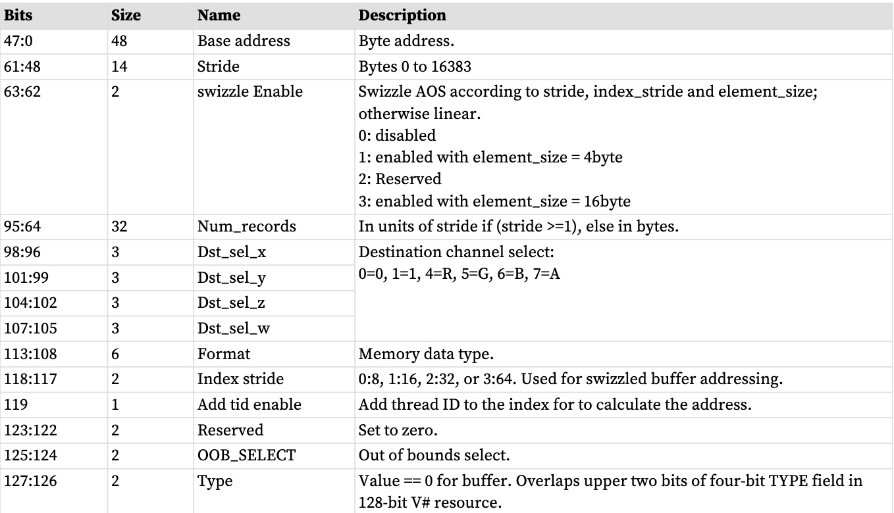

无限资源

将资源常量设置为全零会强制所有加载返回零，并忽略存储。这与“数据格式”设置为零（无效）和 MUBUF 的“add_tid_en = false”有关。

资源-指令不匹配
如果资源类型和指令不匹配（例如，带有图像指令的缓冲区常量，或者带有缓冲区指令的图像资源），则该指令将被忽略（加载不返回任何内容，并且存储不会更改内存）。