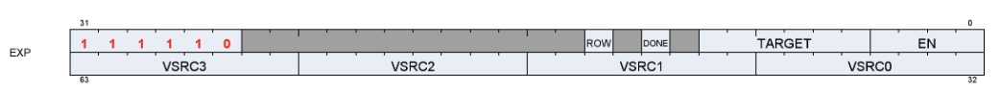
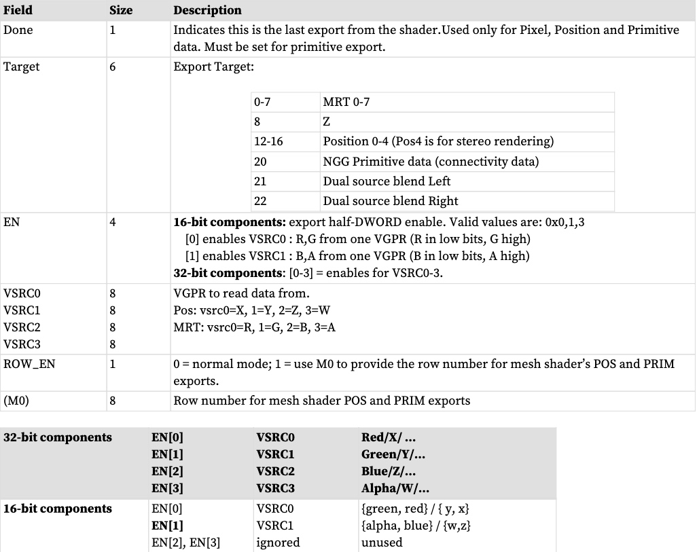
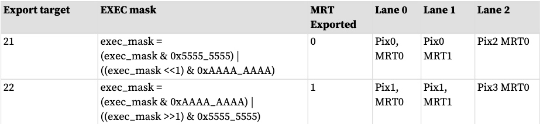

“导出”是将数据从 VGPR 复制到导出缓冲区之一（位置、颜色或 Z）的操作。导出使用 EXEC 掩码，并且仅输出启用的像素或顶点。着色器只能导出到每个目标一次。像素着色器的最后一次导出或顶点着色器的最后一次位置导出必须指示“完成”，不再有像素着色器导出或顶点位置导出。这允许渲染后端和基元汇编器分别使用这些值。

导出可以传输每个元素 32 位或 16 位数据。 16 位导出成对发生：从保存两个 16 位值的一个 VGPR 传输 32 位。导出指令不知道也不关心两者之间的差异 - 它只是在每个通道中移动 32 位数据。 16 位导出是负责转换和打包 16 位数据的着色器程序与声明导出数据类型的配置寄存器中的接收硬件之间的契约。 16 位数据被打包到 VGPR 中，第一个组成部分位于低 16 位中。

**指令字段**

# 像素着色器导出
**像素导出**
导出指令将颜色数据复制到 MRT。数据最多包含四个分量（R、G、B、A）。
或者，导出指令还输出深度 (Z) 数据。
每个像素着色器必须至少有一个导出指令。
最后执行的导出指令必须将 DONE 位设置为 1。
EXEC 掩码应用于所有导出。只有相应 EXEC 位设置为 1 的像素才会将数据导出到输出缓冲区。
每个导出目标只能导出一次。

着色器程序负责将数据从 32b 转换为 16b 以进行 16 位导出。着色器程序负责 alpha 测试。

所有可能影响样本蒙版的数据都必须在第一次从着色器导出时发送。这意味着如果要导出深度，则必须首先导出深度。如果启用了 alpha to mask，则必须首先导出 MRT0，除非同时启用了深度，在这种情况下，必须将 MRT0 的 alpha 值写入深度导出的 alpha 值。如果同时启用 alpha 到蒙版和覆盖到蒙版，则深度导出的 alpha 值将设置为 alpha 到蒙版值（MRT0 的 alpha）和覆盖到蒙版值（深度中本来存在的 alpha）的最小值出口）。如果着色器可以杀死一个像素，则必须在第一次导出之前确定。

**像素着色器双源混合**
在此模式下，交替通道（线程）保存 MRT0 和 MRT1，并非所有线程都进入一个 MRT。有两条指令可完成双源混合导出。要求到 21 和 22 的导出必须是连续的，中间不能有其他导出类型。

# 原始着色器导出（来自GS 着色器阶段）
GS 着色器使用导出指令来输出顶点位置数据，并使用内存存储顶点参数数据。该数据被传递到后续的像素着色器。

每个顶点着色器必须向 POS0 目标输出至少一个位置向量（x、y、z；w 可选）。最后的位置导出必须将 DONE 位设置为 1。为了优化性能，建议在顶点着色器中尽早输出所有位置数据。
# 依懒性检查
导出指令由硬件分两个阶段执行。首先选择要执行的指令，EXPCNT加1。此时wave已经提出了导出数据的请求，但是数据尚未导出。稍后，当导出实际发生时，读取 EXEC 掩码和 VGPR 数据并导出数据，最后递减 EXPcnt。在 EXPcnt 上使用 S_WAITCNT 可防止着色器程序在导出操作完成之前覆盖 EXEC 或保存要导出的数据的 VGPR。

可以同时处理多个导出指令。相同类型（例如：位置）的导出按顺序完成，但不同类型的导出可以乱序完成。如果 STATUS 寄存器的 SKIP_EXPORT 位设置为 1，则硬件将所有 EXPORT 指令视为 NOP。
