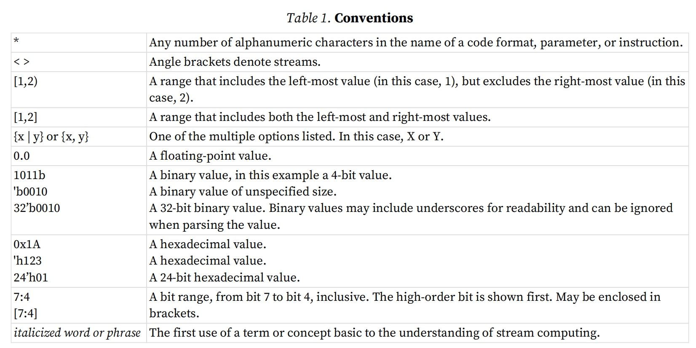
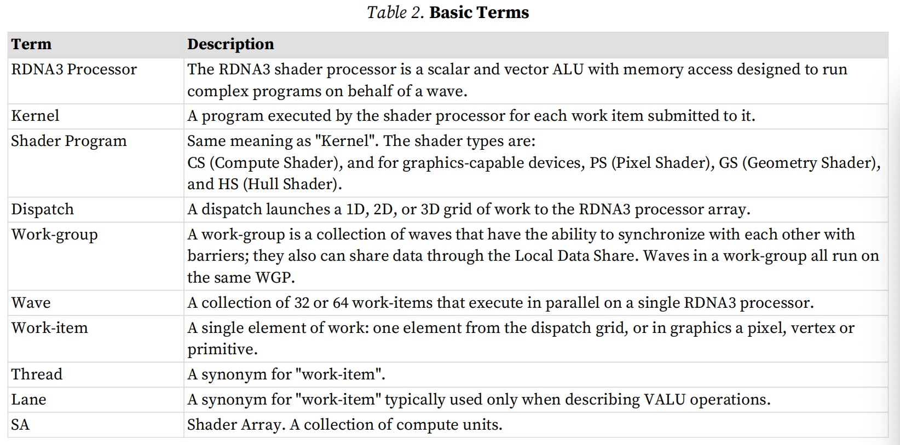
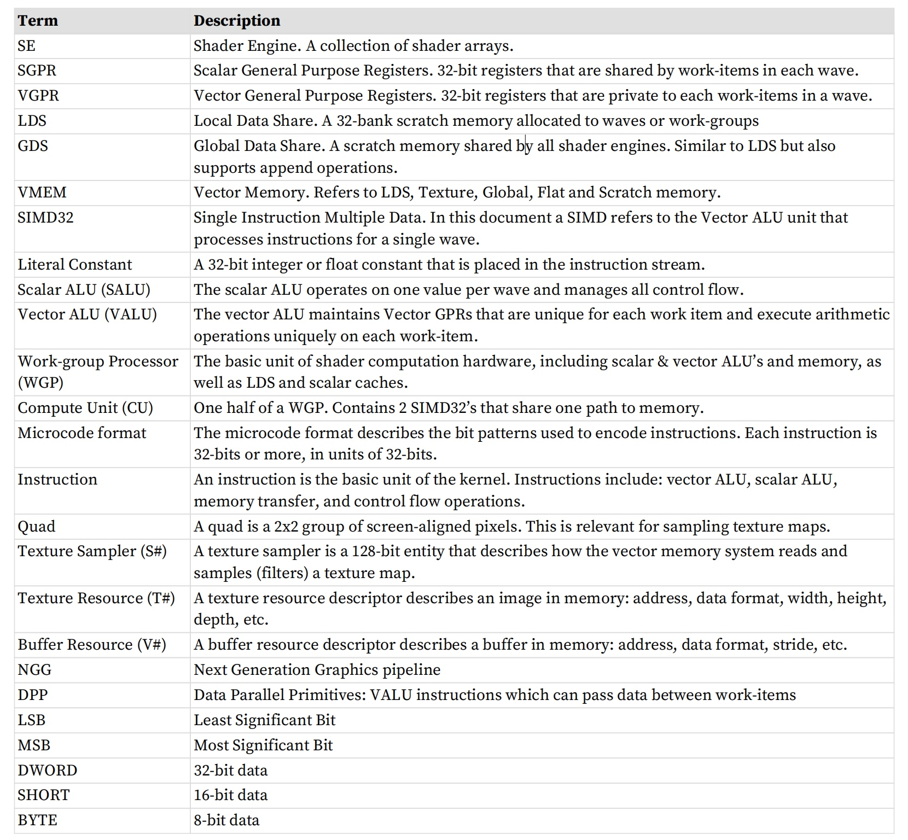
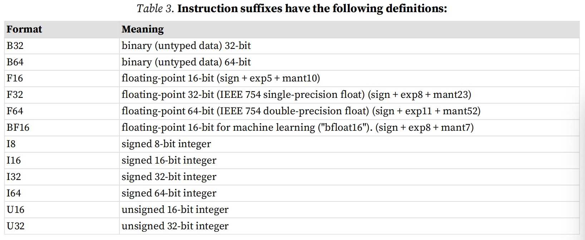
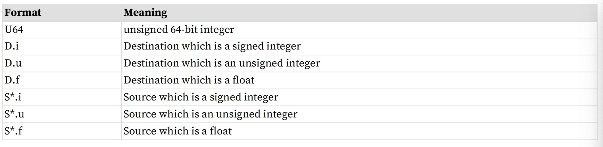
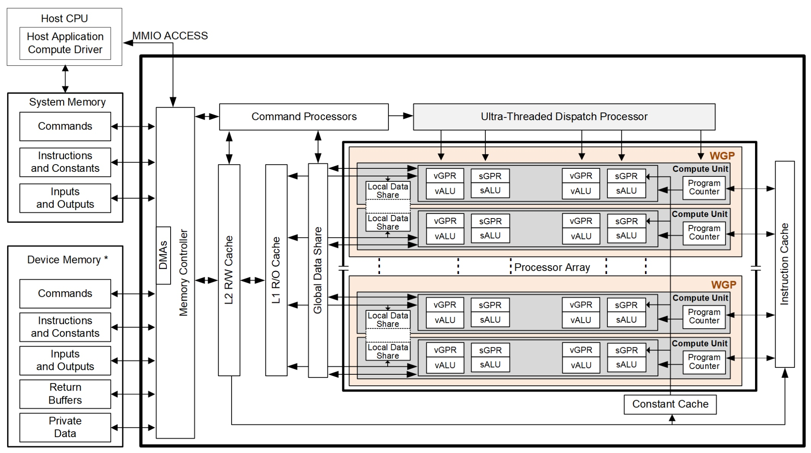
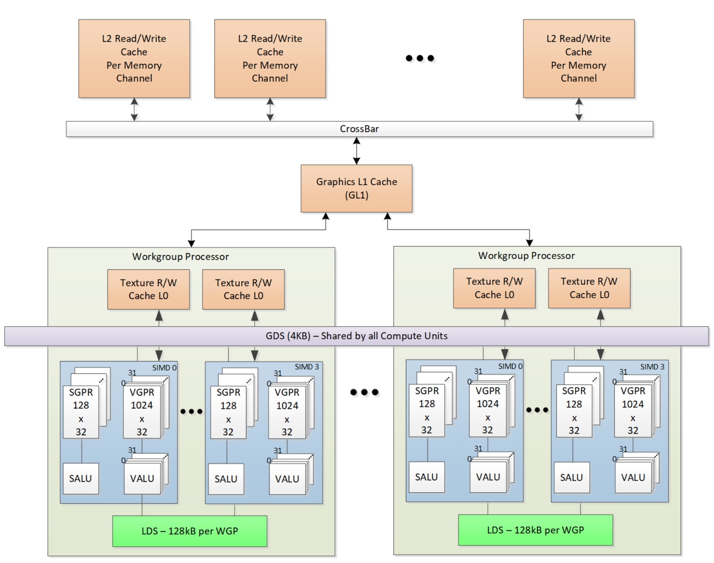

# 引言
本⽂档描述了 RDNA3 设备的指令集和着⾊器程序可访问状态。AMD RDNA3 处理器实现了并⾏微架构， 为计算机图形应⽤程序和通⽤数据并⾏应用提供了⼀个平台。
## 术语
本⽂档中使⽤ 以下术语和约定：

如果指令有两个后缀（例如， _I32_F32）， 则第⼀个后缀表⽰⽬ 标类型， 第⼆个后缀表⽰源类型。
指令定义中使⽤ 以下缩写：
· D = ⽬ 的地
· U = ⽆符号整数
· S = 来源
· SCC = 标量条件代码
· I = 有符号整数
· B = 位域
注意：.u 或 .i 指定将参数解释为⽆符号或有符号整数。
## 硬件概览
下图为AMD RDNA3代系列处理器的框图：

RDNA3设备包括数据并⾏处理器阵列、 命令处理器、 存储器控制器和其他逻辑（未⽰出）。 命令处理器读取主机已写⼊系统内存地址空间中的内存映射寄存器的命令。 当命令完成时， 命令处理器向主机发送硬件⽣成的中断。 内存控制器可以直接访问所有设备内存和主机指定的系统内存区域。 为了满⾜读取和写⼊请求， 内存控制器执⾏直接内存访问（DMA）控制器的功能， 包括根据内存中请求的数据的格式计算内存地址偏移量。

在RDNA3环境中， ⼀个完整的应⽤ 程序包括两部分：
· 在主机处理器上运⾏的程序。
· 在RDNA3 处理器上运⾏的程序， 称为渲染程序或内核。
RDNA3 程序由运⾏在主机上的驱动程序控制：
· 设置内部基地址和其他配置寄存器，
· 指定GPU 运⾏的数据域，
· 使GPU 上的缓存失效并刷新
· 使GPU 开始执⾏程序。
### WGP 工作组处理器
处理器阵列是GPU的核⼼。该阵列被组织为⼀组⼯作组处理器（WGP）管道， 每个管道彼此独⽴，在浮点或整数数据流上并⾏操作。 ⼯作组处理器管道可以处理数据，或者通过内存控制器将数据传输到内存或从内存传输数据。⼯作组处理器管道中的计算可以是有条件的。 写⼊存储器的输出也可以是有条件的。
当它收到请求时，⼯作组处理器管道从内存加载指令和数据，开始执⾏，并继续直到内核结束。当内核运⾏时，GPU硬件会⾃动将指令从内存提取到⽚上缓存中；软件在这⽅⾯不起任何作⽤。内核可以将数据从⽚外存储器加载
到⽚上通⽤寄存器（GPR）和缓存中。
GPU 设备可以检测浮点异常并可以向主机⽣成中断。特别是，它们检测硬件中的IEEE-754浮点异常； 这些可以被记录下来⽤于执⾏后分析。
GPU 通过跟踪不同执⾏阶段中潜在的数百个⼯作项，以及通过将计算操作与内存访问操作来隐藏内存延迟。
### 数据共享
处理器可以在不同的⼯作项之间共享数据。数据共享可以提⾼性能。下图显⽰了每个⼯作项可⽤的内存层次结构。

#### 本地数据共享 LDS
每个⼯作组处理器(WGP)具有128kB内存空间， 可实现⼯作组内的⼯作项或波次内的⼯作项之间的低延迟通信；这是本地数据共享 (LDS)。该存储器配置有64个存储体，每个存储体有512个4字节条⽬。共享内存包含64个整数原⼦单元，以实现快速、⽆序的原⼦操作。该存储器可⽤作可预测地重⽤数据的软件缓存、⼯作组⼯作项的数据交换机，或者作为实现对⽚外存储器的⾼效访问的协作⽅式。单个⼯作组最多可以分配64kB的LDS空间。
#### 全局数据共享 GDS
AMD RDNA3设备使⽤4kB全局数据共享(GDS)内存，可供所有WGP上的内核波形使⽤？。该存储器为所有处理元件提供每个周期128字节的存储器访问。 它为任何处理器提供对任何位置的完全访问。 共享内存包含2个整数原⼦单元， 以实现快速、⽆序的原⼦操作。 该内存可⽤作软件缓存来存储计算内核、归约操作或⼩型全局共享表⾯的重要控制数据。数据可以在内核启动之前从内存中预加载，并在内核完成后写⼊内存。 GDS块包含对内存中缓冲区的⽆序追加/消费和域启动有序追加/消费操作的⽀持逻辑。 这些专⽤电路可以快速压缩数据或在内存中创建复杂的数据结构。
### 设备内存
AMD RDNA3设备提供了多种从处理元件（processing elements）访问⽚外内存的⽅法在每个 WGP 内。 在主读取路径上，该设备由多个L2缓存通道组成，这些通道向只读L1 缓存提供数据， 并最终向每个WGP的L0缓存提供数据。 

特定的无缓存加载指令可以在执行加载子句期间强制从设备内存中检索数据。加载请求子句内的重叠部分会相对于彼此进行缓存。输出缓存由两级组成
缓存：第一个用于写组合缓存（收集分散和存储操作并将它们组合起来以提供
良好的内存访问模式）；第二个是带有原子单元的读/写缓存，让每个处理
元件完成返回初始值的无序原子访问。每个处理元件提供原子操作作用的目的地址、原子操作要使用的数据以及读/写原子单元的返回地址，用于将预操作值存储在内存中。每个存储或原子可以设置操作以在写入确认后向请求的 PE 返回确认返回值（目标处的前原子操作值）被存储到设备内存中。

此应答有两个⽬的：
· 使PE能够在收到写确认后通过从其返回地址执⾏⽆缓存加载来从原⼦操作中恢复预操作
· 使系统能够维持宽松的⼀致性模型。

从给定PE到给定内存通道的每次分散写⼊都会保持顺序。该确认使⼀个处理元件能够实现栅栏， 以通过确保在完成后续写⼊之前所有写⼊都已被发布到存储器来维持串⾏⼀致性。以这种⽅式，系统可以在系统上操作的所有并⾏⼯作项之间维持宽松的⼀致性模型。