本地数据共享 (LDS) 是一种低延迟 RAM 暂存器，用于临时数据存储以及在工作组内的线程之间共享数据。与通过内存访问数据相比，通过 LDS 访问数据可能会显着降低延迟并提高带宽

对于计算工作负载，它允许使用一种简单的方法在同一工作组内不同波次的线程之间传递数据。对于图形，它还用于保存像素着色器的顶点参数。

LDS 空间按工作组或波（未使用工作组时）分配，并记录在着色器不可写入的专用 LDSbase/大小（分配）寄存器中。这些限制所有 LDS 访问工作组或 wave 拥有的空间。
# 概述
下图显示了 LDS 如何适应 GPU 的内存层次结构。
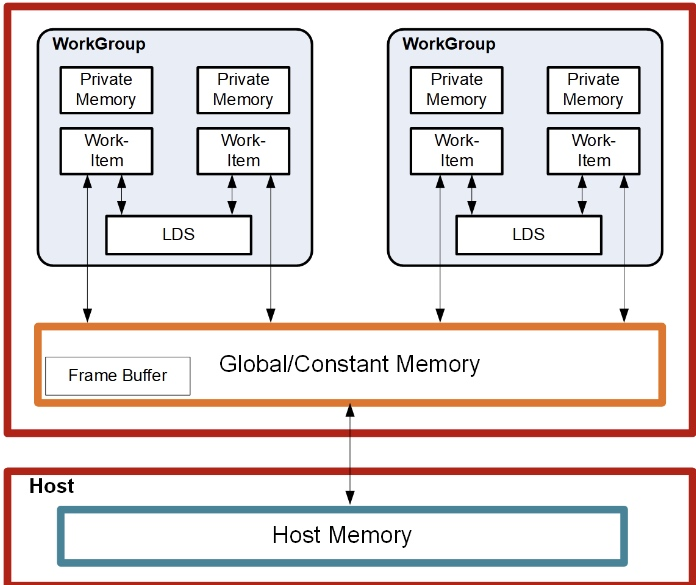


每个工作组处理器有 128kB 内存，分为 64 个 DWORD 宽 RAM 组。这 64 家银行进一步细分为两组，每组 32 家银行，其中 32 家银行附属于一对 SIMD32，其他 32 家银行附属于 WGP 内的另一对 SIMD32。每个存储体都是一个 512x32 双端口 RAM（每个时钟周期 1R/1W）。 DWORD 连续放置在存储体中，但所有存储体都可以同时执行存储或加载。一个工作组最多可以请求 64kB 内存。

LDS 存储器的高带宽不仅是通过其靠近 ALU 实现的，而且还通过同时访问其存储器组来实现。因此，可以同时执行 32 个存储或加载指令，每个指令名义上为 32 位；扩展指令 load_2addr/store_2addr 每个可以是 64 位。但是，如果同时对同一存储体进行多次访问尝试，则会发生存储体冲突。在这种情况下，对于索引和原子操作，硬件被设计为通过将它们转换为串行访问来防止对同一存储体的并发访问尝试。这会降低 LDS 的有效带宽。因此，为了提高吞吐量（最佳效率），避免组冲突非常重要。了解请求调度和地址映射是帮助实现这一目标的关键。

## 内存结构中的数据流
下图是内存结构内数据流的概念图。


数据可以通过使用“DS”指令从 VGPR 传输到 LDS 或从内存加载来加载到 LDS 中。从内存加载时，数据可能会首先加载到 VGPR 中，或者对于某些类型的加载，数据可能会直接从内存加载到 LDS 中。要将数据从 LDS 存储到全局内存，需要从 LDS 读取数据并将其放入工作项的 VGPR，然后写出到全局内存。为了帮助有效利用 LDS，着色器程序必须对全局内存和 LDS 之间传输的内容执行许多操作。

LDS 原子在 LDS 硬件中执行。尽管 ALU 不直接用于这些操作，但 LDS 执行此函数会产生延迟。
## LDS 模式和分配：CU和WGP模式
波工作组以两种模式之一进行调度：CU 或 WGP。
有关详细信息，请参阅本节：WGP 和 CU 模式

## LDS 访问方法
本地数据共享访问有 3 种形式：

**直接负载:**

从 LDS 加载单个 DWORD 并将数据广播到所有通道上的 VGPR。

**索引加载/存储和原子操作:**

加载/存储地址来自 VGPR 以及传入/来自 VGPR 的数据。
LDS-ops 需要最多 3 个输入：2data+1addr 和立即返回 VGPR。
**参数插补负载:**

从每个四边形的 LDS 读取像素参数并将其加载到一个 VGPR 中。
读取每个四边形的所有 3 个参数（P1、P1-P0 和 P2-P0）并将它们加载到四边形内的 3 个通道中（第 4 个通道接收零）。

# 像素参数插值
对于像素波，在波开始之前，顶点属性数据被预加载到 LDS 中，并且重心（I、J）被预加载到 VGPR 中。可以通过使用 LDS_PARAM_LOAD 将属性数据从 LDS 加载到 VGPR 中，然后使用 V_INTERP 指令对每个像素的值进行插值来执行参数插值。

LDS参数加载用于读取顶点参数数据并将其存储在VGPR中以用于参数插值。这些指令的操作方式与内存指令类似，只不过它们使用 EXPcnt 来跟踪未完成的读取，并在它们到达 VGPR 时递减 EXPCnt。

像素着色器可以在参数数据写入 LDS 之前启动。一旦数据在 LDS 中可用，波形的 STATUS 寄存器“LDS_READY”位将设置为 1。如果在设置 LDS_READY 之前发出 LDS_DIRECT_LOAD 或 LDS_PARAM_LOAD，则像素着色器波形将停止。

最常见的插值形式涉及通过重心坐标“I”和“J”对顶点参数进行加权。一个常见的计算是：

```
Result = P0 + I * P10 + J * P20
where "P10" is (P1 - P0), and "P20" is (P2 - P0)
```
参数插值涉及两种类型的指令：

*  LDS_PARAM_LOAD：将打包参数数据从LDS 读取到VGPR（每个四边形打包的数据） 
* V_INTERP_*：VALU FMA 指令，用于跨四边形中的通道解包参数数据。
## LDS 参数加载
参数加载仅在 LDS 中可用，在 GDS 中不可用，并且仅在 CU 模式下可用（不适用于 WGP 模式）。

LDS_PARAM_LOAD 将一个 32 位属性或两个 16 位属性的三个参数（P0、P10、P20）从 LDS 读取到 VGPR 中。对于四边形内的 4 个像素，有 3 个参数（P0、P10 和 P20）相同。这些值分布在每个四边形的 VGPR 通道 0、1 和 2 上。然后使用 FMA 和 DPP 执行插值，因此每个通道都使用其 I 或 J 值以及四边形的共享 P0、P10 和 P20 值。
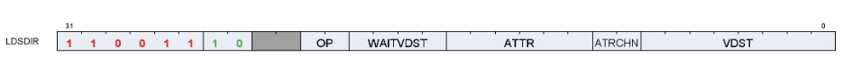

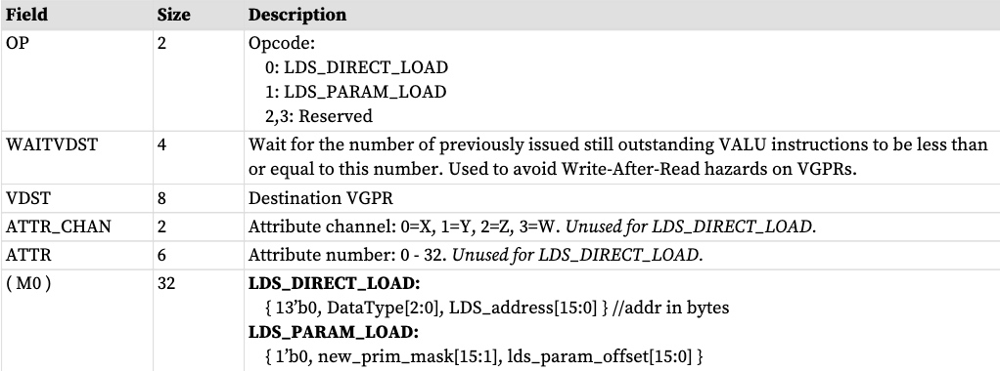

M0 是为此指令隐式读取的，并且必须在这些指令之前初始化

**new_prim_mask**

每个四元组有一个位的掩码，指示该四元组开始一个新的基元；零表示与之前的四元组相同的基元。波中的第一个四边形有一个隐含的“1”（每个波都开始一个新的基元），因此位 [0] 被省略。
**lds_param_offset**
参数偏移量表示参数在LDS中的起始地址。之前的空间可以作为临时的波浪存储空间。 Lds_param_offset 位 [6:0] 必须设置为零。

**Example LDS_PARAM_LOAD**  (new_prim_mask[3:0] = 0110)
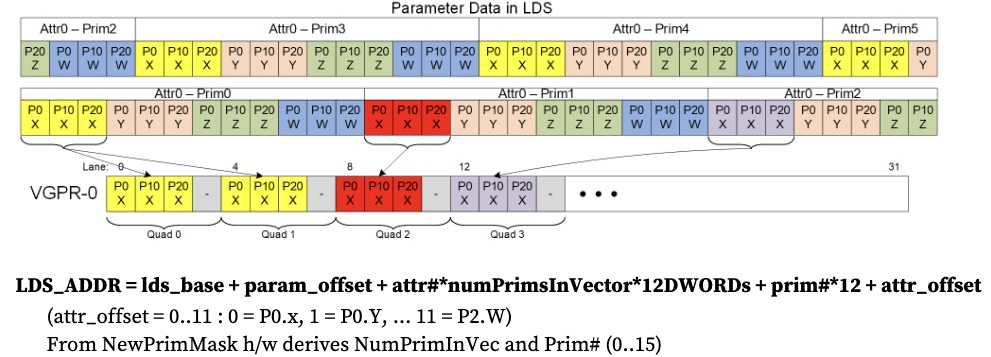

如果 dest-VGPR 超出范围，则仍会执行加载，但 EXEC 会强制为零
LDS_PARAM_LOAD 和 LDS_DIRECT_LOAD 对每个四边形使用 EXEC（如果在四边形中启用了任何像素，则数据将写入四边形中的所有 4 个像素/线程）。
###  16位参数
16 位参数作为 DWORD 中的属性对打包在 LDS 中：ATTR0.X 和 ATTR1.X 共享一个 DWORD。还有一种替代打包模式，其中参数不打包（一个 16 位参数位于 DWORD 的低半部分）。这些属性可以使用相同的 LDS_PARAM_LOAD 指令读取，并返回具有 2 个属性的打包 DWORD（当它们被打包时）。然后可以使用特定的混合精度 FMA 操作码以及 DPP（选择 P0、P10 或 P20）和 OPSEL（选择高位或低位 16 位）来完成插值。

重心是 32 位，而不是 16 位。
### 参数加载数据危险避免
这些数据依赖性规则适用于参数加载和直接加载。

LDS_DIRECT_LOAD 和 LDS_PARAM_LOAD 从 LDS 读取数据并将其写入 VGPR，它们使用 EXPcnt 来跟踪指令何时完成并写入 VGPR。

由着色器程序来确保避免数据危险。这些指令沿着与 VALU 指令不同的路径发出，因此之前的 VALU 指令可能仍在从这些 LDS 指令将要写入的 VGPR 中读取，这可能会导致危险。

EXPcnt 用于跟踪写后读危险，其中 LDS_PARAM_LOAD 将一个值写入 VGPR，而另一条指令读取该值。着色器程序使用“s_waitcnt EXPcnt”等待 LDS_DIRECT_LOAD 或 LDS_PARAM_LOAD 的结果在 VGPR 中可用，然后再在后续指令中使用它。 VINTERP 指令有一个“wait_EXPcnt”字段来帮助避免这种危险。

当 EXEC==0 和 EXPCnt==0 时（如内存操作），这些将被跳过。

来自同一波的混合导出和 LDS-direct/param 指令可能无法按顺序完成（均使用 EXPcnt），如果它们重叠，则需要“s_waitcnt 0”。

```
LDS_PARAM_LOAD V2
S_WAITCNT EXPcnt  0
```

如果 VALU 指令读取 VGPR，然后 LDS_PARAM_LOAD 写入该 VGPR，则存在潜在的读后写危险：LDS_PARAM_LOAD 可能会在读取之前覆盖 VALU 的源 VGPR。用户必须使用 LDS_PARAM_LOAD 指令的“wait_Vdst”字段来防止这种情况。该字段指示发出 LDS_PARAM_LOAD 时可能未完成的未完成 VALU 指令的最大数量。使用此命令可确保所有相关 VALU 指令均已完成。

另一个潜在的数据危险涉及 LDS_PARAM_LOAD 覆盖尚未被先前 VMEM（LDS、纹理、缓冲区、平面）指令读取为源的 VGPR。为了避免这种危险，用户必须确保 VMEM 指令已读取其源 VGPR。这可以通过在 LDS_PARAM_LOAD 之前发出任何 VALU 或导出指令来实现。
# VALU 参数插值
参数插值是使用 FMA 操作执行的，该操作包括内置 DPP 操作，用于将每四边形 P0/P10/P20 值解包为每通道值。由于该指令从相邻通道读取数据，因此隐式 DPP 的行为就像“获取无效 = 1”一样，因此该指令可以从 EXEC==0 的相邻通道读取数据，而不是从中获取值 0。标准插值计算：
```
Per-Pixel-Parameter = P0 + I * P10 + J * P20 // I, J are per-pixel; P0/P10/P20 are per-primitive
```
该参数插值是使用一对指令实现的：
```
// V1 = I, V2 = J, V3 = result of LDS_PARAM_LOAD
V_INTERP_P10_F32 V4, V3[1], V1, V3[0] // tmp = P0 + I*P10
// uses DPP8=1,1,1,1,5,5,5,5; Src2(P0) uses DPP8=0,0,0,0,4,4,4,4
V_INTERP_P20_F32 V5, V3[2], V2, V4 // dst = J*P20 + tmp uses DPP8=2,2,2,2,6,6,6,6
```
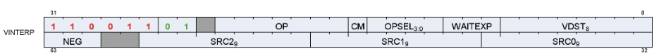
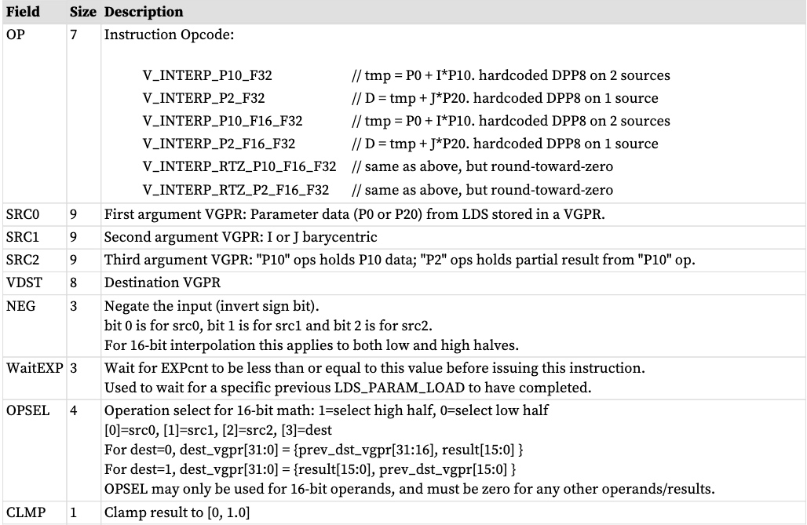

VINTERP 指令包括内置“s_waitcnt EXPcnt”，可轻松解决 LDS_PARAM_LOAD 生成的数据的数据危险问题。

指令限制：
 * V_INTERP 指令不检测或报告异常。 
 * V_INTERP 指令不支持将数据转发到通常来自LDS 数据的输入（V_INTERP_P10_* 的源A 和C 以及V_INTERP_P2_* 的源A）。

 VGPR 预加载了部分或全部：
 * I_persp_sample, J_persp_sample, I_persp_center, J_persp_center,
 * I_persp_centroid, J_persp_centroid
 * I/W, J/W, 1.0/W,
 * I_linear_sample, J_linear_sample
 * I_linear_center, J_linear_center
 * I_linear_centroid, J_linear_centroid

 这些指令消耗​​ LDS_PARAM_LOAD 提供的数据。这些指令包含内置的“s_waitcnt EXPcnt <= N”功能，以实现高效的软件流水线操作。

```
lds_param_load V0, attr0
lds_param_load V10, attr1
lds_param_load V20, attr2
lds_param_load V30, attr3
v_interp_p0 V1, V0[1], Vi, V0[0] s_waitcnt EXPcnt<=3 //Wait V0
v_interp_p0 V11, V10[1], Vi, V10[0] s_waitcnt EXPcnt<=2
v_interp_p0 V21, V20[1], Vi, V20[0] s_waitcnt EXPcnt<=1
v_interp_p0 V31, V30[1], Vi, V30[0] s_waitcnt EXPcnt<=0 //Wait V30
v_interp_p2 V2, V0[2], Vj, V1
v_interp_p2 V12, V10[2], Vj, V11
v_interp_p2 V22, V20[2], Vj, V21
v_interp_p2 V32, V30[2], Vj, V31
```
## 16位参数插值
16 位插值对打包到 16 位 VGPR 中的属性值对进行操作。它们在插值期间使用相同的 I 和 J 值。 OPSEL 用于选择数据的上部或下部。

16 位插值指令有多种变体，可将舍入模式覆盖为“向零舍入”。

V_INTERP_P10_F16_F32 dst.f32 = vgpr_hi/lo.f16 * vgpr.f32 + vgpr_hi/lo.f16 // tmp = P10 * I + P0

* allows OPSEL; Src0 uses DPP8=1,1,1,1,5,5,5,5; Src2 uses DPP8=0,0,0,0,4,4,4,4

V_INTERP_P2_F16_F32 dst.f16 = vgpr_hi/lo.f16 * vgpr.f32 + vgpr.f32 // dst = P2 * J + tmp
* allows OPSEL; Src0 uses DPP8=2,2,2,2,6,6,6,6

# LDS 直接加载
直接加载仅在 LDS 中可用，在 GDS 中不可用。仅在 CU 模式下允许直接访问，在 WGP 模式下不允许直接访问。LDS_DIRECT_LOAD 指令从 LDS 读取单个 DWORD 并将其返回到 VGPR，并进行广播.

M0 提供地址和数据类型。 LDS_DIRECT_LOAD 对每个四边形而不是每个像素使用 EXEC：如果启用了四边形中的任何像素，则数据将写入四边形中的所有 4 个像素。
LDS_DIRECT_LOAD 使用 EXPcnt 来跟踪完成情况。

LDS_DIRECT_LOAD 使用与 LDS_PARAM_LOAD 相同的指令格式和字段。请参阅像素参数插值。
```
LDS_addr = M0[15:0] (byte address and must be DWORD aligned)
DataType = M0[18:16]
0 unsigned byte
1 unsigned short
2 DWORD
3 unused
4 signed byte
5 signed short
6,7 Reserved

Example: LDS_DIRECT_LOAD V4 // load the value from LDS-address in M0[15:0] to V4
```
在将结果写入 VGPR 之前，有符号字节和短数据会被符号扩展为 32 位；无符号字节和短数据在写入 VGPR 之前会被零扩展为 32 位。

# 数据共享索引和原子访问
LDS和GDS都可以执行索引和原子数据共享操作。为简洁起见，下文中使用“LDS”，除非另有说明，否则也适用于 GDS。

索引和原子操作从 VGPR 向 LDS 提供每个工作项的唯一地址，并向 VGPR 提供或返回每个工作项的唯一数据。由于 LDS 的内部分组结构，操作可以在短至一个周期（对于wave32，或对于wave64来说2个周期）内完成，或者需要多达64个周期，具体取决于存储体冲突的数量（映射到相同的地址）记忆库）。

索引操作是简单的 LDS 加载和存储操作，用于从 VGPR 读取数据并向其返回数据。

原子运算是将 VGPR 中的数据与 LDS 中的数据组合起来的算术运算，并将结果写回 LDS。原子操作可以选择将 LDS“预操作”值返回给 VGPR。

LDS 索引和原子指令使用 LGKMcnt 来跟踪它们何时完成。 LGKMcnt 随着每条指令的发出而递增，并在指令完成执行时递减。 LDS 指令与同一波形中的其他 LDS 指令保持顺序。

下表列出并简要描述了 LDS 指令字段。
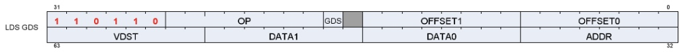

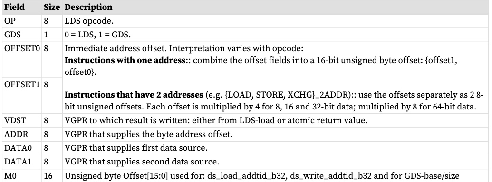

M0 寄存器不用于大多数 LDS 索引操作：只有“ADDTID”指令读取 M0，并且对于这些操作来说，它代表字节地址。

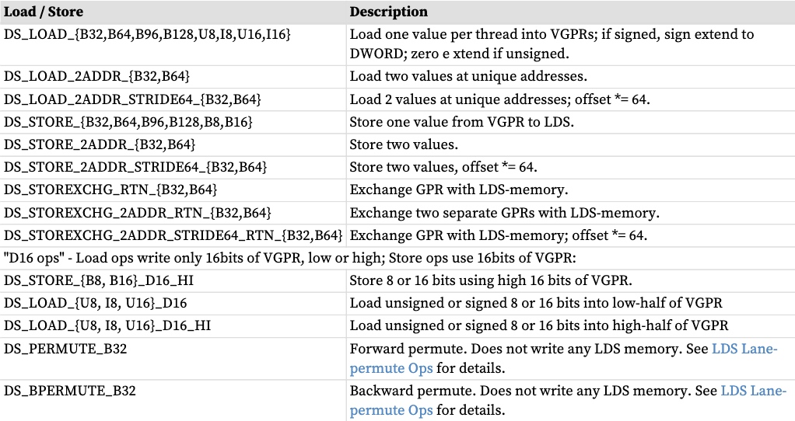
**单地址指令**
```
LDS_Addr = LDS_BASE + VGPR[ADDR] + {InstOffset1,InstOffset0}
```

**双地址指令**
```
LDS_Addr0 = LDS_BASE + VGPR[ADDR] + InstOffset0*ADJ +
LDS_Addr1 = LDS_BASE + VGPR[ADDR] + InstOffset1*ADJ +
Where ADJ = 4 for 8, 16 and 32-bit data types; and ADJ = 8 for 64-bit
```
双地址指令为：LOAD_2ADDR*、STORE_2ADDR* 和 STOREXCHG_2ADDR_*。地址来自VGPR，VGPR[ADDR]和InstOffset都是字节地址。在创建 wave 时，LDS_BASE 被分配给该 wave 或工作组拥有的物理 LDS 区域。

**DS_{LOAD,STORE}_ADDTID 寻址**
```
LDS_Addr = LDS_BASE + {InstOffset1, InstOffset0} + TID(0..63)*4 + M0
Note: no part of the address comes from a VGPR. M0 must be DWORD-aligned.
```
“ADDTID”（添加线程 ID）是一种单独的形式，其中指令的基地址对所有线程都是公共的，但是每个线程都根据其在波形中的线程 ID 添加了固定偏移量。这可以提供一种方便的方式在 VGPR 和 LDS 之间快速传输数据，而无需使用 VGPR 提供地址。

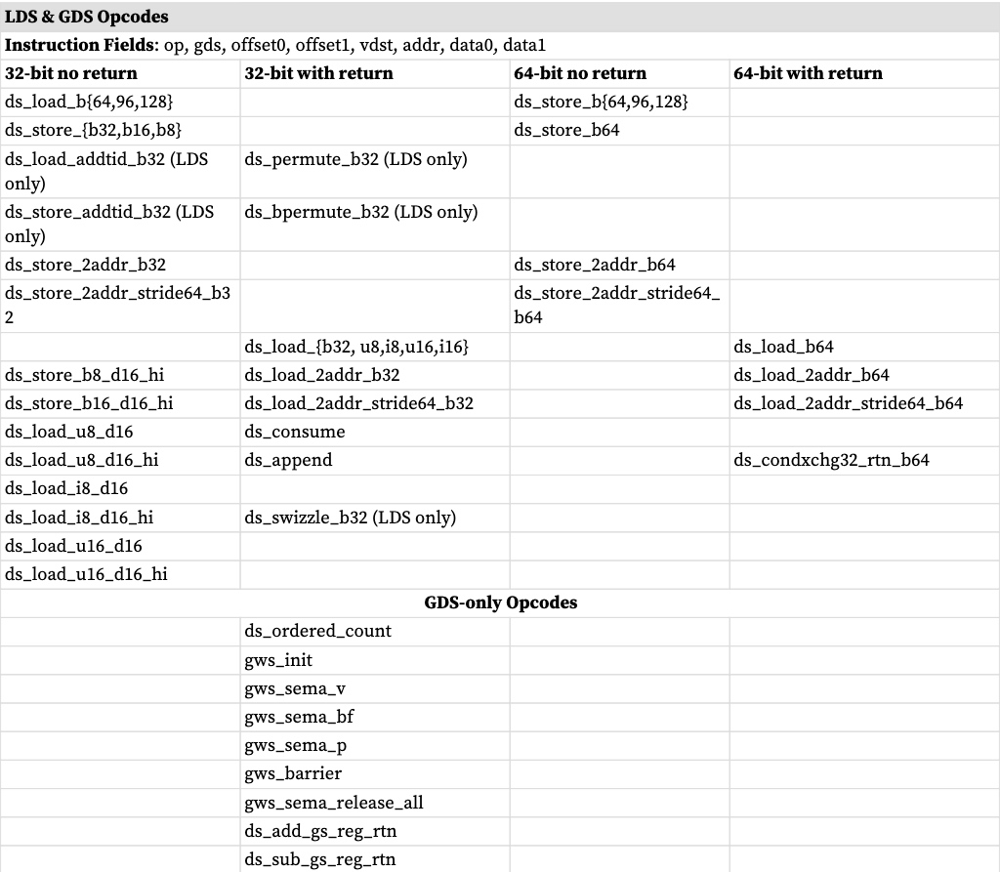

## LDS 原子操作
原子操作将 VGPR 中的数据与 LDS 中的数据组合，将结果写回到 LDS 内存，并可选择将“预操作”值从 LDS 内存返回到 VGPR。当波形中的多个通道访问相同的 LDS 位置时，没有指定通道执行操作的顺序，只是每个通道在另一个通道对数据进行操作之前执行完整的读取-修改-写入操作。
```
LDS_Addr0 = LDS_BASE + VGPR[ADDR] + {InstOffset1,InstOffset0}
```

VGPR[ADDR] 是字节地址。 VGPR 0,1 和 dst 是双打数据的双 GPR。 VGPR 数据源只能是 VGPR 或常数值，不能是 SGPR。浮点原子操作使用 MODE 寄存器来控制非正规刷新行为。
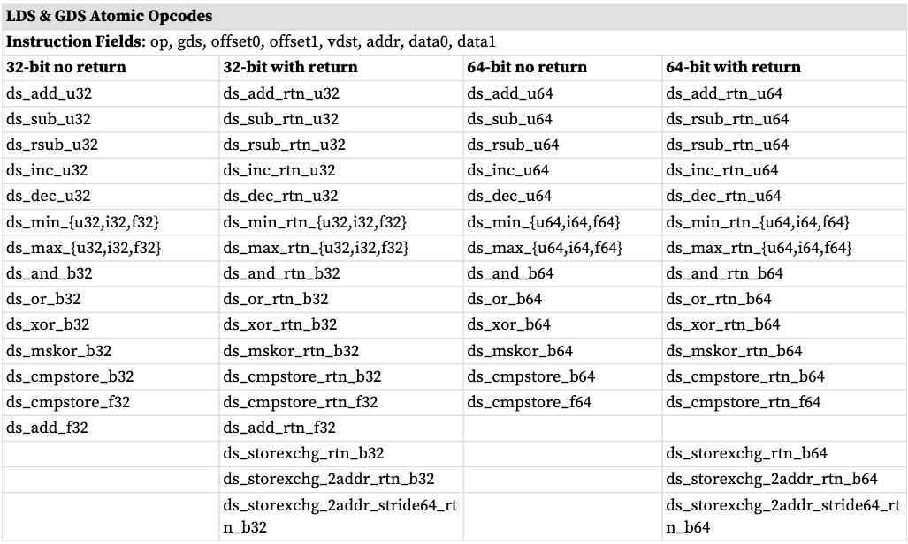

##  LDS 通道置换操作
DS_PERMUTE 指令允许数据在 32 个通道中任意混合。提供了两个版本的指令：向前（分散）和向后（聚集）。这些仅存在于 LDS 中，而不存在于 GDS 中。

请注意，在 wave64 模式下，排列一次仅在 wave64 的每一半上跨 32 个通道进行操作。换句话说，它的执行就像两个独立的 wave32 一样。每个半波可以使用 0-31 范围内的索引来参考同一半波中的车道。

这些指令使用LDS硬件，但不使用任何内存存储，并且可以被未分配任何LDS空间的wave使用。这些指令提供来自 VGPR 的数据值和每个通道的索引值。

* ds_permute_b32 : Dst[index[0..31]] = src[0..31] 其中 [0..31] 是通道编号 
* ds_bpermute_b32 : Dst[0..31] = src[index[0.. 31]]

EXEC 掩码适用于读取源和写入目标。索引值超出范围环绕（仅使用索引位 [6:2]，忽略索引的其他位）。从禁用通道读取数据将返回零。

指令字中：VDST 为目标 V​​GPR，ADDR 为索引 VGPR，DATA0 为源数据 VGPR。
请注意，索引值以字节为单位（因此乘以 4），并且在使用前添加“offset0”字段。
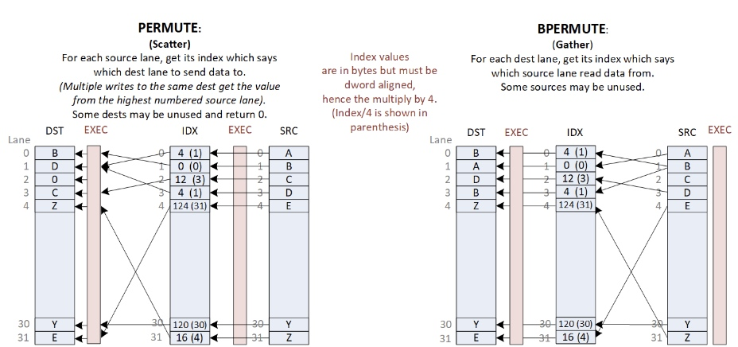


## 用于光线追踪的 DS 堆栈操作
DS_BVH_STACK_RTN_B32 是一条 LDS 指令，用于管理光线追踪 BVH 遍历中使用的 LDS 中的每线程浅堆栈。 BVH 结构由盒节点和三角形节点组成。一个盒子节点最多有四个子节点指针，对于给定的光线（线程），这些子节点指针可能全部返回到着色器（VGPR）。遍历着色器每次迭代都遵循每条光线的一个指针，并且可以将额外的指针推送到 LDS 中的每线程堆栈。注意：返回的指针是经过排序的。

这个“短堆栈”的大小有限，超出了堆栈环绕并覆盖旧项目的范围。当堆栈耗尽时，着色器应切换到无堆栈模式，在该模式下从内存中的表查找当前节点的父节点。着色器程序跟踪最后访问的地址以避免重新遍历子树。

DS_BVH_STACK_RTN_B32 vgpr(dst)、vgpr(stack_addr)、vgpr(lvaddr)、vgpr[4]
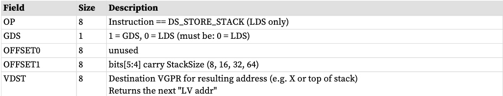
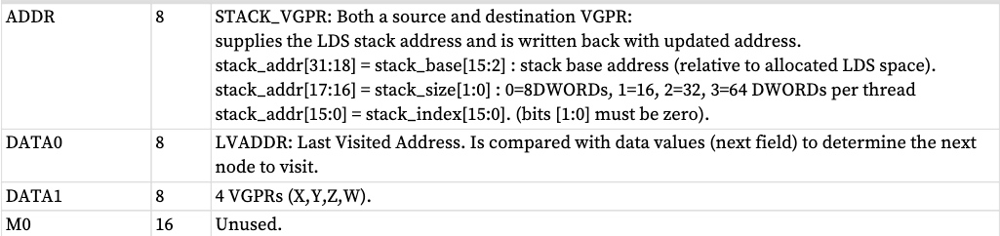
# 全局数据共享
全局数据共享与 LDS 类似，但它是 GPU 上所有 Wave 都可以访问的单个内存。全局数据共享使用与本地数据共享相同的指令格式（仅索引操作 - 无插值或直接加载）。指令为所有加载、存储和原子操作递增 LGKMcnt，并在指令完成时递减 LGKMcnt。 GDS 指令每条指令仅支持一个活动通道。使用第一个活动通道（基于 EXEC），忽略其他通道。
M0 用于：
*  [15:0] 保存 SIZE（以字节为单位） 
*  [31:16] 保存 BASE 地址（以字节为单位）
##  GS NGG 流输出指令
DS_ADD_GS_REG_RTN 和 DS_SUB_GS_REG_RTN 指令仅由 GS 阶段使用，并用于流输出。这些指令对专用寄存器（而不是 GDS 内存）中的数据执行原子加法或子操作，并返回预操作值。源寄存器是 32 位并且是一个无符号整型。这 2 条指令会递增波形的 LGKMcnt，并在指令完成时递减 LGKMcnt。
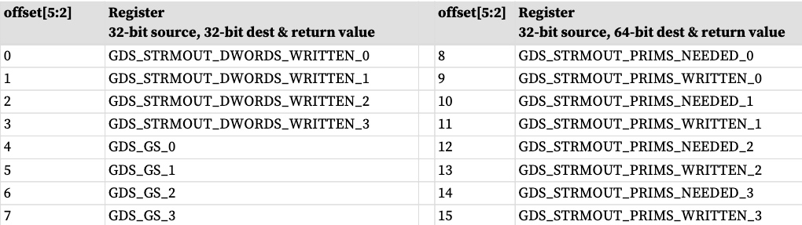

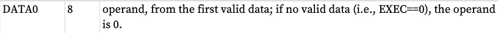
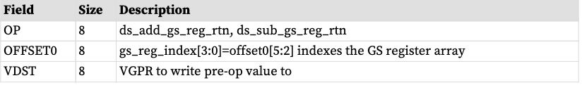

* 输入来自DATA0 的第一个有效数据。
* 如果offset[5:2] 为8-15：该操作映射到64b 操作，将2 个dst 寄存器作为一个组合。源数据仍然是32b。后操作结果是 64b 并存储回 2 个 dst 寄存器。返回值需要 2 个 VGPR。
* 如果offset[5:2] 为0-7：操作映射到正常的32b 操作
* 对于 ds_add_gs_reg_rtn，原子添加操作为 
    * VDST[0] = GS_REG[offset0[5:2]][31:0] 
    * If (offset0[5:2] >= 8) VDST[1] = GS_REG[offset0 [5:2]][63:32
    * GS_REG[offset0[4:2]] += DATA0
*  对于 ds_sub_gs_reg，原子子操作为
    * VDST[0] = GS_REG[offset0[5:2]][31:0]
    * If (offset0[5:2] >= 8) VDST[1] = GS_REG[offset0[5:2]][63:32]
    * GS_REG[offset0[4:2]] -= DATA0

# 对齐和错误
GDS 和 LDS 操作（直接和索引）报告未对齐原子的内存违规 (memviol)。 LDS 处理未对齐的索引读取和写入，但仅限于 SH_MEM_CONFIG 时。对齐模式==未对齐。原子必须对齐。
LDS 对齐模式（配置寄存器控制，在 SH_MEM_CONFIG 中）：
* ALIGNMENT_MODE_DWORD：自动对齐到元素大小的倍数。
* ALIGNMENT_MODE_UNALIGNED：无对齐要求。
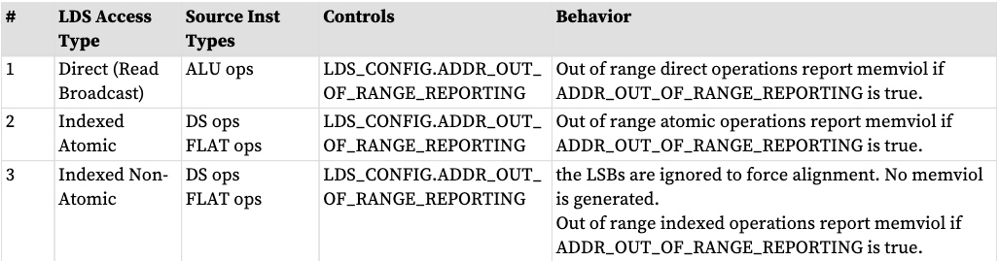


