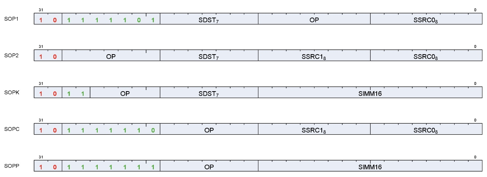
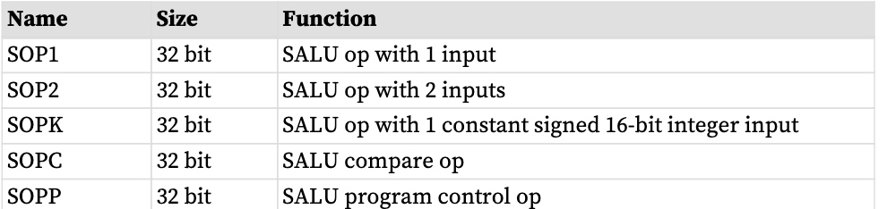
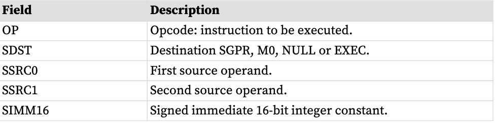
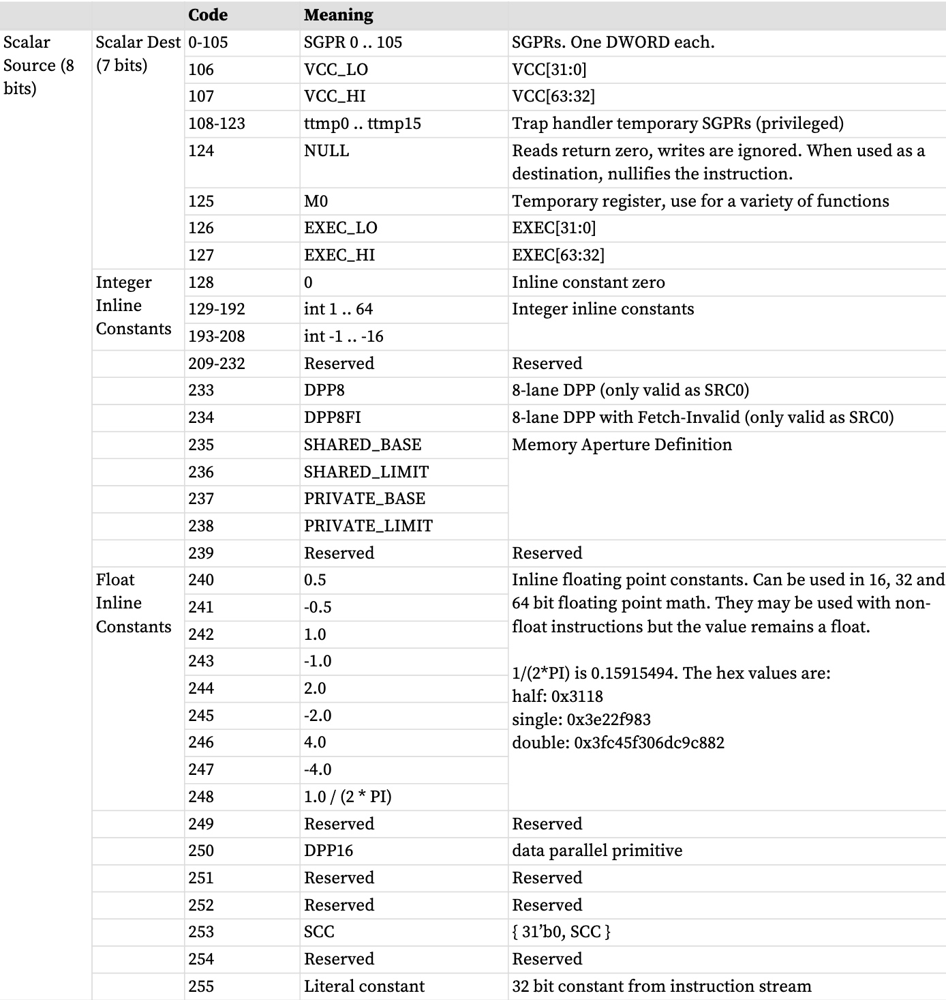
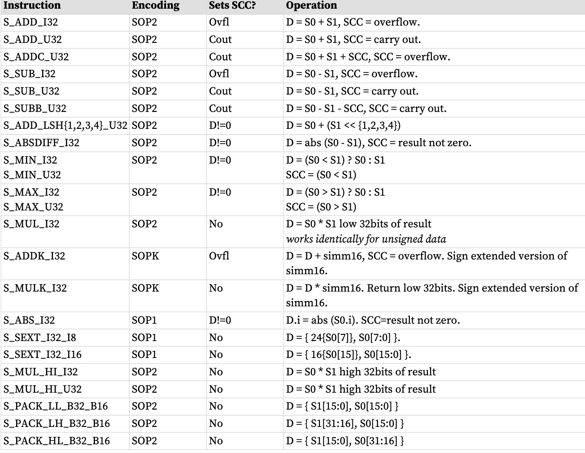
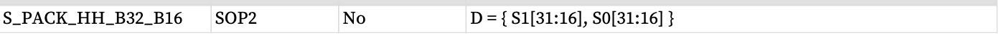
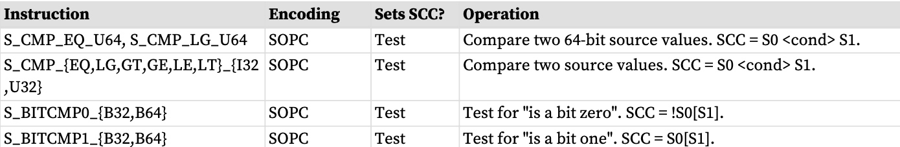
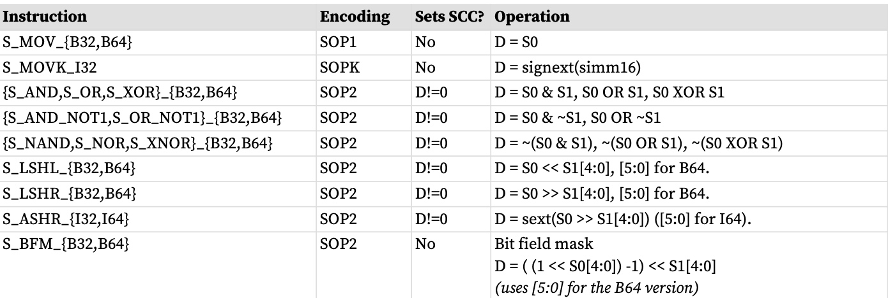
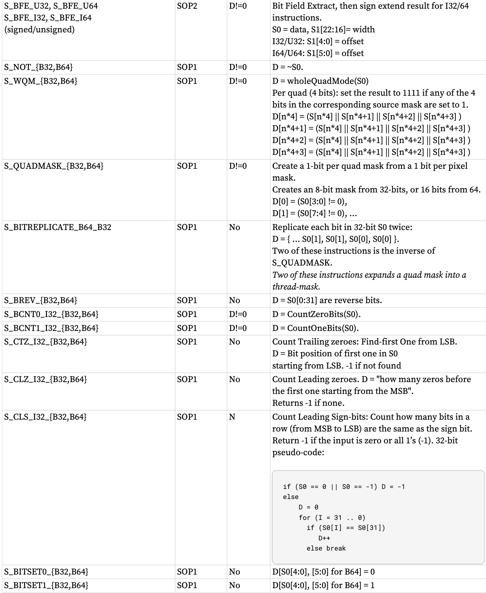
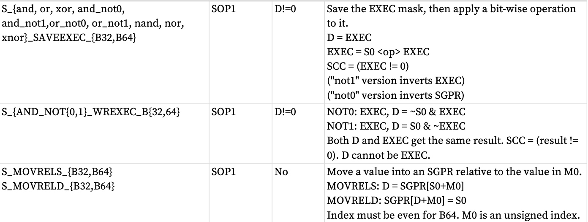

标量 ALU (SALU) 指令对波形中所有工作项通用的值进行运算。这些运算由 32 位整数或浮点算术以及 32 位或 64 位逐位运算组成。 SALU 还可以直接在程序计数器上执行操作，允许程序在 SGPR 中创建调用堆栈。许多操作还设置标量条件代码位 (SCC) 以指示比较结果、进位或指令结果是否为零。
# SALU指令格式
SALU 指令以五种微代码格式之一进行编码，如下所示：

Each of these instruction formats uses some of these fields:

类似指令的列表有时使用大括号 { } 的压缩形式来表示可能名称的列表。例如，S_AND_{B32,B64}定义了两条合法指令：S_AND_B32和S_AND_B64。
# 标量 ALU 操作数
SALU 指令的有效操作数为：
* SGPR，包括陷阱临时SGPR
* 模式寄存器
* 状态寄存器（只读）
* M0 寄存器
* 执行掩码
* VCC 掩模
* SCC
* 内联常量：从-16 到64 的整数，并选择浮点值
* 硬件寄存器（最多 1 个：EXEC、M0、SCC）
* 一个 32 位文字常量
* 如果目标为 NULL，则不执行指令：不写入任何内容且不修改 SCC

在下表中，0-127可以用作标量源或目标； 128-255 只能用作源。

SALU 目的地的范围是 0-127。
SALU 指令可以使用 32 位文字常量。该常量是指令流的一部分，可用于除 SOPP 和 SOPK 之外的所有 SALU 微码格式（S_SETREG_IMM32_B32 中允许的文字除外）。通过将源指令字段设置为“literal”（255）来使用文字常量，然后使用后面的指令 DWORD 作为源值。

如果目标 SGPR 超出范围，则不会将结果写入 SGPR，并且不会更新 SCC。

如果指令在 SGPR 中使用 64 位数据，则​​ SGPR 对必须与偶数边界对齐。例如，使用 SGPR 2 和 3 或 8 和 9（但不是 11 和 12）来表示 64 位数据是合法的。
# 标量条件代码 (SCC)
标量条件代码 (SCC) 是作为执行大多数 SALU 指令的结果而写入的。对于整数算术，它用作扩展整数算术的进位/借位。

SCC 由许多指令设置：
* 比较操作：1 = true
* 算术运算：1 = 执行。 ◦ SCC = 有符号加法和减法运算的溢出。对于加法运算，溢出 = 两个操作数都是符号相同，并且结果的 MSB（符号位）与操作数的符号不同。对于减法 (A - B)，溢出 = A 和 B 具有相反的符号，并且结果符号与 A 的符号不同。
* 位/逻辑运算： 1 = 结果不为零。
# 整数算术指令
本节描述 SALU 提供的算术运算。下表显示了标量整数算术指令：

# 条件移动指令
条件指令使用 SCC 标志来确定是否执行操作，或（对于 CSELECT）要使用哪个源操作数。

# 比较说明
这些指令比较两个值，如果比较产生 TRUE 结果，则将 SCC 设置为 1。

# 按位指令
按位指令对 32 位或 64 位数据进行操作，而不解释其具有类型。对于按位运算（如下表所示），如果结果非零，则设置 SCC。

# 访问说明
这些指令访问硬件内部寄存器。

# 内存孔径查询
着色器可以通过标量操作数查询共享和私有空间的内存孔径基数和大小：
• PRIVATE_BASE
• PRIVATE_LIMIT
• SHARED_BASE
• SHARED_LIMIT

这些值源自 SH_MEM_BASES 寄存器（“SMB”），主要与 FLAT 内存指令一起使用。将 Shared Base 或 Private Base 设置为零会禁用该光圈。

“PTR32”是“地址模式为32位”的缩写，“SMB”是“SH_MEM_BASES”的缩写。这些常数可以是

由 SALU 和 VALU 操作使用，并且是 64 位无符号整数：
SHARED_BASE = ptr32 ? {32’h0, SMB.shared_base[15:0], 16’h0000} : {SMB.shared_base[15:0], 48’h000000000000}
SHARED_LIMIT = ptr32 ? {32’h0, SMB.shared_base[15:0], 16’hFFFF} : {SMB.shared_base[15:0], 48’h0000FFFFFFFF}
PRIVATE_BASE = ptr32 ? {32’h0, SMB.private_base[15:0], 16’h0000} : {SMB.private_base[15:0], 48’h000000000000}
PRIVATE_LIMIT =ptr32 ? {32’h0, SMB.private_base[15:0], 16’hFFFF} : {SMB.private_base[15:0], 48’h0000FFFFFFFF}

"Hole" = (addr[63:47] != 全零或全一) 是内存的非法地址部分