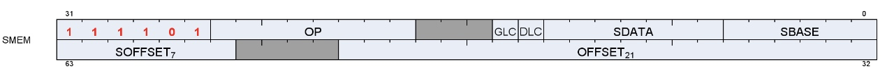
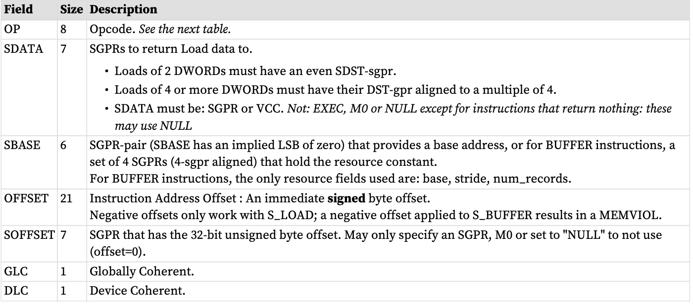
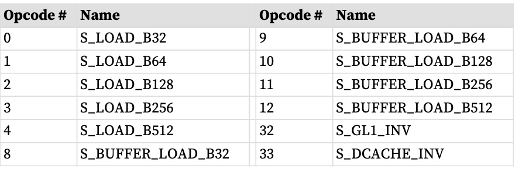
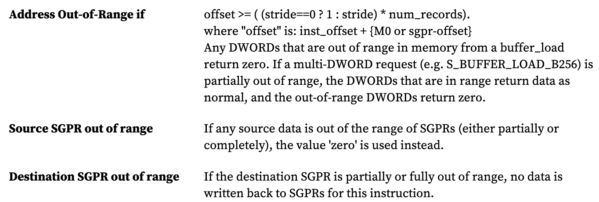

标量内存加载 (SMEM) 指令允许着色器程序通过常量缓存 (“Kcache”) 将数据从内存加载到 SGPR 中。指令可以加载 1 到 16 个 DWORD。数据直接加载到 SGPR 中，无需任何格式转换。
标量单元将连续的 DWORD 从内存加载到 SGPR。这主要用于加载 ALU 常量和间接 T#/S# 查找。不支持数据格式，也不支持字节或短数据。
负载有两种形式：一种仅采用基地址指针，另一种使用顶点缓冲区常量来提供：基址、大小和步幅。
# 微码编码
标量内存加载指令使用 SMEM 微码格式进行编码。

SMEM 编码字段描述



 SMEM Instructions
 

这些指令从内存加载 1-16 个 DWORD。 SGPR中的数据在SDATA中指定，地址由SBASE、OFFSET和SOFFSET字段组成。
## 标量内存寻址
非缓冲S_LOAD指令使用以下公式计算内存地址：

ADDR = SGPR[base] + inst_offset + { M0 or SGPR[offset] or zero }

地址的所有组成部分（基址、偏移量、inst_offset、M0）均以字节为单位，但两个 LSB 被忽略并被视为零。

如果结果 (inst_offset + (M0 或 SGPR[offset])) 为负，则 inst_offset 为负是非法且未定义的。
## 使用缓冲区常量加载
S_BUFFER_LOAD 指令使用类似的公式，但基地址来自缓冲区常量的 base_address 字段。

使用的缓冲区常量字段：base_address、stride、num_records。其他字段将被忽略。

标量内存加载不支持“混合”缓冲区。 Stride 仅用于内存地址边界检查，而不用于计算要访问的地址。

SMEM 仅提供 SBASE 地址（字节）和偏移量（字节或 DWORD）。任何“索引 * 步幅”都必须在着色器代码中手动计算，并添加到 SMEM 之前的偏移量中。 Inst_offset 必须为非负 - inst_offset 的负值会导致 MEMVIOL。

V#.base 和最终地址的两个 LSB 被忽略以强制 DWORD 对齐。

```
"m_*" components come from the buffer constant (V#):
offset = OFFSET + SOFFSET (M0, SGPR or zero)
m_base = { SGPR[SBASE * 2 +1][15:0], SGPR[SBASE*2] }
m_stride = SGPR[SBASE * 2 +1][31:16]
m_num_records = SGPR[SBASE * 2 + 2]
m_size = (m_stride == 0 ? 1 : m_stride) * m_num_records
addr = (m_base & ~3) + (offset & ~0x3)
SGPR[SDST] = load_dword_from_dcache(addr, m_size)
If more than 1 DWORD is being loaded, it is returned to SDST+1, SDST+2, etc,
and the offset is incremented by 4 bytes per DWORD.
```
## S_DCACHE_INV 和 S_GL1_INV
该指令使整个标量高速缓存或 L1 高速缓存无效。它不会向 SDST 返回任何内容。S_GL1_INV 和 S_DCACHE_INV 没有任何地址或数据参数。
# 依赖性检查
标量内存加载返回的数据可能与发出时的顺序无序；当负载跨越两个缓存行时，它们可以在不同时间返回部分结果。着色器程序使用 LGKMcnt 计数器来确定数据何时返回到 SDST SGPR。这是按如下方式完成的。

* 每次提取单个DWORD 时，LGKMcnt 都会增加1，否则缓存会失效。
* 每次读取两个或多个DWORD 时，LGKMcnt 都会增加2。
* 每条指令完成时，LGKMcnt 都会减少等量。

由于指令可能会无序返回，因此使用该计数器的唯一合理方法是实现“S_WAITCNT LGKMcnt 0”；这会强制等待所有数据从之前的 SMEM 返回，然后再继续。

在着色器等待 LGKMcnt==0 之前，不知道缓存无效指令是否已完成。
# 标量内存子句和组 
子句是以 S_CLAUSE 开始并持续 2-63 条指令的指令序列。子句将指令仲裁器锁定到该波上，直到子句完成。

组是代码中碰巧出现但不一定作为子句执行的一组相同类型的指令。当遇到非 SMEM 指令时，组结束。标量存储器指令是成组发出的。硬件不会强制单个波形在从另一个波形发出指令之前执行整个组。

团体限制：
INV 必须单独存在于一个组中，并且不能位于子句中
# 对齐和边界检查
**SDST**
对于两个 DWORD 的读取，SDST 的值必须是偶数，对于更大的读取，SDST 的值必须是四的倍数。如果不遵守此规则，可能会产生无效数据。
**SBASE**
对于 S_BUFFER_LOAD，SBASE 的值必须为偶数（指定 SGPR 的地址，该地址是四的倍数）。如果 SBASE 超出范围，则使用 SGPR0 中的值。
**OFFSET**
OFFSET 的值没有对齐限制。
## 地址和GPR 范围检查
硬件检查地址是否超出范围（仅限 BUFFER 指令）以及源或目标 SGPR 是否超出范围。



