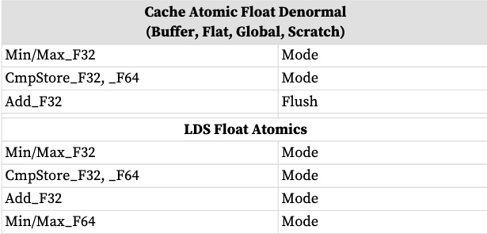
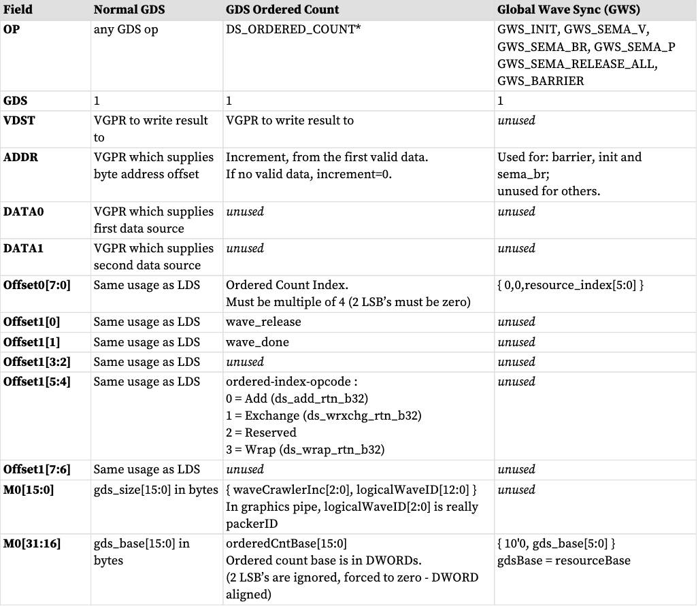
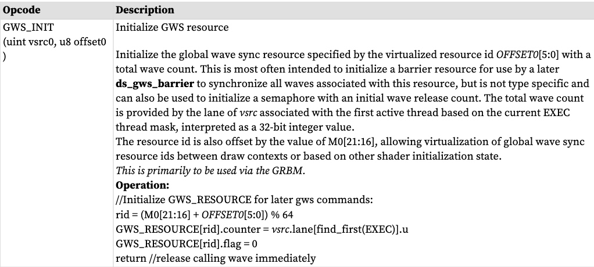
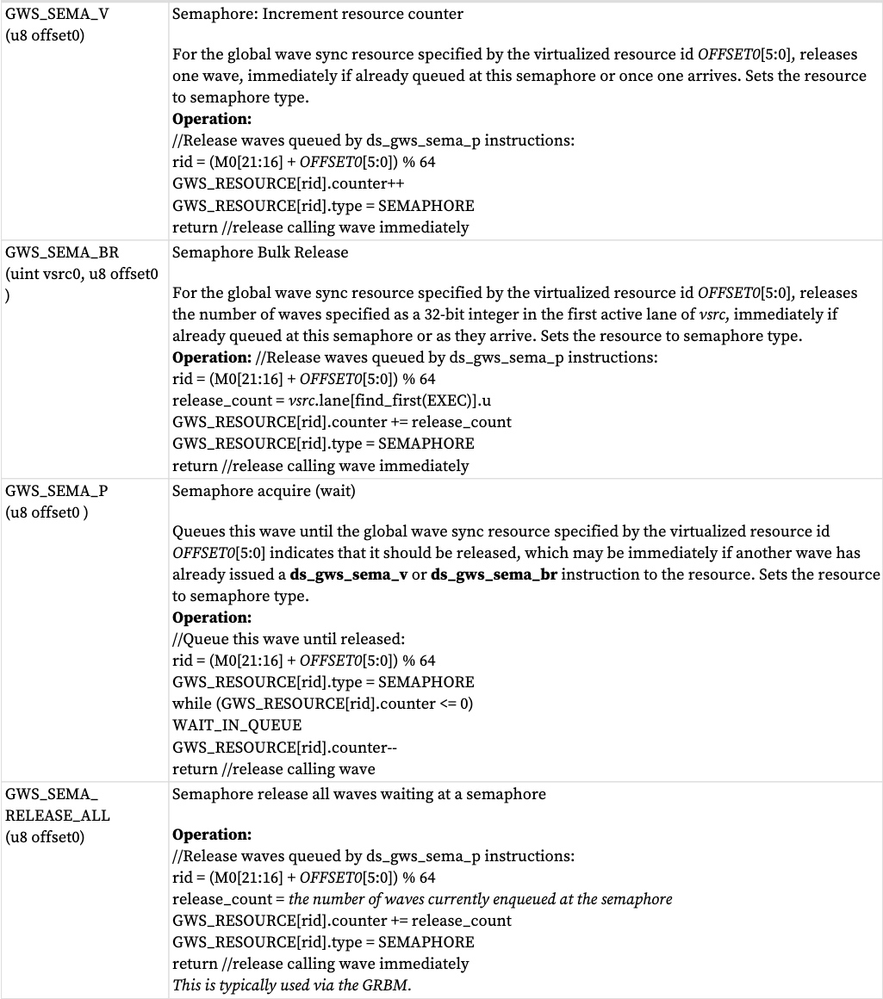
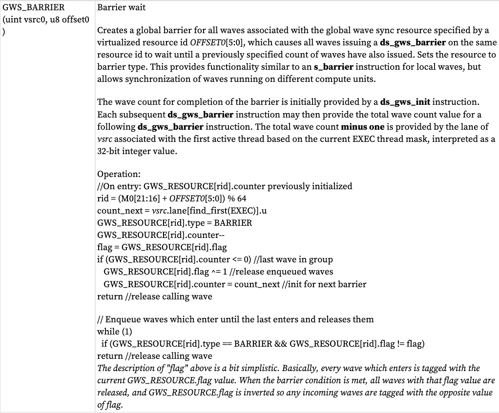

浮点原子可以作为 LDS、Buffer 和 Flat/Global/Scratch 指令发出。
# 四舍五入
LDS 和内存原子的 float-atomic-add 的舍入模式固定为“舍入到最接近的偶数”。 MODE.round 位被忽略。
# 非正则？
当这些对浮点数据进行操作时，数据可能包含非正规数，或者操作产生非正规数。浮点原子指令可以选择传递非正规值，或将它们刷新为零。

LDS 指令允许根据 MODE.denormal 波状态寄存器传递非正规值或将其刷新为零。与 VALU 操作一样，“denorm_single”影响 F32 操作，“denorm_double”影响 F64。 LDS 指令使用 FP_DENORM 位（allow_input_denormal、allow_output_denormal）分别控制输入和输出的刷新。

* 浮点 32 位加法器同时使用 MODE 中的输入和输出分值刷新控制
* 浮点 CMP、MIN 和 MAX 仅使用“输入非正规”刷新控制
    * 比较的每个输入在比较之前将两个操作数的尾数刷新为零，如果指数为零并且同花分母控制处于活动状态。对于 Min 和 Max，返回的实际结果是所选的非刷新输入。
    * CompareStore（“比较交换”）在发生输入非正规刷新时刷新结果。
    
* “Flush”= 刷新所有输入分母 
* “No Flush”= 不刷新输入分母 
* “Mode”= 由着色器的“MODE . fp_denorm”寄存器中的位控制的非规格化刷新

请注意，刷新非规格化时的 MIN 和 MAX 仅用于比较，但结果是其中一个源的未经修改的副本。当输入非正规刷新发生时，CompareStore（“比较交换”）刷新结果。


浮点原子指令 (ds_{min,max,cmpst}_f32) 可以选择传递非正规值，或将它们刷新为零。这是通过 MODE.fp_denorm 位控制的，该位还控制 VALU 非正规行为。没有单独的输入和输出非正规控制：仅考虑 sp_denorm 的位 0 或 dp_denorm 的位 0。其余的非正规规则与 LDS 相同。

浮点原子加法被硬连线以刷新输入非正规数 - 它不使用 MODE.fp_denorm 位。
# NaN 处理 
非数字（“NaN”）是一个 IEEE-754 值，表示无法计算的结果。

NaN 有两种类型：安静型和信号型
* 安静NaN 指数=0xFF，尾数MSB=1 
* 信令NaN 指数=0xFF，尾数MSB=0 并且至少一个其他尾数位==1

由于信令 NaN，LDS 不会产生任何异常或“信号”。

DS_ADD_F32 可以创建一个安静的 NaN，或从其输入传播 NaN：如果任一输入是 NaN，则输出是相同的 NaN，如果两个输入都是 NaN，则选择第一个输入的 NaN 作为输出。 Signaling NaN 转换为 Quiet NaN。

仅当 MODE (allow_input_denorm)=0 时，浮点原子（CMPSWAP、MIN、MAX）才会刷新输入非规格化，否则值将不加修改地传递。刷新时，分母会在操作之前（即比较之前）刷新。

**FP Max 选择规则：**
```
if (src0 == SNaN) result = QNaN (src0) // bits of SRC0 are preserved but is a QNaN
else if (src1 == SNaN) result = QNaN (src1)
else result = larger of (src0, src1)
"Larger" order from smallest to largest: QNaN, -inf, -float, -denorm, -0, +0, +denorm, +float, +inf
```

**FP最小选择规则：**
```
if (src0 == SNaN) result = QNaN (src0)
else if (src1 == SNaN) result = QNaN (src1)
else result = smaller of (src0, src1)
"Smaller" order from smallest to largest: -inf, -float, -denorm, -0, +0, +denorm, +float, +inf, QNaN
```
**FP Compare Swap：仅在比较条件（==）为真时交换，将+0和-0视为相等:**
```
doSwap = (src0 != NaN) && (src1 != NaN) && (src0 == src1) // allow +0 == -0
```
**浮动添加规则：**

*  -INF + INF = QNAN (mantissa is all zeros except MSB)
*  +/-INF + NAN = QNAN (NAN input is copied to output but made quiet NAN)
* -INF + INF, or INF - INF = -QNAN
* 0 + 0 = +0
* NF + (float, +0, -0) = INF, with infinity sign preserved
* NaN + NaN = SRC0’s NaN, converted to QNaN
# 全局波同步和原子有序计数
全局 Wave 同步 (GWS) 提供了在整个 GPU 上的不同 Wave 之间进行同步的功能。
GWS 指令使用 LGKMcnt 来确定操作何时完成。
## GWS 和有序计数编程规则
“GWS”指令（有序计数和 GWS*）必须作为以下形式的单个指令子句发出：
S_WAITCNT LGKMcnt==0 // 仅当可能有任何未完成的 GDS 指令时才需要这样做
GWS_指令
S_WAITCNT LGKMcnt==0 <除 S_ENDPGM 之外的任何指令（如果下一条指令是 s_endpgm，则用 NOP 填充）

在发出 GWS 或有序计数指令之前，用户必须确保没有未完成的 GDS 指令。如果不这样做，可能会导致“NACK”无序到达。

**编程规则**：GWS 或有序计数指令中的源和目标 VGPR 不得是相同的。当有序计数操作被 NACK 拒绝时，可以向目标 VGPR 写入数据。如果此 VGPR 与源 VGPR 相同，则可以防止指令在由于上下文切换而中断时重放。
## 执行处理
GDS / GWS 现在只有单车道宽。如果 EXEC 掩码有多于一位设置为 1，则硬件的行为就好像只有 EXEC 中只有一个“1”：最低有效位。当 EXEC==0 时，不会跳过 GDS / GWS 操作码。

对于这些操作码，如果 EXEC==0，则硬件对于指令的行为就像 EXEC==0…001 一样：ORDERED_COUNT / GWS_INIT / SEMA_BR/GWS_BARRIER

对于其他 GDS / GWS 操作码，指令以 EXE==0 发送，没有任何内容发送到或返回GDS/GWS。在硬件中，数据被发送但被忽略，数据被返回并被忽略以保持 LGKMcnt 工作。
## 序列数？
有序计数按照波形创建顺序生成一个指向无限大小的追加缓冲区的指针。

Ordered Alloc 生成一个指向有限大小的环形缓冲区的指针，该指针返回到“VDST”中的波形。着色器最多可以发出 4 次有序分配计数器。有序计数和分配使用相同的指令 - 区别在于 GDS 计数器如何使用其配置寄存器进行初始化。

GDS 单元支持在专用附加/消耗计数器上运行的指令：
* DS_ORDERED_COUNT 从第一个有效通道获取一个值并发送给GDS。

对于使用此函数的着色器，此指令必须在每个波中发出一次且仅一次。 GDS 以任意顺序从芯片上的不同波接收这些信号，但按照创建波的顺序处理它们。 GDS 包含一个大的 fifo 来保存这些待处理的请求。
**指令字段**

## 全局wave同步
“全局 Wave 同步”允许在不同线程组（包括不同 CU 和 SE）中运行的 Wave 通过屏障和信号量进行同步。

全局波形同步 (GWS) 单元包含 64 个同步资源，这些资源由命令处理器分配给应用程序 (VM_ID)。这些同步资源可以配置为充当计数信号量或屏障。

* GWS 寄存器必须在使用前通过 GRBM 寄存器写入进行配置：gds_gws_resource_cntl、gds_gws_resource 
* GDS_GWS_RESOURCE：标志、计数器（资源中的波形数）、类型、head_{queue、valid、flag} 
* GDS_GWS_VMID：标识范围的每个 VMID 寄存器每个 VMID 拥有的 GWS 资源数（基本和大小）

GWS包含64个同步资源，每个同步资源包含以下状态：
* 1 位状态标志：0 或1 - 用于分隔奇数通道和偶数通道，区分进入波和离开波。
* 12 位计数器 - unsigned int
* 1 字节 类型：信号量或屏障
* 队列头 + 有效 + 标志（13 位）
* 队列尾部 + 标志（12 位）
* FIFO - 保存完整的波形 ID 和 1 位标志

当着色器使用时，M0 提供“resource_base[5:0]”，用于虚拟化资源。资源偏移量来自 GDS/GWS 指令的“offset0[5:0]”字段，并添加到 M0 以及每个 VMID 的基地址以获得最终的资源 ID。资源 ID 被限制在该 VMID 拥有的范围内。如果发生钳位，GWS 将返回 NACK，这会导致波形倒回 PC 并停止。

* GWS_resource_id = (GDS_GWS_VMID.BASE(vmid) + M0[21:16] + offset0[5:0]) % 64 
* 下表. GWS 指令






