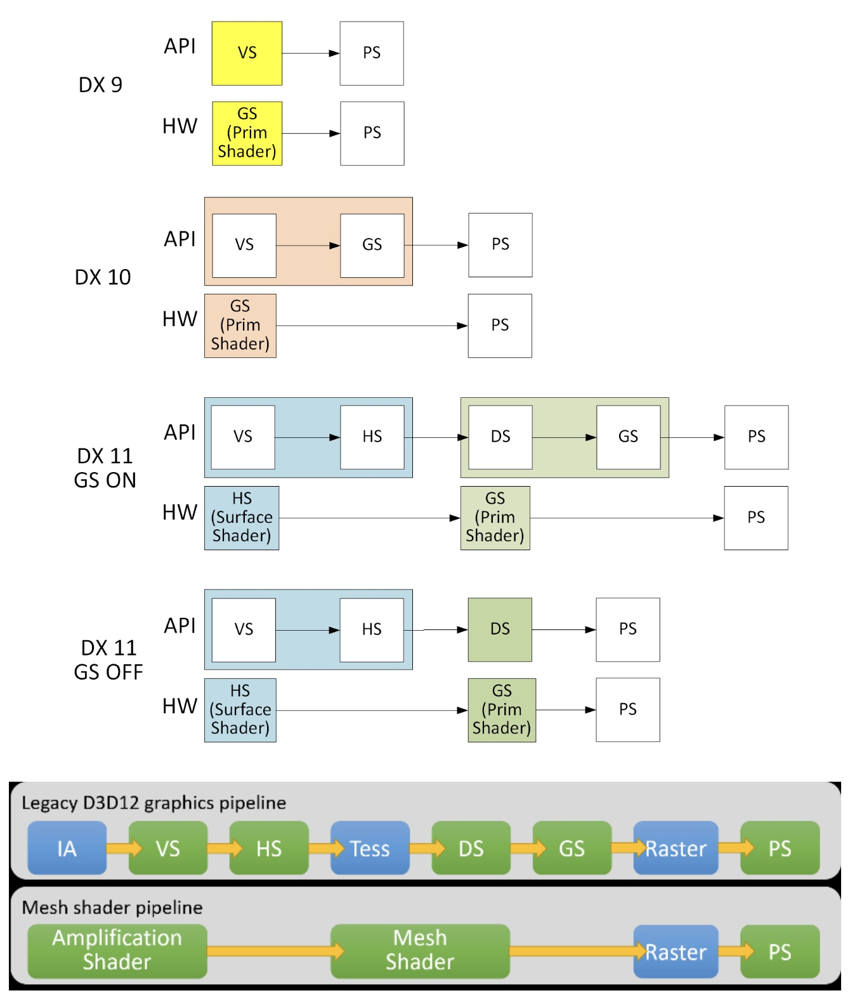

# 渲染概念
RDNA3 着色器程序（内核）是由 GPU 处理器执行的程序。从概念上讲，着色器程序在每个工作项上独立执行，但实际上，处理器将多达 32 或 64 个工作项分组为一个波形，一次在所有 32 或 64 个工作项上执行着色器程序。（这里的波形概念为wave32？  前面有讲）
RDNA3 处理器主要包括：
* 标量 ALU，对每个波一个值进行运算（对所有工作项通用）
* 向量 ALU，对每个工作项的唯一值进行运算
* 本地数据存储，允许工作组内的工作项进行通信和共享数据
* 标量内存，可以通过缓存在SGPR 和内存之间传输数据
* 矢量内存，可以在 VGPR 和内存之间传输数据，包括采样纹理贴图
* 导出将数据从着色器传输到专用渲染硬件

程序控制流使用标量 ALU 指令进行处理。这包括 if/else、分支和循环。标量 ALU (SALU) 和内存指令在整个波形上工作，并可对最多两个 SGPR 以及文字常量进行操作。

向量存储器和 ALU 指令同时对波形中的所有工作项进行操作。为了支持分支和条件执行，每个波都有一个 EXECute 掩码，用于确定哪些工作项当时处于活动状态，哪些工作项处于休眠状态。活动工作项执行向量指令，休眠工作项将该指令视为 NOP。 EXEC 掩码可以随时通过标量 ALU 指令或 VALU 比较写入。

向量 ALU 指令通常最多可以采用三个参数，这些参数可以来自 VGPR、SGPR 或属于指令流的文字常量。它们对 EXEC 掩码启用的所有工作项进行操作。向量比较和加进位将每个工作项的位掩码返回到 SGPR，以指示每个工作项具有比较的“真”结果或生成进位。

向量内存指令在 VGPR 和内存之间传输数据。每个工作项提供其自己的内存地址并提供或接收唯一的数据。这些指令还受 EXEC 掩码的约束。
## wave32 wave64
该着色器支持 32 个工作项的波形（“wave32”）和 64 个工作项的波形（“wave64”）
所有操作都支持这两种波形尺寸，但着色器程序必须针对特定波形尺寸进行编译和运行，无论任何给定波形中有多少工作项处于活动状态。

Wave32 波每条指令最多发出一次。 Wave64 波通常将每条指令发出两次：一次针对低半部分（工作项 31-0），然后再次针对高半部分（工作项 63-32）。这种情况仅发生在 VALU 和 VMEM（LDS、纹理、缓冲区、平面）指令中；无论波形大小如何，标量 ALU 和内存以及分支和消息仅发出一次。无论波浪大小如何，导出请求也只发出一次。来自其他波的指令可能会在给定波指令的低半部分和高半部分之间执行。

如果该一半的 EXEC 掩码全为零，则硬件可以选择跳过该一半，但不会跳过 VMEM 指令的两半，因为这会混淆未完成的内存指令计数器，除非此波中没有未完成的 VMEM 指令。它也不会跳过写入 SGPR 的 VALU 指令的任何一半。有关指令跳过规则的详细信息，请参阅指令跳过：EXEC==0。

硬件操作使得wave64的两次传递都使用指令执行之前的wave状态； wave64 的第一遍不会影响第二遍的输入。

除了低半部分和高半部分之间的 EXEC 掩码不同之外，两次传递之间的标量输入也可能有所不同。两次传递都使用相同的常量，但不同的掩码和进位/出位。

第二遍的区别是：
* 输入增量：进位、div-fmas 和 v_cndmask 均使用下一个 SGPR（SSRC + 1 或 VCC_HI） 
* 输出增量：进位、div-scale 和 v_cmp 均写入下一个 SGPR（SDST + 1、或 VCC_HI） ◦ v_cmpx 写入 EXEC_HI 而不是 EXEC_LO
对于wave32 波，EXEC 和VCC 的高32 位被忽略。 VCCZ和EXECZ分别反映了wave32波形的VCC和EXEC的最低32位的状态。
## 着色器类型
### 计算着色器
计算内核（着色器）是可以在 RDNA3 处理器上运行的通用程序，从内存中获取数据，对其进行处理，然后将结果写回内存。计算内核是通过调度创建的，这会导致 RDNA3 处理器在 1D、2D 或 3D 数据网格中的所有工作项上运行内核。 RDNA3 处理器遍历该网格并生成波，然后运行计算内核。每个工作项都使用其在网格内的唯一地址（索引）进行初始化。根据该索引，工作项计算需要处理的数据的地址以及如何处理结果。
### 图形着色器
着色器支持 3 种类型的图形波：PS、GS 和 HS。
渲染模式（启动行为）：
* 普通 NGG - 几何引擎 (GE) 向波发射硬件发送信息，为每个发射的元素 (prim) 初始化 VGPR； GE获取索引和顶点缓冲区数据并加载到VGPR
* 网格着色器 - 将 GS 启动转变为 CS 风格的启动，并且波启动硬件会展开为元素并动态生成元素索引。网格着色器程序决定如何使用该索引值。

放大着色器决定启动多少个网格着色器组。网格着色器处理顶点，然后处理图元。
## 工作组
工作组是波的集合，可以通过 LDS 共享数据并可以在屏障处同步。工作组中的 Wave 全部发布到相同的 WGP，但可以在 4 个 SIMD32 中的任何一个上运行，并且可以通过 LDS 共享数据。 WGP 支持最多 32 个工作组，每个工作组最多 1024 个工作项。

工作组中的 Wave 可以共享最多 64kB 的 LDS 空间。由单个 wave 组成的工作组不计入 32 的限制。它们不分配屏障资源，并且屏障操作被视为 S_NOP。

每个工作组或波次都可以在两种模式之一下运行，可以在波次创建时每次绘制/调度时进行选择：

### CU模式
在此模式下，LDS 被有效地分为单独的上部 LDS 和下部 LDS，每个 LDS 服务于两个 SIMD32。 Wave 在 LDS 的一半内分配 LDS 空间，该 LDS 与 Wave 运行的 SIMD 相关联。对于工作组，所有波形都分配给 SIMD32 对。这种模式可以提供更快的操作，因为两个半部并行运行，但限制了数据共享（上半部波无法读取 LDS 下半部中的数据，反之亦然）。当处于 CU 模式时，工作组中的所有波都驻留在同一 CU 内。
### WGP模式
在此模式下，LDS 是 WGP 上的所有 Wave 都可以访问的一个大型连续存储器。在 WGP 模式下，工作组的 Waves 可以分布在 WGP 中的两个 CU（所有 4 个 SIMD32）上。

WGP（和LDS）可以同时让一些波在WGP模式下运行，而其他波在CU模式下运行
屏障是一种同步原语，它使每个波在任何波继续之前到达着色器中的给定点。
## 着色器填充要求
由于某些图形设备中使用了激进的指令预取，用户必须在着色器末尾之后使用 64 个额外的 DWORD（256 字节）数据填充所有着色器。建议使用S_CODE_END指令作为填充。这确保了如果指令预取硬件超出着色器末尾，它可能不会到达未初始化的内存（或未映射的内存页）。

所需的着色器填充量与着色器可以提前预取的程度有关。着色器可以设置为在当前程序计数器之前预取 1、2 或 3 个缓存行（64 字节）。这是通过波形启动状态寄存器控制的，或者由着色器程序本身使用 S_SET_INST_PREFETCH_DISTANCE 控制的。