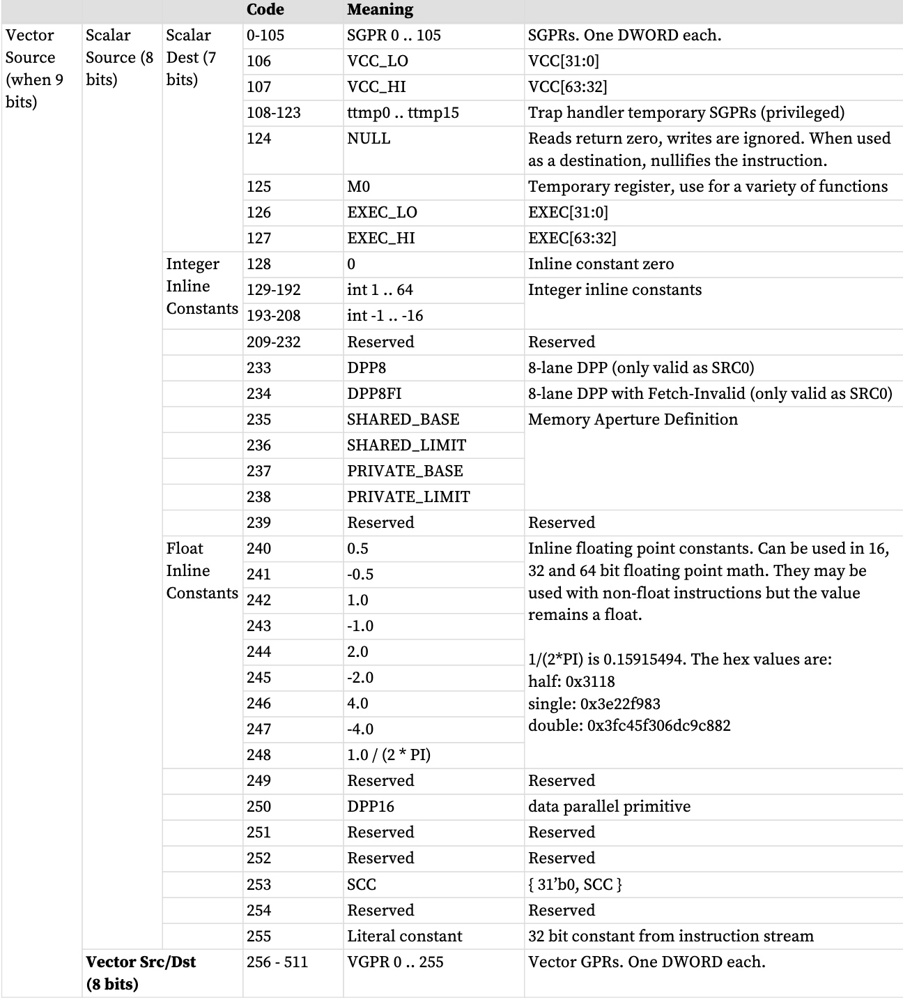
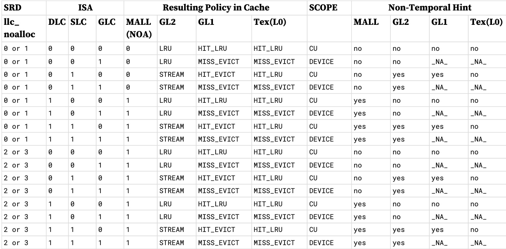
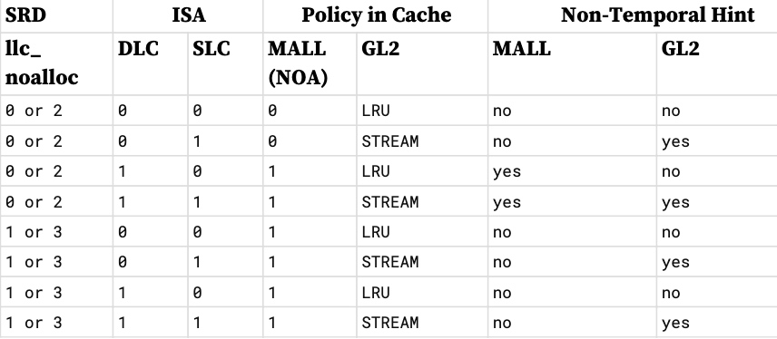

本章介绍着色器指令集。指令分为以下几组：
* 程序流程
* 标量ALU
* 从常量高速缓存读取标量内存
* 矢量ALU 和参数插值
* 矢量内存读/写：
    * 缓冲器
    * 扁平化、全局化和暂存化
    * LDS
* GDS
* 其他：等待计数器、屏障、发送消息

## 通用指令字段
**“内联常量”** - 指定代替源参数的常量，#128-248。例如 1.0、-0.5、32 等。
浮点常量适用于单精度、双精度和 16 位浮点指令，当用于非浮点指令时，数据不会转换（仍为浮点）。

浮点常量根据源操作数的大小进行编码。对于 16 位操作（压缩和非压缩），浮点常量被视为零扩展 32 位数据，即低位为 16 位浮点，高位为 0。

与 32 位或更小的操作数一起使用的整数常量被视为 32 位有符号整数。整数常量针对 64 位源进行有符号扩展。

**“文字常量”** - 指令流中紧随 32 位或 64 位指令之后的 32 位常量。
当用于 64 位有符号整数运算时，它会被符号扩展为 64 位。对于无符号 64 位整数运算（和 64 位二进制运算），它是零扩展的。当用于双浮点运算时，32 位文字是最高有效位，LSB 为零。其他运算（32 位或更少，或打包数学）将其视为 32 位数据。

### 缓存控制：SLC、GLC 和 DLC
标量和向量存储器指令包含控制高速缓存行为的位。 SLC、GLC 和 DLC 指令位影响加载、存储和原子的缓存行为。

**GLC** 控制图形一级缓存
**SLC** 控制图形二级缓存
**DLC** 控制内存附加末级缓存 (MALL)（如果存在）（否则忽略）
通常加载使用 GLC=0（加载获取除外）。 GLC=1 强制一级缓存未命中并从二级缓存读取数据。如果 GPU L0 中有一行匹配，则该行无效； L2 被重读。
着色器加载操作（加载、采样、收集等……）

* 对于S_BUFFER_LOAD 指令，LLC_NOALLOC 来自V#.LLC_noalloc。对于S_BUFFER_LOAD 指令，LLC_NOALLOC 来自V#.LLC_noalloc。
* SMEM 操作将SLC 设置为零。

Shader STORE / ATOMIC 操作（均为设备范围）

"Temporal Hint" = expect data to have temporal reuse.
"SRD" = Shader Resource Descripto

*  ISA.GLC ⇒ 这是用于加载操作的范围位（包括采样、收集等） 
    *  0：CU（工作组）范围 
    *  1：DEVICE 范围

* ISA.SLC ⇒ 图形客户端缓存的临时提示 
    *  0：常规 
    *  1：流（非临时）

* ISA.DLC ⇒ 图形客户端缓存的临时提示无限缓存
    *  0：常规 
    *  1：非临时

* 原子使用 GLC 来指示：
    * 0：不返回任何内容 
    * 1：将预操作值从内存返回到 VGPR