程序流程控制使用标量 ALU 指令进行编程。这包括循环、分支、子例程调用和陷阱。该程序使用 SGPR 来存储分支条件和循环计数器。常量可以从标量常量缓存中直接提取到 SGPR 中。
# 程序控制
下表中的指令控制着色器程序的优先级和终止，并为陷阱处理程序提供支持。
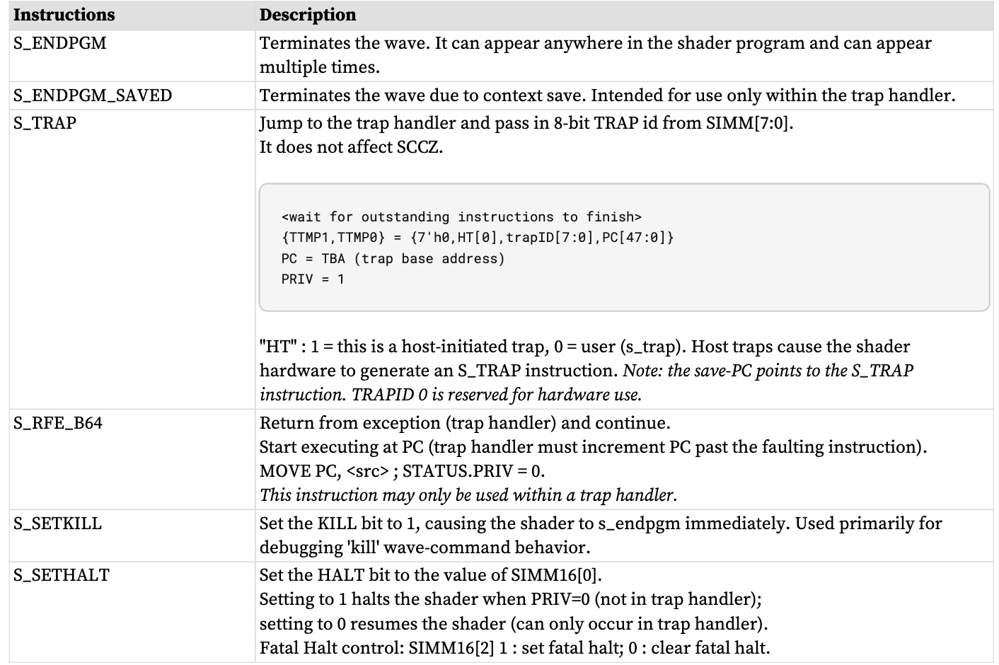
延迟调度指令
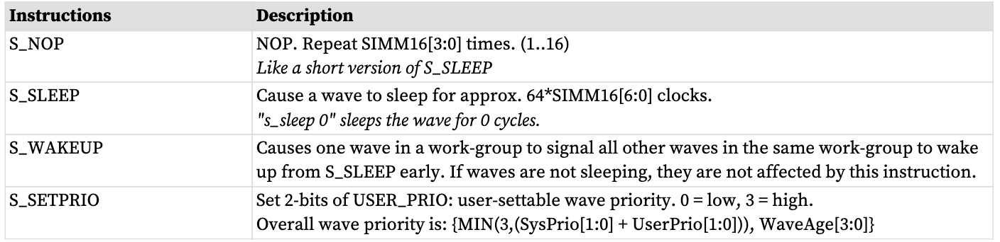
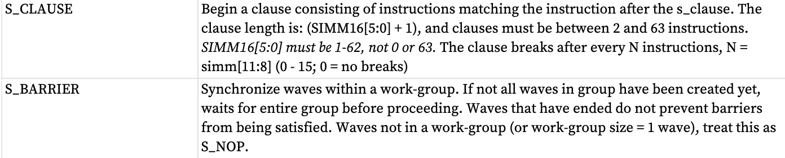
控制指令
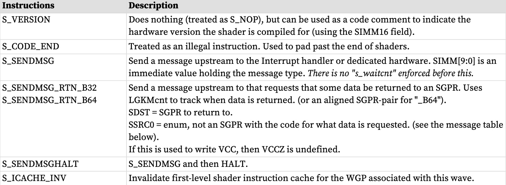
# 指令子句
指令子句是一组以不间断顺序执行的相同类型的指令。通常，硬件可能会交错来自不同波形的指令，但可以使用子句来覆盖该行为，并强制硬件在该子句的持续时间内仅为给定指令类型提供一个波形服务，即使这会使执行硬件空闲。

子句是使用 S_CLAUSE 指令定义和启动的，并且必须仅包含单一类型的指令。子句类型由紧随该子句的指令类型隐式定义。
其主要类型有：
• Image (no sampler) load
• Image store
• Image atomic
• Image sample
• Buffer / Global / Scratch load
• Buffer / Global / Scratch store
• Buffer / Global / Scratch atomic
• Flat load
• Flat store
• Flat atomic
• LDS load / store / atomic / bvh_stack
• IMAGE_BVH
• SMEM
• VALU

也可以在子句中（“子句内部说明”）：
* S_DELAY_ALU 在子句（内部）内是合法的，但毫无意义。
    *  S_DELAY_ALU 不得出现在 VALU 子句中。
* • S_NOP 和S_SLEEP 可以在子句内部使用，但子句的第一条指令必须是子句类型指令（ALU、内存）。

不能出现在子句中：
* 与子句类型不同类型的指令是非法的 
* S_CLAUSE
* S_ENDPGM
* SALU、导出、分支、消息、GDS、lds_param_load、lds_direct_load
* S_WAITCNT、S_WAIT_IDLE、S_WAIT_DEPCTR

S_CLAUSE 定义了子句的总长度，以及它应该被打破以允许其他波有机会通过的频率。例如，它可以说： 16 条指令的子句，但每 4 条指令后中断一次，以允许更高的指令。优先波来访问执行单元。 “条款内部说明”计入该条款的大小。

如果一个子句定义了常规子句中断（例如，一个子句有 16 个指令，但每 4 个指令中断），则每个子子句的第一条指令（每 4 个指令）必须是子句类型，而不是“子句内部指令”。每组指令必须至少有两条子句类型指令。例如。由 12 条 VALU 指令组成的子句分为 4 组，每组 3 条指令 - 每组 3 条指令必须至少有两条 VALU 指令。每组只有 1 个 VALU 指令的子句组没有任何意义 - 它们不再是子句。

如果 VALU 子句中的第一条指令的 EXEC==0，则该子句将被忽略，并且发出指令就像没有子句一样。如果 VALU 子句以 EXEC!=0 开头，但 EXEC 在子句中间变为零，则该子句将继续，直到指定子句的最后一条指令。

如果在开始子句之前需要 S_DELAY_ALU，则顺序必须是：
```
S_DELAY_ALU // must not come immediately after S_CLAUSE - that inst declares clause type
S_CLAUSE
<first instruction in clause>
```
如果跳过 S_CLAUSE 之后的第一条指令（例如，由于 EXEC==0，或由于 EXEC==0 和 VMcnt==0 而跳过 VMEM-load），则不会启动子句。子句中的后续指令不会被跳过，仍然会单独执行，而不是作为子句的一部分。
## 子句？中断？破坏
以下条件可能会破坏条款：
* VALU 异常（陷阱）破坏 VALU 子句 
* 主机命令 wave（停止、恢复、单步等）破坏所有活动子句。
    * 上下文保存会破坏受影响波
    * 这允许主机在调试时读取和写入 SGPR 和 VGPR。如果主机没有破坏，命令时，无法从条款中当前的波以外的波中读取 GPR。
    * 命令时，无法从条款中当前的波以外的波中读取 GPR。进入 HALT（包括主机启动的单步）的波可能会破坏子句。
# 发送消息类型
S_SENDMSG 用于将消息发送到固定功能硬件、主机，或请求将值返回到波形。 S_SENDMSG 在 SIMM16 字段中编码消息类型，在 M0 中编码消息有效负载。 S_SENDMSG_RTN 在 SSRC0 字段中编码消息类型（不读取 SGPR），在 M0 中编码有效负载（如果有），在 SDST 中编码目标 SGPR。

LGKMcnt 跟踪完成情况。

下表列出了可以使用 S_SENDMSG 命令生成的消息。

S_SENDMSG_RTN_B* 指令将数据返回到着色器：将 LGKMcnt 加 2，然后在消息发出时减 1，在数据返回时再减 1。这使得用户只需使用“s_waitcnt LGKMcnt==0”即可等待数据返回。

所有未列出的消息代码均被保留（非法）。
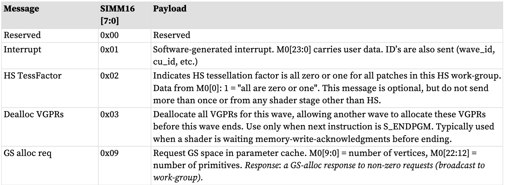

S_SENDMSG_RTN 用于发送向wave 返回值的消息。该指令指定哪个 SGPR 接收 SDST 字段中的数据。该消息在 SSRC0 中编码（在指令字段中，而不是在 SGPR 中）。
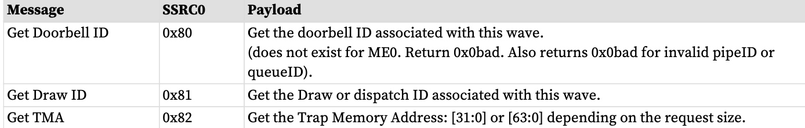
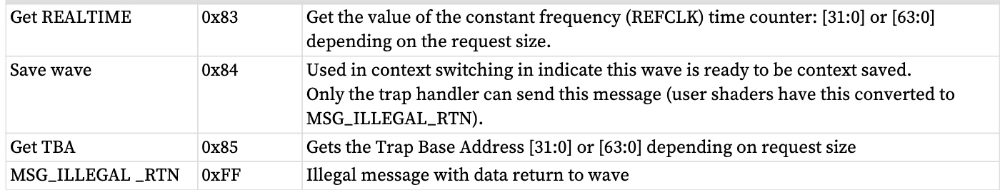
# 分支
分支是使用以下标量 ALU 指令之一完成的。 “SIMM16”是一个符号扩展的 16 位整数常量，被视为分支的 DWORD 

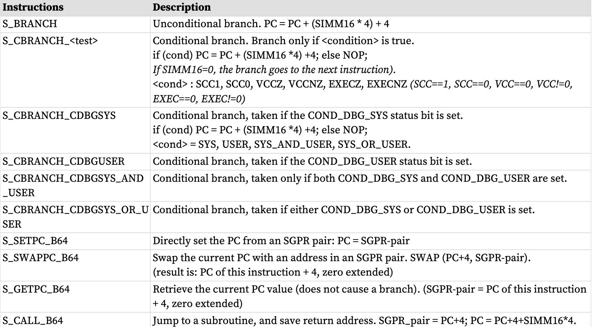
# 工作组和障碍
工作组是在同一工作组处理器上运行的波的集合，可以同步和共享数据。最多可将 1024 个工作项（16 个 wave64 或 32 个 wave32）组合到一个工作组中。当工作组中有多个wave时，可以使用S_BARRIER指令强制每个wave等待，直到所有其他wave到达相同的指令；然后，一切浪潮继续。单波工作组对待所有屏障指令为 S_NOP。
如果在创建工作组的所有 wave 之前，wave 执行 S_BARRIER，则该 wave 会等待，直到工作组完成。
任何波都可以使用 S_ENDPGM 提前终止，并且当剩余的活动波到达其屏障指令时，屏障被认为已满足。
# 数据依赖解析
着色器硬件可以解决大多数数据依赖性，但少数情况必须由着色器程序显式处理。在这些情况下，程序必须插入 S_WAITCNT 指令以确保先前的操作在继续之前已完成。

着色器有四个计数器，用于跟踪发出指令的进度。 S_WAITCNT 等待这些计数器的值等于或低于指定值，然后再继续。这些允许着色器编写器安排长延迟指令，执行不相关的工作，并指定何时需要长延迟操作的结果。
不需要插入 S_NOP 即可实现正确操作。
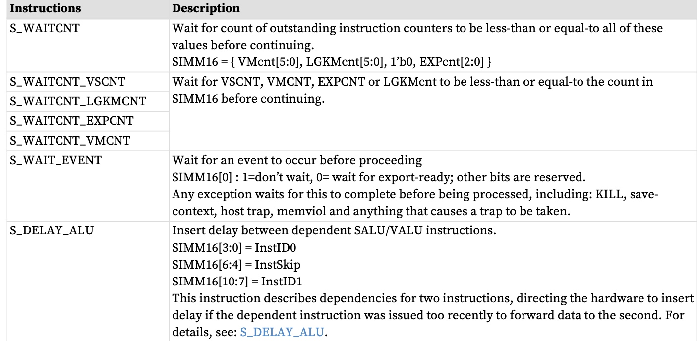
S_WAITCNT* 等待使用指定计数器的未完成指令完成。与该类型的其他指令相比，一种类型内的指令通常按照它们发出的顺序返回，但相对于不同类型的指令，通常不按顺序返回。这些计数器对指令进行计数，而不对线程进行计数。

这些是内存指令组 - 每个指令组相对于其他指令组返回的顺序是乱序的：
* VMcnt
    * 纹理样本
    * 纹理/缓冲区/全局/划痕/平面加载和原子返回 
* VScnt
    * 纹理/缓冲区/全局/暂存/平面存储和原子无返回 
* LGKMcnt
    * LDS 索引操作 
    * SMEM：标量内存加载可能会相对于其他标量内存完全无序返回
    * loads
    * GDS 和 GWS 
    * FLAT 指令（同时使用 LGKMcnt 和 VMcnt 或 VScnt） 
    * 消息 
* EXPcnt：
    * LDS 参数加载和直接加载 
    * 导出：在类型内保持顺序（MRT、Z、位置、原始数据）但类型之间是乱序的

数据可能会乱序写入 VGPR，但计数器递减仍然反映按顺序完成。当写入不同地址时，来自同一 Wave 的存储不会与来自同一 Wave 的存储保持顺序。

简单的 S_WAITCNT 示例
```
global_load_b32 V0, V[4:5], 0x0 // load memory[ {V5, V4} ] into V0
global_load_b32 V1, V[4:5], 0x8 // load memory[ {V5, V4} +8 ] into V1
s_waitcnt VMcnt <= 1 // wait for first global_load to have completed
v_mov_b32 V9, V0 // move V0 into V9
```
# ALU指令软件调度
着色器程序可以包括延迟ALU指令被发出的指令，以便尝试避免由于发出过于紧密的相关指令而导致的流水线停顿。

这是通过以下指令完成的：S_DELAY_ALU 指令：“插入相对于先前 VALU 指令的延迟”。编译器可能会插入 S_DELAY_ALU 指令来指示数据依赖性，这些数据依赖性可能会受益于在它们之间插入额外的空闲周期。

该指令插入在用户想要延迟的指令之前，它指定了该指令依赖于哪些先前的指令。然后硬件确定要添加的延迟周期数。

该指令是可选的 - 对于正确操作来说不是必需的。仅应在必要时插入它以避免依赖停滞。如果依赖指令之间有足够的独立指令，则不需要延迟。对于wave64，用户可能不知道EXEC掩码的状态，因此不知道指令是否需要1次或2次传递才能发出。

S_DELAY_ALU 指令表示：等待 N 前的 VALU-Inst 完成。为了减少指令流开销，S_DELAY_ALU 指令将两个延迟值打包到一条指令中，并带有“跳过”指示符，因此两个延迟指令不需要背靠背。S_DELAY_ALU 可以在零周期内执行 - 它可以与其之前的指令并行执行。如果不需要延迟，这可以避免额外的延迟。

S_DELAY_ALU InstID1[4], Skip[3], InstID0[4] // 打包到 SIMM16 中

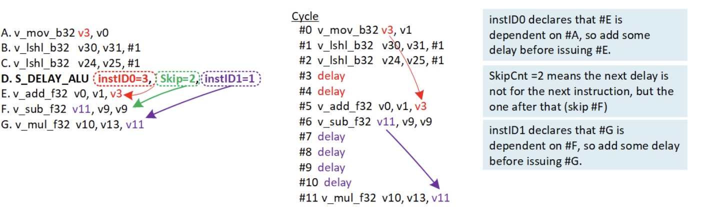

**INSTID**
向后计数已发出的 N VALU 指令。这意味着它不算,已分支的指令。由于 EXEC==0 执行计数而跳过 VALU 指令（记分板立即标记为“就绪”）。

**SKIP**
计算具有第二个依赖性的指令之前跳过的指令数。每条指令都被计为跳过 - 所有类型。

如果在使用前一个 S_DELAY_ALU 的信息之前遇到另一个 S_DELAY_ALU，则当前的 S_DELAY_ALU 将替换任何先前的依赖信息。这意味着如果一条指令依赖于两个单独的先前指令，则这两个依赖项都可以在单个 S_DELAY_ALU 操作中表示，但不能在两个单独的 S_DELAY_ALU 操作中表示。

S_DELAY_ALU 适用于任何类型的操作码，甚至非 ALU（但没有任何作用）

S_DELAY_ALU 不应在 VALU 子句中使用

S_DELAY_ALU 指令代码
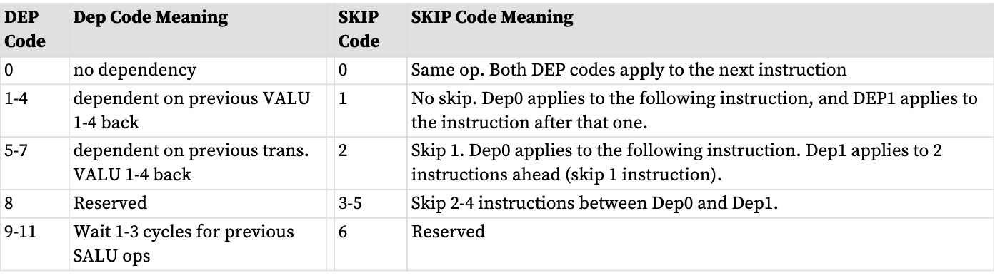
代码 9-11：SALU 操作通常在单个周期内完成，因此等待 1 个周期大致相当于等待 1 个 SALU 操作执行后再继续。


